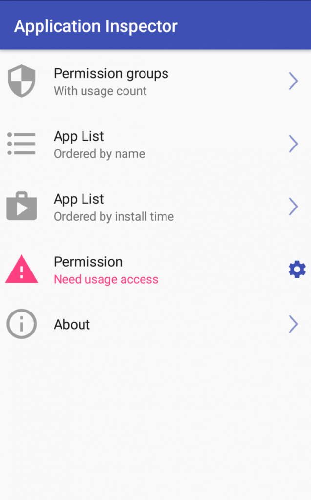

# Uninstall Android Apps

Follow the bellow steps to uninstall pre-installed apps.

::: danger Note
Please disable the apps instead of uninstalling. As it may cause system issues.
:::

## Steps (Without Root)

1. Install the USB drivers for your device (Google has a list of some [universal USB drivers here](https://developer.android.com/studio/run/oem-usb.html))

2. Download the [ADB binary](https://www.xda-developers.com/google-releases-separate-adb-and-fastboot-binary-downloads/) for your particular OS ([Windows](https://dl.google.com/android/repository/platform-tools-latest-windows.zip), [Mac](https://dl.google.com/android/repository/platform-tools-latest-darwin.zip), [Linux](https://dl.google.com/android/repository/platform-tools-latest-linux.zip))

3. Extract the zip file into a folder.

4. On your phone, go to Settings and tap on About Phone. Find the Build Number and **tap on it 7 times to enable Developer Options**.

5. Now enter _Developer Options_ and find _USB Debugging_ and enable it

6. Plug your phone into the computer and change the mode to **"file transfer (MTP)"** mode.

7. On your computer, browse to the directory where you extracted the ADB binary.

   

8. Launch a Command Prompt in your ADB folder. For Windows users, hold **Shift and Right-clicking** then selecting the _"open command prompt here"_ option.

   

9. Once you're in the command prompt/terminal, enter the following command: `adb devices`

10. You will see that the system is starting the ADB daemon. If this is your first time running ADB, you will see a prompt on your phone asking you to authorize a connection with the computer. Grant it

11. Now if you re-run the `adb devices` command, the terminal should print the serial number of your device. If so, then you're ready.

12. Execute the following command: `adb shell`

    

13. Execute the `pm list packages | grep '<OEM/Carrier/App Name>'` command to find package names.

    

14. Alternative way:

    You can find the package name of an installed system application by installing the **App Inspector** app on your phone. I prefer doing it this way so you know what the app name is of the application that you are about to uninstall.

    - Step 1: Tap on _"App List"_

      

    - Step 2: Find the app you want gone. (for example: _"Compass"_)

      

    - Step 3: Find the package name under the App Name (for example: _"com.huawei.compass"_)

      

15. Execute the command like so: `pm uninstall -k --user 0 <name of package>` command to uninstall a specific system application.

    

::: warning Note
As a word of warning, uninstalling system applications can be dangerous so please know what you're getting rid of before you complete these steps. Failing to do so could result in your phone becoming unusable until you perform a factory reset. By removing any given system application, another system application that may depend on it may also break so be careful what you remove. But if something does go wrong, you can always perform a factory reset.
:::
