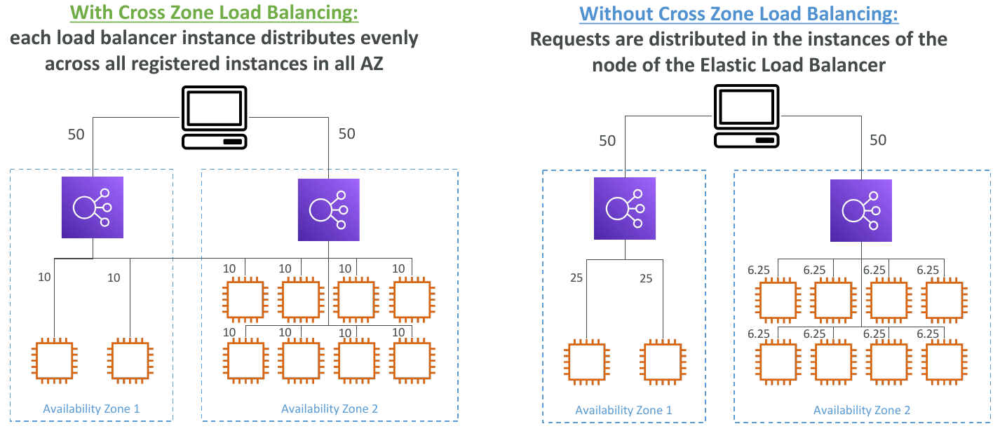

# Load Balancing

Load balancers are servers that forward internet traffic to multiple servers (EC2 Instances) downstream.

## Why use a load balancer?

- Spread load across multiple downstream instances
- Expose a single point of access (DNS) to your application
- Seamlessly handle failures of downstream instances
- Do regular health checks to your instances
- Provide SSL termination (HTTPS) for your websites
- Enforce stickiness with cookies
- High availability across zones
- Separate public traffic from private traffic

- An ELB (EC2 Load Balancer) is a managed load balancer
  - AWS guarantees that it will be working
  - AWS takes care of upgrades, maintenance, high availability
  - AWS provides only a few configuration knobs
- It costs less to setup your own load balancer but it will be a lot more effort on your end.
- It is integrated with many AWS offerings / services

## Health Checks

- Health Checks are crucial for Load Balancers
- They enable the load balancer to know if instances it forwards traffic to are available to reply to requests
- The health check is done on a port and a route (/health is common)
- If the response is not 200 (OK), then the instance is unhealthy

## Types of load balancer on AWS

- AWS has 3 kinds of managed Load Balancers
- Classic Load Balancer (v1 - old generation) - 2009
  - HTTP, HTTPS, TCP
- Application Load Balancer (v2 - new generation) - 2016
  - HTTP, HTTPS, WebSocket
- Network Load Balancer (v2 - new generation) - 2017
  - TCP, TLS (secure TCP) & UDP
- Gateway Load Balancer (Introduced on Nov 10th 2020)
- Overall, it is recommended to use the newer / v2 generation load balancers as they provide more features
- You can setup internal (private) or external (public) ELBs

### Load Balancer Good to Know

- LBs can scale but not instantaneously - contact AWS for a "warm-up"
- Troubleshooting
  - 4xx errors are client induced errors
  - 5xx errors are application induced errors
  - Load Balancer Errors 503 means at capacity or no registered target
  - If the LB can't connect to your application, check your security groups!
- Monitoring
  - ELB access logs will log all access requests (so you can debug per request)
  - CloudWatch Metrics will give you aggregate statistics (ex: connections count)

### Classic Load Balancers (v1)

- Supports TCP (Layer 4), HTTP & HTTPS (Layer 7)
- Health checks are TCP or HTTP based
- Fixed hostname: XXX.region.elb.amazonaws.com

#### Creating a Classic Load Balancer

Steps:

1. Define Load Balancer

   - Load Balancer name:
   - Load Balancer Protocol: HTTP:80
   - Instance Protocol: HTTP:80

2. Assign Security Groups

   - Create or use existing security group
   - Type: HTTP:80
   - Source: Anywhere

3. Configure Security Settings

   - Setup HTTPS or SSL protocol

4. Configure Health Check

   - Ping Protocol: HTTP
   - Ping Port: 80
   - Ping Path: / (or /health or any other path)
   - Response Timeout: between 2 and 60 seconds
   - Interval: between 5 and 300 seconds
   - Unhealthy threshold: 2 (if 2 Health Checks fail in a row then it is healthy)
   - Healthy threshold: 10 (if 10 Health Checks pass in a row then it is healthy)

5. Add EC2 Instances
6. Add Tags
7. Review
8. After the Load Balancer is InService then open the URL present in DNS name and verify if it is hitting the application

### Application Load Balancer (v2)

- Application load balancers is Layer 7 (HTTP)
- Load balancing to multiple HTTP applications across machines (target groups)
- Load balancing to multiple applications on the same machine (ex: containers)
- Support for HTTP/2 and WebSocket
- Support redirects (from HTTP to HTTPS for example)

- Routing tables to different target groups:
  - Routing based on path in URL (example.com/users & example.com/posts)
  - Routing based on hostname in URL (one.example.com & other.example.com)
  - Routing based on Query String, Headers (example.com/users?id=123&order=false)
- ALB are a great fit for micro services & container-based application (example: Docker & Amazon ECS)
- Has a port mapping feature to redirect to a dynamic port in ECS
- In comparison, we'd need multiple Classic Load Balancer per application

#### Target Groups

- EC2 instances (can be managed by an Auto Scaling Group) - HTTP
- ECS tasks (managed by ECS itself) - HTTP
- Lambda functions - HTTP request is translated into a JSON event
- IP Addresses - must be private IPs
- ALB can route to multiple target groups
- Health checks are at the target group level

#### Good to Know

- Fixed hostname (XXX.region.elb.amazonaws.com)
- The application servers don't see the IP of the client directly
  - The true IP of the client is inserted in the header X-Forwarded-For
  - We can also get Port (X-Forwarded-Port) and proto (X-Forwarded-Proto)

#### Creating a Application Load Balancer

Steps:

1. Configure Load Balancer:

   - Name
   - Scheme: internet-facing
   - IP address type: ipv4
   - Listeners: HTTP:80
   - Availability Zones: Select from the VPC

2. Configure Security
3. Configure Security Groups
4. Configure Routing:

   - Target group
   - Name
   - Target type: Instance
   - Protocol: HTTP:80
   - Protocol version: HTTP1
   - Health checks

5. Register Targets
6. Review

### Network Load Balancer (v2)

- Network load balancers (Layer 4) allow to:
  - Forward TCP & UDP traffic to your instances
  - Handle millions of request per seconds
  - Less latency ~100 ms (vs 400 ms for ALB)
- NLB has one static IP per AZ, and supports assigning Elastic IP (helpful for whitelisting specific IP)
- NLB are used for extreme performance, TCP or UDP traffic
- Not included in the AWS free tier

#### Creating a Network Load Balancer

Steps:

1. Configure Load Balancer:

   - Name
   - Scheme: internet-facing
   - IP address type: ipv4
   - Listeners: TCP:80
   - Availability Zones: Select from the VPC

2. Configure Security
3. Configure Routing:

   - Target group
   - Name
   - Target type: instance
   - Protocol: TCP:80
   - Health checks: TCP

4. Register Targets
5. Review

## Sticky Sessions (Session Affinity)

- It is possible to implement stickiness so that the same client is always redirected to the same instance behind a load balancer
- This works for Classic Load Balancers & Application Load Balancers
- The "cookie" used for stickiness has an expiration date you control
- Use case: make sure the user doesn't lose his session data
- Enabling stickiness may bring imbalance to the load over the backend EC2 instances

### Sticky Sessions - Cookie Names

- Application-based Cookies
  - Custom cookie
    - Generated by the target
    - Can include any custom attributes required by the application
    - Cookie name must be specified individually for each target group
    - Don't use AWSALB, AWSALBAPP, or AWSALBTG (reserved for use by the ELB)
  - Application cookie
    - Generated by the load balancer
    - Cookie name is AWSALBAPP
- Duration-based Cookies
  - Cookie generated by the load balancer
  - Cookie name is AWSALB for ALB, AWSELB for CLB

### Add Sticky Sessions

1. Goto Target Groups
2. Select the Target Group and select Actions --> Edit attributes --> Stickiness
3. There are two types of Stickiness:
   - Load balancer generated cookie - Time based
   - Application-based cookie - Time based and App cookie name is required

## Cross-Zone Load Balancing

**With Cross Zone Load Balancing**: Each load balancer instance distributes evenly across all registered instances in all AZ

**Without Cross Zone Load Balancing**: Requests are distributed in the instances of the node of the Elastic Load Balancer

- Application Load Balancer
  - Always on (can't be disabled)
  - No charges for inter AZ data
- Network Load Balancer
  - Disabled by default
  - You pay charges ($) for inter AZ data if enabled
- Classic Load Balancer
  - Through Console => Enabled by default
  - Through CLI / API => Disabled by default
  - No charges for inter AZ data if enabled

To enable Cross-Zone Load Balancing: Goto Load Balancers --> Enable Cross-Zone Load Balancing

## SSL/TLS - Basics

- An SSL Certificate allows traffic between your clients and your load balancer to be encrypted in transit (in-flight encryption)
- SSL refers to Secure Sockets Layer, used to encrypt connections
- TLS refers to Transport Layer Security, which is a newer version
- Nowadays, TLS certificates are mainly used, but people still refer as SSL
- Public SSL certificates are issued by Certificate Authorities (CA)
- Comodo, Symantec, GoDaddy, GlobalSign, Digicert, Letsencrypt, etc...
- SSL certificates have an expiration date (you set) and must be renewed

### Load Balancer - SSL Certificates

- The load balancer uses an X.509 certificate (SSL/TLS server certificate)
- You can manage certificates using ACM (AWS Certificate Manager)
- You can create upload your own certificates alternatively
- HTTPS listener:
  - You must specify a default certificate
  - You can add an optional list of certs to support multiple domains
  - Clients can use SNI (Server Name Indication) to specify the hostname they reach
  - Ability to specify a security policy to support older versions of SSL / TLS (legacy clients)

### SSL - Server Name Indication (SNI)

- SNI solves the problem of loading multiple SSL certificates onto one web server (to serve multiple websites)
- It's a "newer" protocol, and requires the client to indicate the hostname of the target server in the initial SSL handshake
- The server will then find the correct certificate, or return the default one

Note:

- Only works for ALB & NLB (newer generation), CloudFront
- Does not work for CLB (older gen)

### Elastic Load Balancers - SSL Certificates

- Classic Load Balancer (v1)
  - Support only one SSL certificate
  - Must use multiple CLB for multiple hostname with multiple SSL certificates
- Application Load Balancer (v2)
  - Supports multiple listeners with multiple SSL certificates
  - Uses Server Name Indication (SNI) to make it work
- Network Load Balancer (v2)
  - Supports multiple listeners with multiple SSL certificates
  - Uses Server Name Indication (SNI) to make it work

## What's an Auto Scaling Group

- In real-life, the load on your websites and application can change
- In the cloud, you can create and get rid of servers very quickly
- The goal of an Auto Scaling Group (ASG) is to:
  - Scale out (add EC2 instances) to match an increased load
  - Scale in (remove EC2 instances) to match a decreased load
  - Ensure we have a minimum and a maximum number of machines running
  - Automatically Register new instances to a load balancer

### ASGs have the following attributes

- A launch configuration
  - AMI + Instance Type
  - EC2 User Data
  - EBS Volumes
  - Security Groups
  - SSH Key Pair
- Min Size / Max Size / Initial Capacity
- Network + Subnets Information
- Load Balancer Information
- Scaling Policies

### Auto Scaling Alarms

- It is possible to scale an ASG based on CloudWatch alarms
- An Alarm monitors a metric (such as Average CPU)
- Metrics are computed for the overall ASG instances
- Based on the alarm:
  - We can create scale-out policies (increase the number of instances)
  - We can create scale-in policies (decrease the number of instances)

### Auto Scaling New Rules

- It is now possible to define "better" auto scaling rules that are directly managed by EC2
  - Target Average CPU Usage
  - Number of requests on the ELB per instance
  - Average Network In
  - Average Network Out
- These rules are easier to set up and can make more sense

### Auto Scaling Custom Metric

- We can auto scale based on a custom metric (ex: number of connected users)

  1. Send custom metric from application on EC2 to CloudWatch (PutMetric API)
  2. Create CloudWatch alarm to react to low / high values
  3. Use the CloudWatch alarm as the scaling policy for ASG

### ASG Brain Dump

- Scaling policies can be on CPU, Network... and can even be on custom metrics or based on a schedule (if you know your visitors patterns)
- ASGs use Launch configurations or Launch Templates (newer)
- To update an ASG, you must provide a new launch configuration / launch template
- IAM roles attached to an ASG will get assigned to EC2 instances
- ASG are free. You pay for the underlying resources being launched
- Having instances under an ASG means that if they get terminated for whatever reason, the ASG will automatically create new ones as a replacement. Extra safety!
- ASG can terminate instances marked as unhealthy by an LB (and hence replace them)

### Create a Auto Scaling Group

Steps:

1. Goto Auto Scaling Groups
2. Choose launch template or configuration:

   - Name
   - Launch template:
     - Create launch template
     - Launch template name
     - Amazon Machine Image (AMI)
     - Instance Type: t1.micro
     - Key pair (login)
     - Network Settings: VPC or EC2-Classic
     - Security groups
     - Storage: Volume 1 (8GiB, EBS, General purpose SSD (gp2))
     - Resource tags
     - Network interfaces
     - In Advance details add User data

3. Configure settings:

   - Instance purchase options:
     - Adhere to launch template
     - Combine purchase options and instance types (provide min, max, and desired capacity)
   - Network: AZs

4. Configure advanced options:

   - Load balancing:
     - No load balancer
     - Attach to an existing load Balancer
     - Attach to a new load balancer
   - Health checks:
     - EC2 (enabled by default)
     - ELB (use ELB health checks to determine if the instances is healthy)
   - Additional settings: Monitoring (with CloudWatch)

5. Configure group size and scaling policies

   - Group size:
     - Desired capacity
     - Minimum capacity
     - Maximum capacity
   - Scaling policies:
     - Target tracking scaling policy
     - None
   - Instance scale-in protection

6. Add Notifications
7. Add tags
8. Review

### Auto Scaling Groups - Dynamic Scaling Policies

- Target Tracking Scaling
  - Most simple and easy to set-up
  - Example: I want the average ASG CPU to stay at around 40%
- Simple / Step Scaling

  - When a CloudWatch alarm is triggered (example CPU > 70%), then add 2 units
  - When a CloudWatch alarm is triggered (example CPU less than 30%), then remove 1

- Scheduled Actions
  - Anticipate a scaling based on known usage patterns
  - Example: increase the min capacity to 10 at 5 pm on Fridays

### Auto Scaling Groups - Predictive Scaling

- Predictive scaling: continuously forecast load and schedule scaling ahead

Good metrics to scale on:

- **CPUUtilization**: Average CPU utilization across your instances
- **RequestCountPerTarget**: to make sure the number of requests per EC2 instances is stable
- Average Network In / Out (if you're application is network bound)
- Any custom metric (that you push using CloudWatch)

### Auto Scaling Groups - Scaling Cooldowns

- After a scaling activity happens, you are in the cooldown period (default 300 seconds)
- During the cooldown period, the ASG will not launch or terminate additional instances (to allow for metrics to stabilize)
- Advice: Use a ready-to-use AMI to reduce configuration time in order to be serving request fasters and reduce the cooldown period
