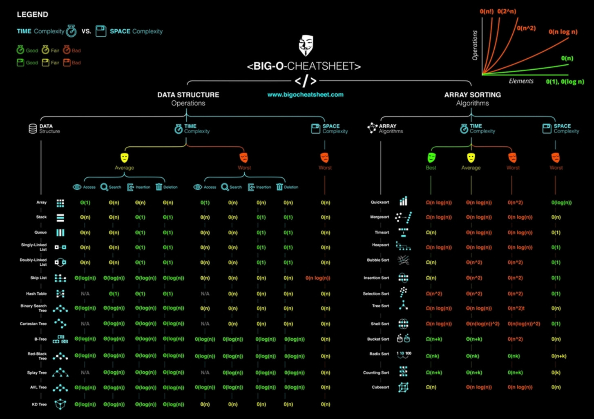

# Algorithms

Informally, an **algorithm** is any well-defined computational procedure that takes some value, or set of values, as **input** and produces some value, or set of values, as **output**. An algorithm is thus a sequence of computational steps that transform the input into the output.

An algorithm is said to be **correct** if, for every input instance, it halts with the correct output

Problem solving vs Programming:

1. Problem-solving: It requires math to solve problems. And math does not have loops, it has [Recursion](./Recursion.md). It's a lifetime of work

2. Programming: Learning the syntax of a language and implementing the solution in it

## Asymptotic Notation

The efficiency of an algorithm depends on the amount of time, storage and other resources required to execute the algorithm. The efficiency is measured with the help of _asymptotic notations_

The study of **change in performance** of the algorithm **with the change in the order of the input size** is defined as **asymptotic analysis**

- **Asymptotic notations** are the mathematical notations used to describe the running time of an algorithm when the input tends towards a particular value or a limiting value

- Algorithm times are measured in terms of _growth_ of an algorithm

### Logarithm

"How many 2's do we multiply together to get 128?"

- **`log2 128 = 7`**

### Big O

_Big O_ is a special notation that tells how fast an algorithm is.

- **Dominant term** of the function is taken for consideration

- Big-O notation represents the **upper bound** of the running time of an algorithm

- Thus, it gives the **worst-case complexity** of an algorithm

Basically:

- How code slows as data grows
- Not the same as running time
- Big trend over time

> "Big O notation is a mathematical notation that describes the limiting behaviour of a function when the argument tends towards a particular value or infinity. It is a member of a family of notations invented by Paul Bachmann, Edmund Landau, and others, collectively called Bachmann–Landau notation or asymptotic notation."

### Other Notations

1. Big O: `"f(n) is O(g(n))"` iff (if and only if) for some constants `c` and `N₀`, `f(N) ≤ cg(N)` for all `N > N₀`

   - **Big O (`O()`)** describes the **upper bound** of the complexity.

2. Omega: `"f(n) is Ω(g(n))"` iff for some constants c and `N₀`, `f(N) ≥ cg(N)` for all `N > N₀`

   - **Omega (`Ω()`)** describes the **lower bound** of the complexity.

   - Omega notation represents the lower bound of the running time of an algorithm.

   - Thus, it provides the **best case complexity** of an algorithm.

3. Theta: `"f(n) is Θ(g(n))"` iff `f(n)` is `O(g(n))` and `f(n)` is `Ω(g(n))`

   - **Theta (`Θ()`)** describes the **exact bound** of the complexity

   - Theta notation encloses the function from above and below

   - Since it represents the upper and the lower bound of the running time of an algorithm, it is used for analysing the **average-case complexity** of an algorithm

4. Little O: `"f(n) is o(g(n))"` iff `f(n)` is `O(g(n))` and `f(n)` is not `Θ(g(n))`

   - **Little O (`o()`)** describes the **upper bound excluding the exact bound**.

_Example:_

The function `g(n) = n² + 3n` is:

- `O(n³)`
- `o(n⁴)`
- `Θ(n²)`
- `Ω(n)`

But you would still be right if you say it is `Ω(n²)` or `O(n²)`

## Time And Space Complexity

There are often many approaches to solving a problem. How do we choose between them? At the heart of computer program design are two (sometimes conflicting) goals:

1. To design an algorithm that is easy to understand, code, and debug

2. To design an algorithm that makes efficient use of the computer's resources

The method for evaluating the efficiency of an algorithm or computer program is called **asymptotic analysis**

- A method for estimating the efficiency of an algorithm or computer program by identifying its growth rate. Asymptotic analysis also gives a way to define the inherent difficulty of a problem. We frequently use the term algorithm analysis to mean the same thing.

- Asymptotic analysis also gives a way to define the inherent difficulty of a problem

Order of the polynomial equation or [Big O](#big-o): How time scales with respect to some input variables

- Usually `n` is used to denote the variable (any letter can be used)

Rules:

1. Different steps get added: `O(a)` and `O(b)` will be added to `O(a+b)`

2. Drop constants: If the complexity is `2n`, the constant `2` is dropped and Big O is represented as `O(n)`

3. Different inputs should use different variables. So, instead of using `n` for two different arrays use `a` and `b`. So, Big O is `O(a * b)` not `O(n^2)`

4. Drop non-dominate terms: If a function has two complexities such as `O(n)` and `O(n^2)`. Drop `O(n)` and just use `O(n^2)`

- `O(n)`:

  ```c
  // one for loop
  for (int i=0; i<n; i++) {
      /* Code */
      }
  ```

- `O(n^2)`:

  ```c
  // one for loop
  for (int i=0; i<n; i++) {
      for (int i=0; i<n; i++) {
      /* Code */
      }
  }
  ```

Time functions

Terms:

- complexity

  - Complexity is different for small numbers than large numbers

- time complexity
- algorithmic complexity
- asymptotic complexity

- Amortization:

  - Long-term averaging
  - Operations can take different times

- Worst case:
  - Typical case vs worst case

Terminology:

- `O(...n...)`
- `n`: how much data
- `O`: "Order of"
- Not a function! (It's just a notation)

_Big-O Complexity:_


1. `O(1)`: **Constant time** (size of data dose not matter)

   - Constant time beats linear if data is sufficiently big

   ```python
   # Array
   arr = [1, 2, 3]
   arr.append(4)    # push to end
   arr.pop()        # pop from end
   arr[0]           # lookup
   arr[1]
   arr[2]

   # HashMap/Set
   hashMap = {}
   hashMap["key"] = 10     # insert
   print("key" in hashMap) # lookup
   print(hashMap["key"])   # lookup
   hashMap.pop("key")      # remove
   ```

2. `O(n)`: **Linear time**

   - Time grows proportionally to data

   ```python
   arr = [1, 2, 3]
   sum(arr)           # sum of array
   for n in arr:      # looping
      print(n)

   arr.insert(1, 100) # insert
   arr.remove(100)    # remove
   print(100 in arr)  # search

   import heapq
   heapq.heapify(arr) # build heap

   # sometimes even nested loops can be O(n)
   # (e.g. monotonic stack or sliding window)
   ```

3. `O(n^2)`: **Quadratic time**

   ```python
   # Traverse a square grid
   arr = [[1, 2, 3], [4, 5, 6], [7, 8, 9]]
   for i in range(len(arr)):
      for j in range(len(arr[i])):
         print(arr[i][j])


   # Get every pair of elements in array
   arr = [1, 2, 3]
   for i in range(len(arr)):
      for j in range(i + 1, len(arr)):
         print(arr[i], arr[j])

   # Insertion sort (insert in middle n times -> n^2)
   ```

4. `O(n*m)`:

   ```python
   # Get every pair of elements from two arrays
   arr1, arr2 = [1, 2, 3], [4, 5]
   for i in range(len(arr1)):
      for j in range(len(arr2)):
         print(arr1[i], arr2[j])

   # Traverse rectangle grid
   arr = [[1, 2, 3], [4, 5, 6]]
   for i in range(len(arr)):
      for j in range(len(arr[i])):
         print(arr[i][j])
   ```

5. `O(n^3)`: and so on

   ```python
   # Get every triplet of elements in array
   arr = [1, 2, 3]
   for i in range(len(arr)):
      for j in range(i + 1, len(arr)):
         for k in range(j + 1, len(arr)):
               print(arr[i], arr[j], arr[k])
   ```

6. `O(log n)`:

   ```python
   # Binary search
   arr = [1, 2, 3, 4, 5]
   target = 6
   l, r = 0, len(arr) - 1
   while l <= r:
      m = (l + r) // 2
      if target < arr[m]:
         r = m - 1
      elif target > arr[m]:
         l = m + 1
      else:
         print(m)
         break

   # Binary Search on BST
   def search(root, target):
      if not root:
         return False
      if target < root.val:
         return search(root.left, target)
      elif target > root.val:
         return search(root.right, target)
      else:
         return True

   # Heap Push and Pop
   import heapq
   minHeap = []
   heapq.heappush(minHeap, 5)
   heapq.heappop(minHeap)
   ```

7. `O(n log n)`:

   ```python
   # Heap Sort
   import heapq
   arr = [1, 2, 3, 4, 5]
   heapq.heapify(arr)     # O(n)
   while arr:
      heapq.heappop(arr) # O(log n)

   # Merge Sort (and most built-in sorting functions)
   ```

8. `O(2^n)`:

   ```python
   # Recursion, tree height n, two branches
   def recursion(i, arr):
      if i == len(arr):
         return 0
      branch1 = recursion(i + 1, arr)
      branch2 = recursion(i + 2, arr)
   ```

9. `O(c^n)`:

   ```python
   # c branches, where c is sometimes n.
   def recursion(i, arr, c):
      if i == len(arr):
         return 0

      for j in range(i, i + c):
         branch = recursion(j + 1, arr)
   ```

10. `O(sqrt(n))`:

    ```python
    # Get all factors of n
    import math
    n = 12
    factors = set()
    for i in range(1, int(math.sqrt(n)) + 1):
       if n % i == 0:
          factors.add(i)
          factors.add(n // i)
    ```

11. `O(n!)`:

    - Permutations
    - Travelling Salesman Problem



Static and Global variables:

## Data Structures

Check out [Data Structures](./../Data-Structures/)

## Call Stack

A call stack is a [_stack data structure_](../Data-Structures/Stack.md) that stores information about the active subroutines of a computer program.

- The order in which elements come off a stack gives rise to its alternative name, **LIFO** (last in, first out).

## Coding Techniques

- Master Theorem

### Divide & Conquer

A **divide and conquer algorithm** is a strategy of solving a large problem by

1. Breaking the problem into smaller sub-problems
2. Solving the sub-problems, and
3. Combining them to get the desired output.

Divide & Conquer is an algorithm design paradigm based on multi-branched [Recursion](./Recursion.md).

A divide-and-conquer algorithm works by recursively breaking down a problem into two or more sub-problems of the same or related type, until these become simple enough to be solved directly.

The solutions to the sub-problems are then combined to give a solution to the original problem.

It's applications:

- [Binary Search](./Searching_Algorithms.md#binary-search)
- [Merge Sort](./Sorting_Algorithms.md#merge-sort)
- [Quick Sort](./Sorting_Algorithms.md#quick-sort)
- Finding the GCD is an use case of D&C.
- Check Euclid's algorithm for GCD.
- Strassen's Matrix multiplication
- Karatsuba Algorithm

## NP-Complete Problems

### The Travelling Salesperson problem

Performance:

- **O(n!)**

Implementation

## Famous Algorithms

- Dynamic programming
- Greedy algorithm

  - Dijkstra's Shortest Path algorithm

- Backtracking

- Sliding window

- Monotonic stack

## References

1. _Grokking Algorithms: An illustrated guide for programmers and other curious people_, by Adiya Y. Bhargava.
