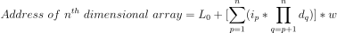

# Arrays

_Definition:_ Contiguous area of memory consisting of equal-size elements. An array variable will store the address of the first element of that array (it acts like a pointer)

Array is a data structure consisting of a collection of elements, each element is stored contiguously (right next to each other) in memory

- They are used when the size of elements is already known, as adding new element requires a free memory next to the last element, else the whole array needs to be moved to a new memory location with enough space. If there is no space to accommodate the whole array, it may cause memory issues

- As the memory location of each element can be determined easily, it is very fast in getting an element from anywhere in the array

- All elements in the array should be the same type (all integers or all doubles or all strings and so on).

_Example:_ Declaring and initializing an array

```c
int main()
{
    // MEMORY ALLOCATION HAPPENS DURING DECLARATION
    // ARRAY OF INTEGERS OF LENGTH 5 AND THE ARRAY CONTAINS GARBAGE VALUES
    int A[5];               // DECLARATION

    int B[2] = { 1, 2 };    // DECLARATION and INITIALIZATION

    // INITIALIZING ONLY FEW ELEMENTS
    int C[4] = { 1, 2 };    // REST OF THE ELEMENTS WILL BE 0 i.e. {1,2,0,0}

    // INITIALIZE ALL ELEMENTS WITH 0
    int D[4] = { 0 };       // {0,0,0,0}

    // SIZE OF AN ARRAY CAN BE SKIPPED
    int E[] = { 1, 2, 3 };  // SIZE 3
}
```

_Example:_ Set and get values in elements of an array

```c
int main()
{
    int A[3] = { 1, 2, 3 };

    printf("%d", A[0]);     // 1

    A[0] = 55

    printf("%d", A[0]);     // 55
    printf("%d", A[1]);     // 2
    printf("%d", 0 [A]);    // 55
    printf("%d", 1 [A]);    // 2
    printf("%d", *A);       // 55 - IT IS POINTING TO 0th ELEMENT
    printf("%d", *(A + 1)); // 2 - POINTING TO THE NEXT ADDRESS
    printf("%d", *(A + 2)); // 3

    // PRINT THE MEMORY ADDRESS OF ARRAY ELEMENTS
    for (int i = 0; i < 3; i++)
    {
        printf("%u", &A[i]);
    }

    // OUTPUT:
    // 3638371264
    // 3638371268
    // 3638371272
}
```

_Example:_ Read elements of an array using `foreach` (C++)

```cpp
int main()
{
    int A[5] = {1, 2, 3, 4, 5};

    cout << sizeof(A) << endl;

    for (int x : A)
    {
        cout << x << endl;
    }

    return 0;
}
```

- Indexed by contiguous integers starting with _0_ in case of C/C++

- Size of an array is **sum of sizes consumed by all of its elements**

- If an array of size `5` and only first `3` elements are initialized with values then the remaining `2` elements value will be set to `0`

- Arrays have constant-time access to any element and to add/remove at the end. Linear time to add/remove at an arbitrary location.

- To find the address of any element in an array use: `array_starting_address + element_size * (index_of_element - index_of_first_element)`

## Size

Arrays are created inside the Stack Memory and have fixed size and cannot be changed after initialization.

The size of an array can be determined dynamically (user inputs the size during runtime) (supported in C++):

- We can create an array of size _n_, where _n_ is determined during runtime by the user (dynamically)

- After the size is know, an array of size _n_ is declared

- Here the array cannot be initialized with values during declaration

- Garbage value is set instead of setting `0` for elements whose value was not provided

_Example:_

```cpp
int main()
{

    int n;

    cout << "Enter the number of elements in the array: ";
    cin >> n;

    int A[n];

    for (int x : A)
    {
        cout << x << endl;
    }

    return 0;
}
```

> Variable size array is available in C++ and latest compilers of C (not in old C compilers)

We can create an array inside Heap memory as well using a pointer:

- Create a pointer
- Allocate memory to an array of some size
- Assign the address of the allocated memory to the pointer
- Now the pointer will point to the first element of the array
- The elements of the array can be utilized using the same array syntax with the pointer

```c
int main()
{
    int *p;

    p = (int *)malloc(5 * sizeof(int));
    // p = new int[5]           // IN C++

    for (int i = 0; i < 5; i++)
    {
        printf("%d\n", p[i]);   // ACCESSING ELEMENTS OF THE ARRAY
    }

    return 0;
}
```

### Increase Size of an Array Created In Heap

Size of an array cannot be changed after initialization. So to accommodate more elements we need to use pointers to create arrays.

```c
int main()
{
    int *p = (int *)malloc(2 * sizeof(int));
    int *q = (int *)malloc(5 * sizeof(int));
    int i;

    p[0] = 3;
    p[1] = 6;

    for (i = 0; i < 2; i++)
    {
        q[i] = p[i];
    }

    for (i = 0; i < 5; i++)
    {
        printf("%d", q[i]);
    }

    free(p);
    // delete [] p;

    p = q;
    q = NULL;

    for (i = 0; i < 5; i++)
    {
        printf("%d", p[i]);
    }

    return 0;
}

// OUTPUT:
// *p = 3, 6
// *q = 3, 6, 0, 0, 0
// *p = 3, 6, 0, 0, 0
// *q = NULL pointer
```

## Arrays in Compilers

Compilers will not know the address during compilation. To get the address of the array and its elements the compiler will use the formula `Address(A[i]) = L0 + (i * w)`, where:

- `L0`: is the memory address of the first element of the array
- `i`: is the nth element which needs to be accessed
- `w`: is the size of the Data type (word size)

During runtime the address of the array is known and the value of `L0` is update and this is known as _Data binding_ (systems or assembly programming).

## Multi-Dimensional Arrays

The size of a two-dimensional array is represented as `m x n`, where `m` is the number of rows and `n` is the number of columns.

We can create multi-dimensional arrays by:

1. Array declared with array size and dimensions. In memory array will have one dimension but the compiler provides ways to define multi-dimensions. Array is created in Stack Memory.

   ```c
   int A[2][2] = {{1, 2}, {3, 4}};
   ```

2. Array of pointers where each pointer points to an array. Multi-dimensional array in Heap memory. Pointer array is created in Stack Memory and the arrays which each element points to is stored in Heap Memory.

   ```c
   int *A[3];

   A[0] = (int *)malloc(4 * sizeof(int));
   A[1] = (int *)malloc(4 * sizeof(int));
   A[2] = (int *)malloc(4 * sizeof(int));
   ```

3. Using double pointers. The double pointer is created in Stack Memory and the array of pointers along with the arrays will be created in Heap Memory,

   ```c
   int main()
   {
       int **A; // DOUBLE POINTER

       A = (int **)malloc(2 * sizeof(int *));
       // A = new int *(5);

       A[0] = (int *)malloc(3 * sizeof(int));
       A[1] = (int *)malloc(3 * sizeof(int));

       A[0][0] = 15;
       A[1][1] = 45;

       printf("%d", A[1][1]);

       return 0;
   }
   ```

When we create a multi-dimensional array, during runtime the actual array created will be linear not multi-dimensional in memory. So, the multi-dimensional array is mapped on to (or represented as) single dimension and stored inside the memory.

There are two ways to do this mapping or representation:

1. **Row-major:** The elements of multi-dimensional array are mapped row by row. If we stack all elements of an array as `(1,1),(1,2)...,(1,n),(2,1),(2,2)...,(2,n)...,` the **column values change** rapidly, hence _Row-Major_.

   - Formula for `m x n` metrics:

     `Address(A[i][j] = L0 + ((i * n) + j) * w`

   - Formula for `d1 x d2 x d3 x d4` metrics:

     `Address(A[i1][i2][i3][i4]) = L0 + ((i1 * d2 * d3 * d4) + (i2 * d3 * d4) + (i3 * d4) + i4) * w`

   - Multiplication of dimensions goes left to right.

   - Formula for `d1 x d2 x d3 .... xdn`metrics:

     

   - For n dimension the number of multiplication are `n(n - 1)/2` and have `O(n^2)`. Optimizing the above formula:

     `Address(A[i1][i2][i3][i4]) = L0 + (i4 + d4 * (i3 + d3 * (i2 + (d2 * i1)))) * w`

   - Here the number of multiplications are reduced to `n-1` and hence `O(n)`.

2. **Column-major:** The elements of multi-dimensional array are mapped column by column. If we stack all elements of an array as `(1,1),(2,1)...,(n,1),(1,2),(2,2)...,(n,2)...,` the **row values change** rapidly, hence _Column-Major_.

   - Formula for `m x n` metrics: `Address(A[i][j] = L0 + (i + (j * m)) * w`

   - Formula for `d1 x d2 x d3 x d4` metrics: `Address(A[i1][i2][i3][i4]) = L0 + ((i4 * d3 * d2 * d1) + (i3 * d2 * d1) + (i2 * d1) + i1) * w`

   - Multiplication of dimensions goes right to left.

Looking at the formula we can see that both the methods are equally efficient and any one of them can be used.

In C/C++, **Row-major mapping is used**.

## Performance

|     ~     |  Add   | Remove |
| :-------: | :----: | :----: |
| Beginning | `O(n)` | `O(n)` |
|    End    | `O(1)` | `O(1)` |
|  Middle   | `O(n)` | `O(n)` |

::: tip NOTE
Most languages use zero-based indexing, some use one as the starting index, and some allow the user to specify the starting index.
:::

## Implementation

Data Type is defined as:

- Representation of Data
- Operations allowed on Data

Array ADT:

- Representation of Data: Defined by the compiler
- Operations allowed on Data: Defined by the user

### Create An Array ADT

Let us create an Array ADT in Heap Memory:

- Array pointer: `*A`
- Array size: `size`
- Number of elements present: `length`

```c
struct Array
{
    int *A;
    int size;
    int length;
};

int main()
{
    struct Array arr;

    printf("Enter the size of the array: ");
    scanf("%d", &arr.size);

    arr.A = (int *)malloc(arr.size * sizeof(int));
    arr.length = 0;

    return 0;
}
```

### Initialize

```c
void Initialize(struct Array *arr)
{
    int n, i;
    printf("Enter the size of the array: ");
    scanf("%d", &arr->size);

    arr->A = (int *)malloc(arr->size * sizeof(int));
    arr->length = 0;

    printf("Enter number of elements to be entered: ");
    scanf("%d", &n);

    printf("Enter all elements\n");

    for (i = 0; i < n; i++)
        scanf("%d", &arr->A[i]);

    arr->length = n;
}

int main()
{
    struct Array arr;

    Initialize(&arr);

    return 0;
}
```

### Display

```c
void Display(struct Array arr)
{
    int i;

    printf("\n\nAll elements are:\n");

    for (i = 0; i < arr.length; i++)
        printf("Element %d: %d\n", i, arr.A[i]);
}

int main()
{
    struct Array arr;

    Initialize(&arr);

    Display(arr);

    return 0;
}
```

### Add/Append

- Add element at the end of the array or append the element to the array
- Operation: `O(1)`

```c
void Append(struct Array *arr, int newElement)
{
    if (arr->length < arr->size)
        arr->A[arr->length++] = newElement;
}
```

### Insert

- Insert element at an index of the array
- Operation: Best: `O(1)`, Worst: `O(n)`

```c
void Insert(struct Array *arr, int index, int newElement)
{
    int i;

    if (index <= arr->length)
    {
        for (i = arr->length; i > index; i--)
        {
            arr->A[i] = arr->A[i - 1];
        }

        arr->A[index] = newElement;
        arr->length++;
    }
}
```

### Delete

- Delete element at an index of the array
- Operation: Best: `O(1)`, Worst: `O(n)`

```c
int Delete(struct Array *arr, int index)
{
    int x = -1, i;

    if (index >= 0 && index < arr->length)
    {
        x = arr->A[index];

        for (i = index; i < arr->length; i++)
        {
            arr->A[i] = arr->A[i + 1];
        }

        arr->length--;
    }

    return x;
}
```

### Search

1. Linear search:

   - The elements must be unique for that array else only the first found element will be used even if the same value is present at different locations of that array

   - Operations: Best: `O(1)`, Worst: `O(n)`, Average: `O(n)`

     ```c
     int Linear_search(struct Array arr, int element)
     {
         int i;

         for (i = 0; i < arr.length; i++)
         {
             if (arr.A[i] == element)
                 return i;
         }

         return -1;
     }
     ```

   - Optimization using _Transposition_: Swapping the index of searched value with its lesser indexed adjacent element. If the same value is searched again and again the number of comparisons keep decreasing and reach `O(1)`.

     ```c
     int Linear_search_transposition(struct Array *arr, int key)
     {
         int i;

         for (i = 0; i < arr->length; i++)
         {
             if (arr->A[i] == key)
             {
                 arr->A[i] = arr->A[i - 1];
                 arr->A[i - 1] = key;
                 return i;
             }
         }

         return -1;
     }
     ```

   - Optimization using _Move to Front/Head_: Swapping the first element with the searched value. If the same value is searched again the operation will be `O(1)`

     ```c
     int Linear_search_move_front(struct Array *arr, int key)
     {
         int i;

         for (i = 0; i < arr->length; i++)
         {
             if (arr->A[i] == key)
             {
                 arr->A[i] = arr->A[0];
                 arr->A[0] = key;
                 return i;
             }
         }

         return -1;
     }
     ```

2. Binary Search: The array must be sorted.

   - Operations: Best: `O(1)`, Worst: `O(log2 n)`

     ```c
     int Binary_search(struct Array arr, int key)
     {
      int low = 0, mid, high = arr.length - 1;

      while (low <= high)
      {
          mid = (low + high) / 2;

          if (arr.A[mid] == key)
              return mid;

          else if (arr.A[mid] > key)
              high = mid - 1;

          else
              low = mid + 1;

          mid = low + high / 2;
      }

      return -1;
     }
     ```

   - Using Recursion:

     ```c
     int Binary_search_recursion(int A[], int low, int high, int key)
     {
        int mid;

        if (low <= high)
        {
            mid = (low + high) / 2;

            if (A[mid] == key)
                return mid;

            else if (A[mid] > key)
                return Binary_search_recursion(A, low, mid - 1, key);

            else
                return Binary_search_recursion(A, mid + 1, high, key);
        }

        return -1;
     }
     ```

### Get

Get the element at an index:

- Operations: `O(1)`

```c
int Get(struct Array arr, int index)
{
    if (index >= 0 && index < arr.length)
        return arr.A[index];

    return -1;
}
```

### Set

Set value for element at an index:

- Operations: `O(1)`

```c
void Set(struct Array *arr, int index, int key)
{
    if (index >= 0 && index < arr->length)
        arr->A[index] = key;
}
```

### Find Max (unsorted)

- Operations: Best: `O(n)`, Worst: `O(n)`

```c
int Max(struct Array arr)
{
    int i = 0, max = arr.A[i];

    for (; i < arr.length; i++)
        if (max < arr.A[i])
            max = arr.A[i];

    return max;
}
```

### Find Min (unsorted)

- Operations: Best: `O(n)`, Worst: `O(n)`

```c
int Min(struct Array arr)
{
    int i = 0, min = arr.A[i];

    for (; i < arr.length; i++)
        if (min > arr.A[i])
            min = arr.A[i];

    return min;
}
```

### Sum of All Elements

- Operations: Best: `O(n)`, Worst: `O(n)`

```c
int Sum(struct Array arr)
{
    int i, sum = 0;

    for (i = 0; i < arr.length; i++)
        sum += arr.A[i];

    return sum;
}
```

- Using Recursion:

  ```c
  int Sum_recursive(int A[], int n)
  {
      if (n < 0)
          return 0;

      return Sum_recursive(A, n - 1) + A[n];
  }
  ```

### Average

- Operations: Best: `O(n)`, Worst: `O(n)`

```c
float Average(struct Array arr)
{
    int i, sum = 0;

    for (i = 0; i < arr.length; i++)
        sum += arr.A[i];

    return (float)sum / arr.length;

    // or just instead of for loop

    return (float)Sum(arr) / arr.length;
}
```

### Reverse

- Using auxiliary array: Operations: `O(n)`

  ```c
  void Reverse_auxiliary_array(struct Array *arr)
  {
      int i, j, *B;

      B = (int *)malloc(arr->length * sizeof(int));

      for (i = arr->length - 1, j = 0; i >= 0; i--, j++)
          B[j] = arr->A[i];

      for (i = 0; i < arr->length; i++)
          arr->A[i] = B[i];
  }
  ```

- Optimized: Operations: `O(n/2)`

  ```c
  void Reverse(struct Array *arr)
  {
      int i, j, temp;

      for (i = 0, j = arr->length - 1; i < j; i++, j--)
      {
          temp = arr->A[i];

          arr->A[i] = arr->A[j];

          arr->A[j] = temp;
      }
  }
  ```

### Insert in Sorted Order

```c
void Insert_in_sorted_order(struct Array *arr, int key)
{
    int i = arr->length - 1;

    if (arr->length < arr->size)
    {
        while (arr->A[i] > key && i >= 0)
        {
            arr->A[i + 1] = arr->A[i];
            i--;
        }

        arr->A[i + 1] = key;
        arr->length++;
    }
}
```

### Check if the array is sorted

```c
int Is_sorted(struct Array arr)
{
    int i;

    for (i = 0; i < arr.length - 2; i++)
        if (arr.A[i] > arr.A[i + 1])
            return 0;

    return 1;
}
```

### Rearrange Positive and Negative values

```c
void Rearrange(struct Array *arr)
{
    int i, j, temp;
    i = 0;
    j = arr->length - 1;

    while (i < j)
    {
        while (arr->A[i] < 0)
            i++;
        while (arr->A[j] >= 0)
            j--;

        if (i < j)
        {
            temp = arr->A[i];

            arr->A[i] = arr->A[j];

            arr->A[j] = temp;
        }
    }
}
```

### Merge

- Merge two sorted arrays into a new sorted array

- Both arrays must be sorted and the resulting array after merging must also be sorted

- Operations: `Theta(m + n)`

```c
struct Array *Merge(struct Array arr1, struct Array arr2)
{
    int i = 0, j = 0, k = 0;

    struct Array *arr3 = (struct Array *)malloc(sizeof(struct Array));

    while (i < arr1.length && j < arr2.length)
    {
        if (arr1.A[i] < arr2.A[j])
            arr3->A[k++] = arr1.A[i++];

        else
            arr3->A[k++] = arr2.A[j++];
    }

    for (; i < arr1.length; i++)
        arr3->A[k++] = arr1.A[i];

    for (; j < arr2.length; j++)
        arr3->A[k++] = arr2.A[j];

    arr3->length = arr1.length + arr2.length;
    arr3->size = 20;

    return arr3;
}

struct Array *merged_arr = Merge(arr1, arr2);
```

### Union Operation

- Combining two arrays with no duplicate elements copied from second array to create a new array
- New array size might be smaller than the combined size of first and second array
- Operations: Unsorted Array: `O(n^2)`

  ```c
  struct Array *Union(struct Array arr1, struct Array arr2)
    {
        int i = 0, j = 0, k = 0;

        struct Array *arr3 = (struct Array *)malloc(sizeof(struct Array));

        while (i < arr1.length && j < arr2.length)
        {
            if (arr1.A[i] < arr2.A[j])
                arr3->A[k++] = arr1.A[i++];

            else if (arr1.A[i] > arr2.A[j])
                arr3->A[k++] = arr2.A[j++];

            else
            {
                arr3->A[k++] = arr1.A[i++];
                j++;
            }
        }

        for (; i < arr1.length; i++)
            arr3->A[k++] = arr1.A[i];

        for (; j < arr2.length; j++)
            arr3->A[k++] = arr2.A[j];

        arr3->length = k;
        arr3->size = 20;

        return arr3;
    }
  ```

- Operations: Sorted Array: `Theta(m + n)`

- Similar to [Merge](#merge) operation

### Intersection

- Take common elements from two arrays and store them in a new array
- Operations: Unsorted Array: `O(n^2)`

```c
struct Array *Intersection(struct Array arr1, struct Array arr2)
{
    int i = 0, j = 0, k = 0;

    struct Array *arr3 = (struct Array *)malloc(sizeof(struct Array));

    while (i < arr1.length && j < arr2.length)
    {
        if (arr1.A[i] < arr2.A[j])
            i++;

        else if (arr1.A[i] > arr2.A[j])
            j++;

        else if (arr1.A[i] == arr2.A[j])
        {
            arr3->A[k++] = arr1.A[i++];
            j++;
        }
    }

    arr3->length = k;
    arr3->size = 20;

    return arr3;
}
```

- Operations: Sorted Array: `Theta(m + n)`

- Similar to [Merge](#merge) operation

### Difference

- Get all the elements that are present in the first element but not in the second element.
- Operations: Unsorted Array: `O(n^2)`

```c
struct Array *Difference(struct Array arr1, struct Array arr2)
{
    int i = 0, j = 0, k = 0;

    struct Array *arr3 = (struct Array *)malloc(sizeof(struct Array));

    while (i < arr1.length && j < arr2.length)
    {
        if (arr1.A[i] < arr2.A[j])
            arr3->A[k++] = arr1.A[i++];

        else if (arr1.A[i] > arr2.A[j])
            j++;

        else if (arr1.A[i] == arr2.A[j])
        {
            i++;
            j++;
        }
    }

    for (; i < arr1.length; i++)
        arr3->A[k++] = arr1.A[i];

    arr3->length = k;
    arr3->size = 20;

    return arr3;
}
```

- Operations: Sorted Array: `Theta(m + n)`

- Similar to [Merge](#merge) operation

### Member

- Search if the element is present in the array
- Same as searching
