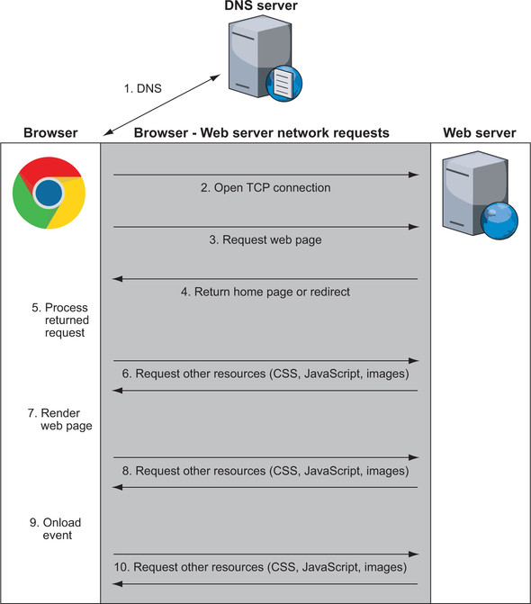
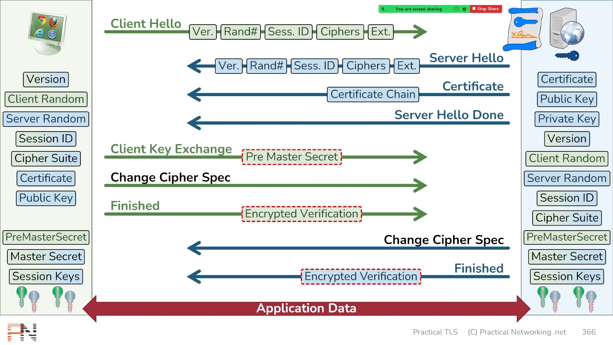
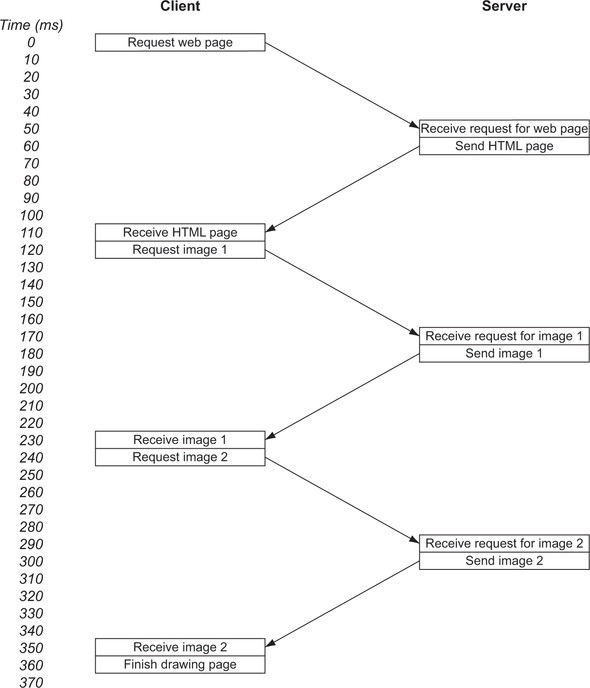

# Hypertext Transfer Protocol (HTTP)

**Hypertext Transfer Protocol (HTTP)** is an _application-layer_ protocol for transmitting hypermedia documents, such as HTML

- HTTP is one of the main technologies used by the _World Wide Web_ (WWW)

The main features of HTTP are:

- Uses **Client-Server model**: Client asks server for resource, server replies

- Based on a **request** and a **response**

- HTTP is **simple** - human-readable text protocol

- HTTP is **extendable** - easy to implement new features (just add headers)

- HTTP is a **stateless protocol**:

  - Meaning that the server does not keep any data (state) between two requests
  - HTTP protocol itself does not store state
  - **Not session less**, HTTP Cookies allow the use of stateful sessions

- **Transport protocol agnostic**: HTTP is often based on _TCP/IP_ layer, it can be used on any reliable transport layer

::: tip Internet
The internet is a collection of public computers through the shared use of the Internet Protocol (IP). It's made up of many services, including the WWW (or the web), email, file sharing, and internet telephony. The web, therefore, is but one part of the internet, though it's the most visible part
:::

## What happens when you browse the web?

1. The browser requests for the real address of [www.google.com](http://www.google.com/) from a Domain Name System (DNS) server

   - DNS might perform multiple steps, hence it is called recursive resolver
   - DNS returns an IP address
   - This IP address can be in an IPv4 or the newer IPv6

2. The browser asks your computer to open a _Transmission Control Protocol (TCP)_ connection over IP to this address on the standard web port (port `80`) or over the standard secure web port (port `443`)

   - IP is used to direct traffic through the internet, but TCP adds stability and retransmissions to make the connection reliable

   - TCP/IP together, they form the backbone of much of the internet

3. When the browser has a connection to the web-server, it can start asking for the website. This step is where HTTP comes in, and the web browser uses HTTP to ask the Google server for the Google home page

   - The actual full URL includes the port and would be [http://www.google.com:80](http://www.google.com/), but if standard ports are being used (`80` for HTTP and `443` for HTTPS), the browser hides the port

   - If non-standard ports are being used, the port is shown. Some systems, particularly in development environments, use port `8080` for HTTP or `8443` for HTTPS, for example

4. The Google server responds with whatever URL you asked for. Typically, what gets sent back from the initial page is the text that makes up the web page in HTML format

   - Instead of an HTML page, however, the response may be an instruction to go to a different location. Google, for example, runs only on HTTPS, so if you go to [http://www.google.com](http://www.google.com/), the response is a special HTTP instruction (usually, a `301` or `302` response code) that redirects to a new location at [https://www.google.com](https://www.google.com/)

   - Similarly, if something goes wrong, you get back an HTTP response code, the best-known of which is the `404` Not Found response code

5. The web browser processes the returned request. Assuming that the returned response is HTML, the browser starts to parse the HTML code and builds in memory the Document Object Model (DOM), which is an internal representation of the page

6. The web browser requests any additional resources it needs. Each of these resources is requested similarly, following steps 1-6, and yes, that includes this step, because those resources may in turn request other resources. The average website isn't as lean as Google and needs 75 resources, often from many domains, so steps 1-6 must be repeated for all of them. This situation is one of the key things that makes web browsing slow and one of the key reasons for _HTTP/2_, the main purpose of which is to make requesting these additional resources more efficient

7. When the browser has enough of the critical resources, it starts to render the page on-screen. Choosing when to start rendering the page is a challenging task and not as simple as it sounds. If the web browser waits until all resources are downloaded, it would take a long time to show web pages, and the web would be an even slower, more frustrating place. But if the web browser starts to render the page too soon, you end up with the page jumping around as more content downloads, which is irritating if you're in the middle of reading an article when the page jumps down. A firm understanding of the technologies that make up the web-especially HTTP and HTML/CSS/JavaScript-can help website owners reduce these annoying jumps while pages are being loaded, but far too many sites don't optimize their pages effectively to prevent these jumps

8. After the initial display of the page, the web browser continues, in the background, to download other resources that the page needs and update the page as it processes them. These resources include non-critical items such as images and advertising tracking scripts. As a result, you often see a web page displayed initially without images (especially on slower connections), with images being filled in as more of them are downloaded

9. When the page is fully loaded, the browser stops the loading icon (a spinning icon on or near the address bar for most browsers) and fires the _`onload` JavaScript_ event, which JavaScript code may use as a sign that the page is ready to perform certain actions

10. At this point, the page is fully loaded, but the browser hasn't stopped sending out requests. We're long past the days when a web page was a page of static information. Many web pages are now feature-rich applications that continually communicate with various servers on the internet to send or load additional content. This content may be user-initiated actions, such as when you type requests in the search bar on Google's home page and instantly see search suggestions without having to click the Search button, or it may be application-driven actions, such as your Facebook or Twitter feed's automatically updating without your having to click a refresh button. These actions often happen in the background and are invisible to you, especially advertising and analytics scripts that track your actions on the site to report analytics to website owners and/or advertising networks



Short version:

1. **Client** asks **DNS Recursive Resolver** to lookup a hostname (`stanford.edu`)

2. **DNS Recursive Resolver** sends DNS query to **Root Nameserver**

   - **Root Nameserver** responds with IP address of **TLD Nameserver** (`.edu`, etc.)

3. **DNS Recursive Resolver** sends DNS query to **TLD Nameserver**

4. **DNS Recursive Resolver** sends DNS query to **Domain Nameserver**

   - **Domain Nameserver** is authoritative, sp replies with server IP address

5. **DNS Recursive Resolver** finally responds to Client, sending server IP address (`171.67.215.200`)

## HTTP Versions

The HTTP Request and Response syntax have been updated in each version

### HTTP/0.9

The first published specification for HTTP was version 0.9, issued in 1991

1. Connection is made over **TCP/IP** or a similar connection-oriented service

2. Optional port or **80** if no port is provided

3. A single line of ASCII text should be sent, consisting of **GET**, the document address (with no spaces), and a carriage return and line feed (the carriage return being optional)

4. Response is a message in HTML format ("a byte stream of ASCII characters")

5. The **connection is closed** after each response is received

6. Hard to distinguish an error response from a satisfactory response

7. Server doesn't store any information about the request, hence it is **stateless**

The only possible command in HTTP/0.9:

```http
GET /page.html↵
```

Where:

- `GET` is an HTTP method
- `/page.html` is the resource that we need

::: tip NOTE
There is no concept of headers in HTTP/0.9 or any other media, such as images
:::

### HTTP/1.0

The HTTP/1.0 RFC is not a formal specification and was published in 1996

1. More request methods: **HEAD** and **POST** were added to the previously defined GET

2. Addition of an optional **HTTP version number** for all messages. HTTP/0.9 is assumed by default to aid in backward compatibility

3. **HTTP headers**, which could be sent with both the request and the response to provide more information about the resource being requested and the response being sent

4. A **3-digit response code** indicating (for example) whether the response was successful. This code also enabled redirect requests, conditional requests, and error status (404)

5. **GET** can send data in the form of query parameters that are specified at the end of a URL, after the **?** character e.g. `https://www.google.com/?q=search+string`

#### Request Syntax

With headers:

```http
GET /page.html HTTP/1.0↵
Header1: Value1↵
Header2: Value2↵
↵
```

And without headers:

```http
GET /page.html HTTP/1.0↵
↵
```

Here we can see some changes to the HTTP/1.0 GET request as compared to HTTP/0.9:

- The first line now contains an optional HTTP _version_ section
- Then an optional HTTP header section followed by two return characters (`↵`)

##### Useful HTTP Request Headers

- `Host`: The domain name of the server (e.g. example.com)
- `User-Agent`: The name of your browser and operating system
- `Referer`: The webpage which led you to this page (misspelled)
- `Cookie`: The cookie server gave you earlier; keeps you logged in
- `Cache-Control`: Specifies if you want a cached response or not
- `If-Modified-Since`: Only send resource if it changed recently
- `Connection`: Control TCP socket (e.g. `keep-alive` or `close`)
- `Accept`: Which type of content we want (e.g. `text/html`)
- `Accept-Encoding`: Encoding algorithms we understand (e.g. `gzip`)
- `Accept-Language`: What language we want (e.g. `es`)

_Example:_

```bash
curl https://twitter.com --header "Accept-Language: kn" --silent | grep JavaScript
```

#### Response Syntax

A typical response from a HTTP/1.0 server:

```http
HTTP/1.0 200 OK
Date: Sun, 27 Sep 2020 13:30:24 GMT
Content-Type: text/html
Server: Apache

<!doctype html>
<html>
<head>
etc.
```

- The first line consists of an HTTP version (HTTP/1.0), a 3-digit [HTTP status code](#http-response-status-codes) (200), and a text description of that status code (OK)

##### Useful HTTP Response Headers

- `Date`: When response was sent
- `Last-Modified`: When content was last modified
- `Cache-Control`: Specifies whether to cache response or not
- `Expires`: Discard response from cache after this date
- `Vary`: List of headers which affect response; used by cache
- `Set-Cookie`: Set a cookie on the client
- `Location`: URL to redirect the client to (used with 3xx responses)
- `Connection`: Control TCP socket (e.g. `keep-alive` or `close`)
- `Content-Type`: Type of content in response (e.g. `text/html`)
- `Content-Encoding`: Encoding of the response (e.g. `gzip`)
- `Content-Language`: Language of the response (e.g. `kn`)
- `Content-Length`: Length of the response in bytes

_Example:_

```bash
curl https://twitter.com --header "Accept-Language: kn" --silent | grep JavaScript
```

### HTTP/1.1

The first HTTP/1.1 specification was published in January 1997, updated Specification in June 1999, and then enhanced for a third time in June 2014

#### Host

`Host` is a **Mandatory header**. The URL provided with the first line of an HTTP request isn't an absolute URL but a relative URL

- Nowadays, many web servers host several sites on the same server (a situation is known as _virtual hosting_), so it's important to tell the server which site you want as well as which relative URL you want on that site

- The host header was implemented to include the full absolute URL

```http
GET / HTTP/1.1
Host: www.google.com
```

> [Conversation over the HTTP host header](https://lists.w3.org/Archives/Public/ietf-http-wg-old/1999SepDec/0014.html)

::: warning NOTE

```http
GET / HTTP/1.1
```

The above request is not according to the HTTP/1.1 specification, this request should be rejected by the server (with a **`400`** response code). Most of the web servers are more forgiving than they should be and have a default host that is returned for such requests
:::

#### Connection

The connection between the server and the client is closed after each request. This created unnecessary delays while requesting multiple resources

Hence, the new `Connection` HTTP header with the value `Keep-Alive` was added, so that the client can ask the server to keep the connection open for additional requests

```http
GET /page.html HTTP/1.0
Connection: Keep-Alive
```

- If the server supports persistent connections, it includes a `Connection: Keep-Alive` header in the response:

```http
HTTP/1.0 200 OK
Date: Sun, 25 Jun 2017 13:30:24 GMT
Connection: Keep-Alive
Content-Type: text/html
Content-Length: 12345
Server: Apache

<!doctype html>
<html>
<head>
etc.
```

- It is difficult to know when the response is completed and when the client sends another request. To overcome this, **`Content-Length` HTTP header** is used to define the length of the response body, and when the entire body is received, the client is free to send another request

- HTTP/1.1 sets **`Connection: Keep-Alive`** by default, hence no need of including it in the header (some clients and servers include this)

- If the server did want to close the connection, it had to explicitly include a **`Connection: close`** HTTP header in the response

```http
HTTP/1.1 200 OK
Date: Sun, 25 Jun 2017 13:30:24 GMT
Connection: close
Content-Type: text/html; charset=UTF-8
Server: Apache

<!doctype html>
<html>
<head>
etc.
Connection closed by foreign host.
```

| HTTP Version | Connection Header | Connection |
| ------------ | ----------------- | ---------- |
| HTTP/1.0     | Not Included      | Closed     |
| HTTP/1.0     | Included          | Kept open  |
| HTTP/1.1     | Both              | Kept open  |

::: tip NOTE
Connection header is supported by many _HTTP/1.0_ servers, even though it wasn't included in the _HTTP/1.0_ specification
:::

HTTP/1.1 added the concept of **pipelining**, it is possible to send several requests over the same persistent connection and get the responses back in order. If a web browser is processing an HTML document, for example, and sees that it needs a CSS file and a JavaScript file, it should be able to send the requests for these files together and get the responses back in order rather than waiting for the first response before sending the second request

```http
GET /style.css HTTP/1.1
Host: www.example.com

GET /script.js HTTP/1.1
Host: www.example.com

HTTP/1.1 200 OK
Date: Sun, 25 Jun 2017 13:30:24 GMT
Content-Type: text/css; charset=UTF-8
Content-Length: 1234
Server: Apache

.style { ... }

HTTP/1.1 200 OK
Date: Sun, 25 Jun 2017 13:30:25 GMT
Content-Type: application/x-javascript; charset=UTF-8
Content-Length: 5678
Server: Apache

Function(){ ... }
```

::: danger IMPORTANT
Support for pipelining in both clients (browsers) and servers is poor

So, HTTP/1.1 is still fundamentally a request-and-response protocol for most implementations. While that one request is being handled, the HTTP connection is blocked from being used for other requests
:::

#### Other New Features

- New methods are `PUT`, `OPTIONS`, and the less-used `CONNECT`, `TRACE`, and `DELETE`
- Better caching methods. These methods allowed the server to instruct the client to store the resource (such as a CSS file) in the browser's cache so it could be reused later if required. The Cache-Control HTTP header introduced in HTTP/1.1 had more options than the Expires header from HTTP/1.0
- HTTP cookies to allow HTTP sessions and move from the stateless protocol
- The introduction of character sets (as shown in some examples in this chapter) and language in HTTP responses
- Proxy support
- Authentication
- New status codes
- Trailing headers

#### HTTP Response Status Codes

Categories of Status Codes:

1. `1xx`: Informational ("Hold on")
2. `2xx`: Success ("Here you go")
3. `3xx`: Redirection ("Go away")
4. `4xx`: Client error ("You messed up")
5. `5xx`: Server error ("I messed up")

- The status codes and descriptions are not present in HTTP/0.9

Here are some of the response codes ([List of all status codes](https://www.iana.org/assignments/http-status-codes/http-status-codes.xhtml)):

| Category              | Value     | Description (Status Message)  | Details                                                                                                                                                                                         |
| --------------------- | --------- | ----------------------------- | ----------------------------------------------------------------------------------------------------------------------------------------------------------------------------------------------- |
| `1xx` (informational) | _`100`_   | Continue                      | Everything so far is OK and that the client should continue with the request or ignore it if it is already finished                                                                             |
|                       | `101`     | Switching Protocols           | The client has asked the server to change protocols and the server has agreed to do so                                                                                                          |
|                       | `102`     | Processing                    | The server has received and is processing the request, but that it does not have a final response yet                                                                                           |
|                       | `103`     | Early Hints                   | Used to return some response headers before final HTTP message                                                                                                                                  |
| `2xx` (successful)    | **`200`** | OK                            | The standard response code for a successful request                                                                                                                                             |
|                       | **`201`** | Created                       | Should be returned for a POST request                                                                                                                                                           |
|                       | _`202`_   | Accepted                      | The request is being processed but hasn't completed processing yet                                                                                                                              |
|                       | **`204`** | No content                    | The request has been accepted and processed, but there's no BODY response to send back                                                                                                          |
|                       | _`206`_   | Partial Content               | The request has succeeded and the body contains the requested ranges of data, as described in the `Range` header of the request (succeeded)                                                     |
| `3xx` (redirection)   | `300`     | Multiple choices              | This code isn't used directly. It explains that the 3xx category implies that the resource is available at one (or more) locations, and the exact response provides more details on where it is |
|                       | _`301`_   | Moved permanently             | The resource has a new parament URL. The Location HTTP response header should provide the new URL of the resource                                                                               |
|                       | `302`     | Moved temporarily             | The resource temporarily resides at a different URL. The Location HTTP response header should provide the new URL of the resource                                                               |
|                       | **`304`** | Not modified                  | The resource has not been modified since last cached. This code is used for conditional responses in which the BODY doesn't need to be sent again                                               |
| `4xx` (client error)  | **`400`** | Bad request                   | The request couldn't be understood and should be changed before resending                                                                                                                       |
|                       | **`401`** | Unauthorized                  | You're not authenticated                                                                                                                                                                        |
|                       | **`403`** | Forbidden                     | You're authenticated, but your credentials don't have access                                                                                                                                    |
|                       | **`404`** | Not found                     | Indicates that the server cannot find the requested resource                                                                                                                                    |
|                       | `429`     | Too Many Requests             | Indicates the user has sent too many requests in a given amount of time ("rate limiting")                                                                                                       |
|                       | `451`     | Unavailable For Legal Reasons | Indicates that the user requested a resource that is not available due to legal reasons, such as a web page for which a legal action has been issued                                            |
| `5xx` (server error)  | **`500`** | Internal server error         | The request couldn't be completed due to a server-side error                                                                                                                                    |
|                       | `501`     | Not implemented               | The server doesn't recognize the request (such as an HTTP method that hasn't yet been implemented)                                                                                              |
|                       | `502`     | Bad gateway                   | The server is acting as a gateway or proxy and received an error from the downstream server                                                                                                     |
|                       | `503`     | Service unavailable           | The server is unable to fulfil the request, perhaps because the server is overloaded or down for maintenance                                                                                    |
|                       | `504`     | Gateway timeout               | The server, while acting as a gateway or proxy, did not get a response in time from the upstream server that it needed in order to complete the request                                         |

::: tip NOTE
**HTTP/1.0 doesn't define any `1xx`** status codes, but does define the category. Some codes such as _(203, 303, 402)_ are not part of HTTP/1.0
:::

### HTTP 2

- Multiplexing
- Stream prioritization
- Binary protocol
- Server push

## HTTPS

HTTP is a plain-text protocol. HTTP messages are unencrypted and are readable by any party

Hence, HTTPS a secure version of HTTP was introduced

**HTTPS** encrypts messages in transit by using the **Transport Layer Security** (TLS) protocol, though it's often known by its **previous incarnation as Secure Sockets Layer** (SSL)

HTTPS adds 3 important concepts to HTTP messages:

1. **Encryption**: Messages can't be read by third parties while in transit

2. **Integrity**: The message hasn't been altered in transit, as the entire encrypted message is digitally signed, and that signature is cryptographically verified before decryption

3. **Authentication**: The server is the one you intended to talk to

### SSL/TLS

SSL/TLS have 3 goals (CIA):

1. Confidentiality:

   - Provided by [Symmetric Encryption](../Application_Security/Cryptography.md#symmetric-encryption)
   - No man in the middle

2. Integrity:

   - Provided by [M.A.C.](../Application_Security/Cryptography.md#hash-based-message-authentication-code-hmac) (Hashing)
   - Data should not be tampered and if tampered, the receiver should know about it and discard it

3. Authentication:

   - Provided by Certificates/PKI

CIA of security is used in any of the secure communication protocol such as TLS, IPsec, SSH, etc.

History of HTTP encryption:

1. SSLv1 was never released outside Netscape

2. SSLv2 and **SSLv3** were released in 1995 and 1996 respectively

   - **SSLv3** was widely used, but in 2014 major vulnerabilities were discovered and support for SSLv3 is **not supported** by browsers

3. SSL was standardized as TLS

4. TLSv1.0 (~SSLv3.1) in 1999, is similar to SSLv3, though not compatible

5. TLSv1.1 and TLSv1.2 were released in 2006 and 2008 respectively

6. **TLSv1.3** was released in 2018 (current standard)

   - TLSv1.0 and TLSv1.1 should not be used (deprecated)

#### TLS Handshake

- What ciphers will be used?
- Secret Key
- Authentication (Public Key)
- Robust against Man in the middle attacks, Replay attacks, Downgrade attacks, etc.

A TLS handshake is the process that kicks off a communication session that uses TLS. During a TLS handshake, the two communicating sides exchange messages to acknowledge each other, verify each other, establish the cryptographic algorithms they will use, and agree on session keys

Cipher suite picks total four protocols, one for Key-Exchange, Authentication, Encryption, and Hashing:

- Example Cipher Suite string representation `TLS_ECDHE_RSA_WITH_AES_128_GCM_SHA256` represents:

  - Elliptic-curve Diffie–Hellman (ECDHE): is a key agreement protocol that allows two parties, each having an Elliptic-curve public-private key pair, to establish a shared secret over an secure channel

  - Rivest–Shamir–Adleman (RSA): is a public-key cryptosystem that is widely used for secure data transmission

  - AES_128_GCM: Algorithm, Key size, and Operation Mode used for encryption

  - SHA256: used for hashing

Basic steps of **TLSv1.2 Handshake** (Total 2 round trips):

1. TCP Handshake

2. Client Hello:

   - **Version**: Highest version of TLS/SSL the Client supports
   - **Random Number** (hash) (_"client random"_): 32 bytes/256 bits
     - Timestamp encoded in first four bytes (optional)
   - **Session ID**: 8 bytes/32 bits
     - `0000...` all 0's in initial Client Hello
   - List of **Cipher Suites** supported by Client
   - **Extensions**: Optional additional features added to TLS/SSL

3. Server Hello (server responds with):

   - **Version**: Highest version of TLS/SSL the Server supports
   - **Random Number** (hash) (_"server random"_): 32 bytes/256 bits
     - Timestamp encoded in first four bytes (optional)
   - **Session ID**: 8 bytes/32 bits
     - Value generated by Server to identity ensuing Session Keys
   - **Cipher Suites** selected by Server
     - If non of TLS version and cipher suite match it sends TLS alert
   - **Extensions**: Optional additional features added to TLS/SSL

4. Certificate (server sends):

   - Server Certificate and Full Certificate Chain
   - Includes Server Public Key

5. Server Hello Done:

   - Indicates server has nothing more to send at this time

6. Client Key Exchange:

   - Establish Mutual Keying Material (i.e., Seed Value)

   - Authentication: Client verifies the server's SSL certificate with the certificate authority that issued it. This confirms that the server is who it says it is, and that the client is interacting with the actual owner of the domain

   - Client generates **Pre-Master-Secret** (Example using RSA):

     - 2 bytes: TLS/SSL Version (optional)
     - 46 bytes: Random

   - Pre-Master-Secret is encrypted using Server's Public Key

     - Server can only decrypt if it has Server Private Key

   - Both parties now have matching Seed Values and hence they both generate all Session Keys:

     - Seed value used to generate Session Keys (Symmetric Keys)

     - Pre-Master-Secret used to derive **Master Secret**

       - Master Secret generated using Pre-Master-Secret + `"master secret"` + Client Random + Server Random

     - Master Secret is used to generate Session Keys, I.V.'s (Client and Server, required by CBC)

       - **Session Keys** generated using Master Secret + `"key expansion"` + Client Random + Server Random

     - Generated Session Keys are:

       - Client Encryption Key
       - Client HMAC Key
       - Server Encryption Key
       - Server HMAC Key

   - In the above section calculations involve a PRF (Pseudo Random Function):

     - PRF is a Hashing algorithm that generates digests at any desired length

   - At this point, both parties have identical Session Keys, but they don't know whether the other has the same keys

     - Rest of the handshake will prove to both parties that the other party has the correct Session Keys

7. Change Cipher Spec (client sends): Indicates Client has everything necessary to speak securely

8. Finished (client sends): Proves to the Serve that Client has correct Session Keys

   - Sends an Encrypted Verification
   - Client calculates Handshake Hash of all Handshake Records seen so far (Steps 2 to 6) (Prevents downgrade attacks)
   - Verification Data (uses PRF)= Master Secret + `"client finished"` + Handshake Hash
   - Verification Data encrypted with Client Session Keys (Encrypted Verification)

9. Change Cipher Spec (server sends): Indicates Server has everything necessary to speak securely

10. Finished (server sends): Proves to the Client that Server has correct Session Keys

    - Generates Encrypted Verification using Server Session Keys similar to Step 8, now including Step 8
    - Verification Data (uses PRF)= Master Secret + `"server finished"` + Handshake Hash

11. Start sending application data securely

```text
┌───────────┐                ┌───────────┐
│  Client  │                │  Server  │
└─────┬─────┘                └─────┬─────┘
      │                            │
      │                            │
      │ ─────────────────────────► │  ──┐
      │ 1. SYN                     │    │
      │                            │    │
      │                            │    │ TCP
      │ ◄───────────────────────── │    │
      │ 3. ACK          2. SYN ACK │  ──┘
      │                            │
      │ -------------------------- │
      │                            │
      │ ─────────────────────────► │  ──┐
      │ 4. ClientHello             │    │
      │                            │    │
      │ ◄───────────────────────── │    │
      │             5. ServerHello │    │
      │                Certificate │    │
      │            ServerHelloDone │    │
      │                            │    │ TLS
      │ ─────────────────────────► │    │
      │ 6. ClientKeyExchange       │    │
      │    ChangeCipherSpec        │    │
      │    Finished                │    │
      │                            │    │
      │ ◄───────────────────────── │    │
      │        7. ChangeCipherSpec │    │
      │           Finished         │  ──┘
```

TLSv1.3 Handshake:

- Total 1 round trip
- TLS 1.3 does not support RSA, nor other cipher suites and parameters that are vulnerable to attack
- It is faster and more secure

Basic steps:

1. Client Hello:

   - Protocol version
   - Client random
   - List of cipher suites
   - It also includes the parameters that will be used for calculating the premaster secret. Essentially, the client is assuming that it knows the server's preferred key exchange method (which, due to the simplified list of cipher suites, it probably does). This cuts down the overall length of the handshake - one of the important differences between TLS 1.3 handshakes and TLS 1.0, 1.1, and 1.2 handshakes

2. Server generates master secret:

   - At this point, the server has received the client random and the client's parameters and cipher suites
   - It already has the server random, since it can generate that on its own. Therefore, the server can create the master secret

3. Server Hello and "Finished":

   - It includes the server's certificate, digital signature, server random, and chosen cipher suite
   - Because it already has the master secret, it also sends a "Finished" message

4. Final steps and client "Finished":

   - Client verifies signature and certificate, generates master secret, and sends "Finished" message

5. Secure symmetric encryption achieved



[TLS Handshake Deep Dive and decryption with Wireshark](https://www.youtube.com/watch?v=25_ftpJ-2ME)

### HTTPS Workings

HTTPS works by using public-key encryption, which allows servers to provide public keys in the form of digital certificates when users first connect. The browser encrypts messages by using this public key, which only the server can decrypt, as only it has the corresponding private key. This system allows us to communicate securely with a website without having to know a shared secret key in advance, which is crucial for a system like the internet, where new websites and users come and go every second of every day

The digital certificates are issued, and digitally signed, by various _certificate authorities (CAs)_ trusted by the browser

- **Post `443`** is used instead of port _80_
- **`https://`** URL scheme is used instead of `http://`
- HTTPS doesn't alter the way HTTP is used in terms of syntax or message format except for the encryption and decryption itself

::: danger Certificates
HTTPS indicates to us that the connection is secure, but does not give any information about the trustworthiness of the server

Benefits of EV or Domain Validated (DV) or Organizational Validated (OV) certificates is highly disputed
:::

- _Telnet_ cannot be used to send HTTPS requests as it dose not handle the encryption and decryption part. So, programs like **OpenSSL** can be used:

```bash
openssl s_client -crlf -connect www.google.com:443 -quiet↵
GET / HTTP/1.1↵
Host: www.google.com↵
↵
```

## Drawbacks of HTTP/1.x

- The internet is built upon HTTP/1.x
- Has been functioning reasonably well for a 20-year-old technology

### Why websites still take time to load even though the internet speed has increased significantly?

- Broadband speeds have increased, hence decreasing the time taken to download the assets required by the website
- As a result websites should load really fast, but that is not the case. Websites still take time to load
- This is due to the way HTTP/1.x works. HTTP was a request and response based protocol
- Each website makes multiple HTTP requests to get the required assets. These requests are synchronous, i.e. the second request is made only after a response is received for the first request
- Thus website loads slowly if there are many requests being made

Let us consider a scenario:

Imagine a simple web page with some text and two images

1. Suppose that a request takes 50ms to reach the web server and the server takes 10ms to respond and the browser takes 10ms to process the response

2. Now the following steps happen when we request for a web page:

   

3. So the total time taken to load the web page was 360ms. Out of which 60ms was spent on processing the requests. And a total of 300ms or 80% of the time, was spent waiting for messages

4. In this scenario, the browser knows that it requires 2 images. So instead of requesting for both the images, the browser ask for image 1 and waits for the response before asking for image 2

5. This is an inefficient process. Some browsers open multiple connections to the servers to overcome the waiting process

6. If the number of assets required by the web page is large then the loading time will increase significantly

- _Latency_ measures how long it takes to send a single message to the server
- _Bandwidth_ measures how much a user can download in those messages
- Latency is the biggest problem of the internet rather than the bandwidth
- Because of increased bandwidths, the size of a typical web page has increased without harming the loading time significantly
- On the other hand, latency has not improved that much. Thus preventing the increase in requests made by the web page without effecting loading time severely

### Pipelining for HTTP/1.1

- HTTP/1.1 tired to introduce _pipelining_, which allows concurrent requests to be sent before responses are received so that requests can be sent parallel

- The initial HTML still needs to be requested separately, the rest of the requests can be sent concurrently. Thus shaving off 100ms loading time in the previous example

- Pipelining should have brought huge improvements to HTTP performance, but for many reasons, it was difficult to implement, easy to break, _head-of-line_ (HOL) blocking, and not well supported by web browsers or web servers

::: danger SUPPORT
Pipelining was rarely used
:::

### Domain Sharding

- Multiple connections are opened to overcome the issues with pipelining. About 6 connections are opened per domain

- Websites can serve static contents through sub-domains, thus allowing further 6 more connections per sub-domain. This technique is known as _domain sharding_

- Domain sharding helps to increase performance, reduce HTTP headers such as cookies

Disadvantages:

- Extra memory and processing is required to maintain multiple connections over TCP
- TCP is significantly inefficient

## HTTP Compression

The HTTP specification allows the server to compress responses if the client supports compression

- It reduces network traffic and increases response speed
- If the client supports compression, it will send along the type of compression it can accept:

  ```http
  <!-- CLIENT -->

  GET /foo
  Accept-Encoding: gzip


  <!-- SERVER -->

  200 OK
  Content-Encoding: gzip
  <!-- gzipped payload -->
  ```

## HTTP Caching

Caching involves both the client and the server

- Modern default: **Don't cache, validate!**

  - Use a [CDN](https://web.dev/content-delivery-networks/) to get close to your users

  - Use `ETag` validation to save bytes

- Opt-in to caching as needed:

  - Some assets are immutable (hashes)

- Using Service Worker

  - Service Workers only run on the 2nd load: and give you a whole extra cache!
  - Common pattern: Use Workbox to inject a manifest
  - Use a runtime cache for other stuff
  - Network or Cache First?

    - By going Network-First, just fetch new HTML
    - HTML contains updated hashed asset links: cache misses, but no danger of stale assets
    - Network-first sites rarely need a reload button

    - Cache First, you want to load fast at all costs!
    - But it creates a UX problem, needs reload UX. Obtrusive/confusing (button)
    - New Web Periodic Background Synchronization API can be used (less support)

- If no caching strategy is explicitly specified, browsers will use **Heuristic Freshness** (the cache can guess a freshness lifetime)

  - Without instructions, assets may expire at different times

The server can let the clients know that responses are cacheable in few ways:

- Cache Headers:

  - The `Cache-Control` header is the master knob for caching, it holds directives (instructions) - in both requests and responses

    - `max-age=n`: how long asset is valid for, in seconds
    - `must-revalidate`: cannot use after `max-age` (optional)
    - `public`/`private`: cached by CDNs or just you
    - `no-store`: don't cache this asset, good for logged in stuff
    - `no-cache`: cache it, but the response must be validated with the origin server before each reuse
    - `immutable`: this file won't change, really

      - Chrome (after 2017) by default behaves as if `immutable` is present
      - Entry points (such as `index.html` files) shouldn't be marked as `immutable`
      - Cache-busting using version/hashes in URLs of static resources:

        - Query strings are marginally safer, as if an old entrypoint refers to `script.js?v=abcd` even if that hash is out of date, they'll still load something

      ```html
      <!-- using query string is better -->
      <script src=https://example.com/react.js?v=18.2></script>

      <!-- or using hash in the filename -->
      <script src=https://example.com/react.18.2.js></script>
      ```

      ```http
      Cache-Control: public, max-age=604800, immutable
      ```

    - Good defaults:

      - `Cache-Control: max-age=0, must-revalidate, public` (always validate)
      - Great CDNs will invalidate edge caches when you redeploy
        - Depending on CDN, you might also have to set `s-maxage` (similar to `max-age` but for shared caches, and they will ignore `max-age` when it is present)

    - _Example:_

      - `Cache-Control: max-age=31536000, immutable` (fresh for 1 year = forever as per spec)
      - `Cache-Control: max-age=100, must-revalidate` (fresh for 100 seconds)
      - `Cache-Control: no-cache, no-store` (**never cache**)

  - Previously the `Expires` header was also be used to let the client know how long to cache a request:

    - `Expires: Mon, 06 Nov 2022 07:42:00 GMT`

  - If a response includes both `Cache-Control` and `Expires`, **`Cache-Control` takes priority** in determining whether cache data is fresh

How clients determine to serve cached response?

- If content is still fresh (based on header value), then return cached content. No call to the server is made

- If content is stale (not fresh), then check with the server to see if the cached copy is still valid

  - Validation headers are included on the outgoing request which lets the server know which version of the resource the client has in the cache

  - If the server determines that the resource still hasn't changed, it can send back `304 Not Modified` status and updated cache headers `Cache-Control` with new freshness info

  - `304` response dose not include a response body

1. Validation with `Last-Modified` header:

   - Caching began in 1999

   ```http
   <!-- INITIAL SERVER RESPONSE -->

   200 OK
   Cache-Control: max-age=100
   Last-Modified: Fri, 31 Dec 1999 11:49:59 GMT

   <!-- CLIENT REQUEST TO CHECK CACHE VALIDITY -->

   GET /rooms/ref-data
   If-Modified-Since: Fri, 31 Dec 1999 11:49:59 GMT

   <!-- SERVER RESPONSE IF CACHE IS VALID -->

   304 Not Modified
   Cache-Control: max-age=100
   Last-Modified: Fri, 31 Dec 1999 11:49:59 GMT
   ```

2. Validation with `Etag` header (better):

   - `ETag`: is a fingerprint or hash that uniquely identifies this version of a resource

   - If cache is stale, new `ETag` value is sent to the client

   - **`ETag` validation is stronger and more accurate** than validation with `Last-Modified` because `Last-Modified` is only accurate down to a second of resolution whereas the `ETag` fingerprint will change anytime a resource is modified

   - `ETag` takes precedence if both are used

   - If `ETag` matches, server will respond with `304 Not Modified` status

   - Some diminishing returns for small files, as server call needs to happen for validation

   ```http
   <!-- INITIAL SERVER RESPONSE -->

   200 OK
   Cache-Control: max-age=100
   Etag: "88dk35h"

   <!-- CLIENT REQUEST TO CHECK CACHE VALIDITY -->

   GET /rooms/ref-data
   If-None-Match: "88dk35h"

   <!-- SERVER RESPONSE IF CACHE IS VALID -->

   304 Not Modified
   Cache-Control: max-age=100
   Etag: "88dk35h"
   ```

Downsides:

- One validation might beget another, and so on: Critical Request Chains

  - Parallel fetches (e.g., lots of images) aren't an issue: HTTP/2+ solves this

- Every small file needs validation

## Authentication and Authorization

Send and receive **Authentication and Authorization over HTTPS**

- Authentication: Checking are the users who they say they are?

- Authorization: Checking is the user allowed to do this?

### Authentication

Authorization Header Format: Used for Authentication (not Authorization)

```http
GET /profile
Authorization: Scheme value...
```

- Servers responds back with status code `401 Unauthorized` if authentication fails

Authentication Schemes:

1. Basic: username/password (or API key/secret)

   - Raw credentials are sent, which can be extremely (always use HTTPS)

2. Bearer: tokens issued by the server

3. Digest: (less common) A hash is computed from the client's credentials and some other pieces of the request, like headers, time-stamp, request payload, etc.. Some extra security

What schema to choose depends upon:

- The target audience
- What credentials will they use?

| Developers or Machines                              | End User Applications                                        |
| --------------------------------------------------- | ------------------------------------------------------------ |
| Machine to Machine or Service to Service connection | Web sites or Apps where user can enter username and password |
| API keys                                            | -                                                            |
| HTTP Basic (if not worried about security)          | -                                                            |
| OpenID Connect client credentials (better security) | OpenID Connect resource owner password                       |
| Digest authentication (hard to implement)           | Digest authentication (hard to implement)                    |

#### OpenID Connect

OpenID Connect resource owner password flow:

- Client sends user's credentials (usually username/password) to the server

- If credentials are good, the server creates an access token and sends it back to the client

- The client can use that access token instead of the raw credentials to make authenticated requests to the API

- The token is placed in the Authorization header with a _Bearer_ scheme

The OpenID Connect client credentials flow is very similar except a client would exchange an API key in secret instead of a username and password for a token

## HTTP Security

### DNS Hijacking

- Attacker changes DNS records of target to point to own IP address
- All site visitors are directed to attacker's web server
- Motivation

  - Phishing
  - Revenue through ads, cryptocurrency mining, etc.

#### How do they do it?

- Malware changes user's local DNS settings: like the `hosts` file
- Hacked recursive DNS resolver
- Hacked router
- Hacked DNS Nameserver
- Compromised user at DNS provider
- TLS verification can be completed using [Let's Encrypt](https://letsencrypt.org/) that says this server is legit

#### DNS Privacy

- Queries are in plaintext
- ISPs have been known to sell this data

- **DNS-over-HTTPS**

::: tip DNS SETTING
Consider switching your DNS settings to Cloudflare (**`1.1.1.1`**) or another provider with a good privacy policy
:::

## Tools

There are many tools that can be used to create a TCP/IP connection, hence the same tools can be used to send a HTTP request

Some of the tools are:

1. **Telnet**: It opens a TCP/IP connection to a server

   ```bash
   printf 'HEAD / HTTP/1.1\r\nHost: en.wikipedia.org\r\n\r\n' | nc en.wikipedia.org 80
   ```

   - `printf` - Similar to `cat` but smarter
   - `nc` - netCat is used to talk to internet

2. **Openssl**: Can be used to for HTTPS connection

::: tip Warning
HTTP is not based on Ping. Ping is much simpler than HTTP
:::

## HTTP Proxy Servers

- Can cache content
- Can block content (e.g. malware, adult content)
- Can modify content
- Can sit in front of many servers ("reverse proxy")

## References

- [URI - Specification](https://tools.ietf.org/html/rfc1630)
- [HTTP-Core Github](https://github.com/httpwg/http-core)
