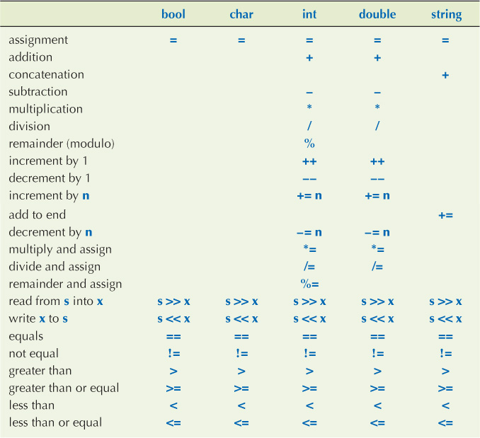

# C/C++ Concepts

To start working with C/C++ you need to install few application in your system, such as IDE's or Text Editors, Compilers etc.

You can use any IDE or Text editor, some of the are listed below:

For Windows (uses [MinGW Compiler](https://osdn.net/projects/mingw/)):

- [Vim](https://www.vim.org/download.php): Text editor or [Neovim](https://neovim.io/): Vim-based text editor
- [Visual Studio](https://visualstudio.microsoft.com/)
- [Visual Studio Code](https://code.visualstudio.com/): Text editor
- [Code::Blocks](http://www.codeblocks.org/downloads/binaries/)
- [Dev-Cpp](https://github.com/Embarcadero/Dev-Cpp/releases/tag/v6.3): Download the **with Mingw/GCC** version so that compiler will also be included

_Dev-Cpp Setup:_

Make the below changes in **Tools** --> **Compiler Options**:

1. In the **Compiler** section, tick mark **Add the following commands when calling compiler:** and add `-g` in the text available below. This helps while debugging the code.

2. Now, in **Programs** section, append `-std=c++99` to **gcc:** and **g++:** like `gcc.exe -std=c++11` and `g++.exe -std=c++11`. To use the latest C++ 11 standards.

## Memory

The main memory can divided into:

1. Heap:

2. Stack:

3. Code Section:

_Example:_

```c
int main()
{
    int A[5];
    int B[5]={2,4,6,8,10};
    int i;
    for(i=0;i<5;i++)
    {
        printf("%d", B[i]);
    }
}
// ARRAYS A AND B WILL APPEAR IN THE STACK AFTER DECLARATION.
```

## Types and objects

- A _type_ defines a **set of possible values and a set of operations (for an object)**.
- An _object_ is **some memory that holds a value of a given type**.
- A _value_ is a **set of bits in memory interpreted according to a type**.
- A _variable_ is a **named object**.
- A _declaration_ is a statement that **introduces an identifier (name) and describes its type, be it a type, object or function**. The compiler uses this to reference that identifier and dose not set aside any memory for it.

  ```cpp
  extern int bar;
  extern int g(int, int);
  double f(int, double);          // extern can be omitted for function declarations
  class foo;                      // no extern allowed for type declarations

  double f(int, double);          // in C/C++ an identifier can be declared as often as you want
  double f(int, double);
  extern double f(int, double);   // the same as the two above
  extern double f(int, double);
  ```

- A _definition_ actually instantiates/implements the identifier, the compiler asks memory manager to **set aside memory for that object or function**. You can only define exactly once.

  ```cpp
  int bar;
  int g(int lhs, int rhs) {return lhs*rhs;}
  double f(int i, double d) {return i+d;}
  class foo {};
  ```

::: tip NOTE
If something is declared but not defined, then the linker doesn't know what to link references to and complains about a missing symbols. If you define something more than once, then the linker doesn't know which of the definitions to link references to and complains about duplicated symbols.
:::

**Operations on data types**:



## Struct (Structure)

_Definition:_ It's a **physically grouped list of dissimilar data items under one name in a block of memory**, allowing the different data items to be **accessed via a single pointer**. It's used for defining user-defined data types, apart from the primitive data types.

- Group of related data items
- `struct` is the **keyword** used to define a structure.
- `.` (dot operator) is used to **access the members of the structure**
- Its size will the **sum of sizes consumed by all of its elements**
- **Structure Padding** is used to allocate memory for a structure

_Example:_ Define a `struct` called _Rectangle_

```c
// DEFINITION
struct Rectangle
{
  int length;
  int breadth;
} r1, r2; // GLOBAL STRUCT VARIABLES

int main()
{
  // DECLARATION (MEMORY IS ALLOCATED)
  struct Rectangle r;
  struct Rectangle r1={10,5};

  // INITIALISATION
  r.length=25;
  printf("Area of the Rectangle is %d", r.length * r.breadth);
}
```

```c
struct Card
{
  int face;
  int shape;
  int color;
};

int main()
{
  struct Card deck[52]={{1,0,0}, {0,0,1}, .... };
  deck[0].face=2;
}
```

_In C++:_

```cpp
int main()
{
  Rectangle r; // IN C++ NO NEED TO PROVIDE struct KEYWORK

  struct Rectangle r1={10,5};
}
```

::: tip NOTE
_C_ structs do not have member functions. _C++_ allows struct to have member functions and by default all members are public as compared to class where by default all members are private.
:::

## Pointers

_Definition:_ Pointer is **an address variable** that is meant for **storing the address of another variable**.

- The size of a pointer will always be equal to size the of its type.

Pointers are used for:

- **Accessing heap memory**. The program will not automatically access the heap. Heap memory is external to the program.
- Accessing resources, such as files, keyboard, monitor, etc.:

  - Like access files, files are stored in hard disks and are external to the program. File pointers are used to access these files.
  - Similarly to interact with any external device we use the pointer.

- Functions use Pointers as parameters while using call by reference method.

_Example:_

```c
int main()
{
    // data variable
    int a=10;

    // pointer variable
    int *p;

    // save address of `a`
    p=&a;

    // print data present in `a`
    printf("%d", a);
    printf("%d", *p); // also know as dereferencing
}
```

Array variable actually points to the first element of the array:

```c
int main()
{
    int A[5]={2,4,6,8,10};
    int *p;

    // A ITSELF POINTS TO THE FIRST ELEMENT OF THE ARRAY
    p=A;

    printf("%d", *p); // 2
    printf("%d", *A); // 2

}
```

::: tip NOTE
Pointers consume the same amount of memory (8 bit) irrespective of the type of pointer
:::

**Accessing heap memory**:

- In C `malloc` is used to get memory in heap. Its present in `<stdlib.h>` and takes size as a parameter.
- `malloc` returns a `void` pointer (generic pointer), so we have to type-caste it and say it's an `integer` pointer.
- We need to **free the memory allocated to the variables** after they are no more required using `free()` in C and `delete` in C++
- **Heap memory must be de-allocated**

_Example:_

```c
// REQUIRED FOR malloc
#include<stdlib.h>
int main()
{
    int *p;
    p=(int *)malloc(5 * sizeof(int));
    // TYPE-CASTE AS malloc RETURNS A void POINTER, malloc WILL NOW PROVIDE MEMORY FOR
    // AN ARRAY OF LENGTH 5 AND EACH ELEMENT OF SIZE INT

    free(p); // CLEARING MEMORY ALLOCATED TO p
}
```

In C++:

```cpp
int main()
{
    int *p;
    p=new int[5]; // SIMILAR TO USING malloc

    delete [] p; // CLEARING MEMORY ALLOCATED TO p
    // ADD EMPTY [] AS p IS POINTING TO AN ARRAY
}
```

Pointer to a [Structure](#struct-structure):

_Example:_

```c
struct Rectangle
{
    int length;
    int breadth;
};

int main()
{
    struct Rectangle r={10,5};
    struct Rectangle *p=&r;

    r.length=15;

    (*p).breadth=25;    // *p IS ENCLOSED INSIDE A BRACKET BECAUSE `.` HAS HIGHER PRIORITY THAN `*`
    p->length=25;       // ALTERNATIVE METHOD

    printf("%d %d\n", r.length, r.breadth);         // 25 25
    printf("%d %d\n", (*p).length, (*p).breadth);   // 25 25
    printf("%d %d\n", p->length, p->breadth);       // 25 25
}
```

Dynamic allocation of Pointer (in heap memory):

_Example:_

```c
// struct FROM THE ABOVE EXAMPLE
int main()
{
    struct Rectangle *p;

    p=(struct Rectangle *)malloc(sizeof(struct Rectangle));

    p->length=22;
    p->breadth=10;
}
```

- Void Pointer: Type-less memory

  ```c
  int main()
  {
    int a=4;
    int *pA = &a;

    printf("%d\n", *pA);

    void *vA = &a;

    printf("%d\n", *vA); // Error
  }
  ```

## Reference

_Definition:_ An **alias given to a variable**

- Must be **initialized during declaration**
- While referencing **both the variable and its reference have the same address**

_Example:_

```cpp
int main()
{
    int a=10;
    int &r=a;
    // r IS REFERRING TO a

    cout<<a; // 10
    r++;
    cout<<r; // 11
    cout<<a; // 11
}
```

::: danger NOTE
Reference is not a part of the C language.
:::

## Functions

_Definition:_ A function is **a named sequence of statements**. A function can return a result (also called a _return value_).

> Also called _subroutine_, _modules_, _procedures_

_Example:_

```c
// ADDITION FUNCTION
int add(int a, int b) // THIS LINE IS KNOWN AS THE PROTOTYPE OR SIGNATURE OF THE FUNCTION
{
    // DECLARATION AND DEFINITION OF THE FUNCTION
    int c;

    // int a AND b ARE KNOWN AS FORMAL PARAMETERS
    c = a + b;
    return(c);
}

// MAIN FUNCTION
int main()
{
    int x, y, z;
    x = 10;
    y = 5;

    // INVOCATION OF THE FUNCTION
    y = add(x, y); // HERE int z AND x ARE KNOWN AS ACTUAL PARAMETERS

    printf("Sum is %d", y);
}
```

### Parameter Passing

There are three ways of passing the parameters to a function.

1. _Pass/Call by Value:_ In pass by value, **changes in formal parameters do not reflect in the actual parameters**. Refer to the above examples.

2. _Pass/Call by Address:_ In pass by address, **changes in formal parameters reflect in actual parameters**.

   _Example:_

   ```c
   void swap(int *x, int *y) // TO USE VARIABLE ADDRESS, DEFINE POINTERS
   {
       int temp;
       temp=*x;
       *x=*y;
       *y=temp;
   }

   int main()
   {
       int a;
       int b;
       swap(&a, &b); // PASS THE VARIABLE ADDRESS NOT THE VALUE
       printf("A == %d, B == %d", a, b);
   }
   ```

3. _Pass/Call by Reference_: In pass by reference also, **changes in formal parameters reflect in actual parameters**. Present **only in C++**.

   _Example:_

   ```cpp
   void swap(int &x, int &y) // USING & WE REFERENCE THE VARIABLES a AND b
   {
       int temp;
       temp=*x;
       *x=*y;
       *y=temp;
   }

   int main()
   {
       int a;
       int b;
       swap(a, b); // NO CHANGES
       printf("A == %d, B == %d", a, b);
   }
   ```

::: tip NOTE
Pass by Reference should be used very carefully as it converts the modular code into monolithic code.
:::

_Arrays as Parameters:_

- Arrays **cannot be passed by value**, they are **passed by address**.

  _Example:_

  ```c
  void fun(int A[], int n) // HERE A[] IS A POINTER TO AN ARRAY, int *A IS THE SAME AS int A[]
  {
      int i;
      for(i=0; i<n; i++)
      {
          printf("%d", A[i]);
      }
  }

  int main()
  {
      int A[5] = {1,2,3,4,5};
      fun(A, 5);
  }
  ```

  Function that returns a Pointer:

  _Example:_

  ```c
  int [] fun(int n)
  {
      int *p;
      p = (int *)malloc(n * sizeof(int));
      return(p);
  }

  int main()
  {
      int *A;
      A = fun(5);
  }
  ```

Structure as parameter:

- Pass/Call by Value:

  _Example:_

  ```c
  struct Rectangle
  {
      int length;
      int breadth;
  }

  int area(struct Rectangle r1)
  {
      return r1.length * r1.breath;
  }

  int main()
  {
      struct Rectangle r = {1, 2};
      printf("Area of the Rectangle is %d", area(r));
  }
  ```

- Pass/Call by Address:

  _Example:_

  ```c
  struct Rectangle
  {
      int length;
      int breadth;
  }

  int changeLength(struct Rectangle *p, int l)
  {
      p->length = l;
  }

  int main()
  {
      struct Rectangle r = {1, 2};
      changeLength(&r, 20);
  }
  ```

::: tip NOTE
Even when a `struct` has an array member, it can be passed by value even though array alone cannot be passed by value.
:::

::: warning

- Confirm if true or false: C does not have any built-in data structures.
- As part of the code activation record of the function, all the variables are created in the stack.

:::

## Structure of the Code

1. In _C_, `main()` function **should only have variable declarations and function calls.**

   These functions will be responsible for initialization, mutation, etc.

   The structure is usually maintained as _structs_ and _functions_ related to them.

   _Example:_

   ```c
   struct Rectangle
   {
       int length;
       int breadth;
   }

   void initialize(struct Rectangle *r, int l, int b)
   {
       r->length = l;
       r->breadth = b;
   }

   int area(struct Rectangle r)
   {
       return r.length * r.breadth;
   }

   void changeLength(struct Rectangle *r1, int l)
   {
       r->length = l;
   }

   int main()
   {
       struct Rectangle r;

       initialize(&r, 10, 5);
       printf("Area of the Rectangle is %d", area(r));
       changeLength(&r, 20);
   }
   ```

2. Similarly in _C++_, OOP's concepts are used to organize the code.

   All the **variables and functions related to them are grouped together as a class**.

   _Example:_

   ```cpp
   class Rectangle
    {
        int length;
        int breadth;

    public:
        // INSTEAD OF INITIALIZE FUNCTION WE USE A constructor FOR INITIALIZATION
        Rectangle(int l, int b)
        {
            length = l;
            breadth = b;
        }

        int area()
        {
            return length * breadth;
        }

        void changeLength(int l)
        {
            length = l;
        }
    };

    int main()
    {
        Rectangle r(10, 5);

        cout << "Area of the Rectangle is " << r.area() << endl;

        r.changeLength(20);

        cout << "Area of the Rectangle is " << r.area() << endl;

        return 0;
    }
   ```

   _Example:_

   ```cpp
   #include<iostream> // .h DEPENDS ON COMPILER (CHECK)

   using namespace std; // IF ONLY iostream IS USED

   class Rectangle
   {
       private:
           int length;
           int breadth;

       public:
           // DEFAULT CONSTRUCTOR
           Rectangle()
           {
               length = 1;
               breadth = 1;
           }

           // PARAMETERIZED CONSTRUCT (USING CONSTRUCTOR OVERLOADING)
           Rectangle(int l, int b); // PROTOTYPE OR SIGNATURE OF THE FUNCTION

           // BELOW TWO FUNCTIONS ARE FACILITATORS WHICH PERFORM SOME
           // OPERATIONS ON DATA MEMBERS
           int area();
           int perimeter();

           // THIS IS accessor/getter (get()) FUNCTION
           int getLength()
           {
               return length;
           }

           // THIS IS mutator/setter (set()) FUNCTION
           void setLength(int l)
           {
               length = l;
           }

           // DESTRUCTOR (CALL WHENEVER DYNAMIC MEMORY IS ALLOCATED BY THE CLASS)
           ~Rectangle();
   };

   Rectangle::Rectangle(int l, int b)
   {
       length = l;
       breadth = b;
   }

   int Rectangle::area()
   {
       return length * breadth;
   }

   int Rectangle::perimeter()
   {
       return 2 * (length + breadth);
   }

   Rectangle::~Rectangle()
   {
       // FREE THE DYNAMICALLY ALLOCATED MEMORY
   }

   int main()
   {
       Rectangle r(10, 5);
       cout<<r.area();
       cout<<r.perimeter();
       r.setLength(20);
       cout<<r.getLength();

       // NOW DESTRUCTOR WILL AUTOMATICALLY CALLED
       // WHEN THE OBJECT GOES OUTSIDE THE SCOPE
   }
   ```

3. C++ program supports _generic (template) functions_ and _generic(template) classes_.

   ```cpp
   template <class T>
   class Arithmetic
   {
       private:
           T a;
           T b;

       public:
           Arithmetic(T a, T b);
           T add();
           T sub();
   };

   template <class T>
   Arithmetic<T>::Arithmetic(T a, T b)
   {
       // THIS REFERS TO CLASS MEMBER VARIABLES NOT THE FUNCTION VARIABLES
       this->a = a;
       this->b = b;
   }

   template <class T>
   T Arithmetic<T>::add()
   {
       T c;
       c = a + b;
       return c;
   }

   template <class T>
   T Arithmetic<T>::sub()
   {
       T c;
       c = a - b;
       return c;
   }

   int main()
   {
       Arithmetic<int> ar(10, 5);
       cout<<ar.add();

       Arithmetic<double> ar1(1.5, 2.3);
       cout<<ar1.add();
   }
   ```
