# ASP.NET Framework

## Overview

ASP.NET Framework is an open-source, server-side web-application framework.

## Model-View-Controller

Model-View-Controller (MVC) is a software design pattern commonly used for developing user interfaces that divides the related program logic into three interconnected elements.



### Model

Model represents the data and business logic.

- A model is a class with properties.

- To add model: `Right-Click on Models --> Add --> Class --> FilenameModel.cs`

  ```csharp
  // CustomerModel.cs
  public class CustomerModel
  {
      public string Name { get; set; }
      public int Age { get; set; } = 0;
      public bool IsAlive { get; set; } = true; // sets default value
   }
  ```

### View

View is the user interface.

- **Views is divided into layout and templates.**
- The _Shared_ folder in _Views_ contains _\_Layout.cshtml_ (ref. [CSHTML File](#cshtml))

### Controller

Controller handles the user request. User interacts with View, which in-turn raises appropriate URL request, this request will be handled by a controller. The Controller renders View with the model data as a response.

- The controller returns views.
- Default controller in ASP.NET is _HomeController.cs_
- Controller class inherits from System.Web.Mvc.Controller
- Each public method in a controller is known as an _action method_.
- To add controller: `Right-Click on Controllers --> Add --> Controller --> MVC 5 ... Empty --> FilenameController.cs`

  This automatically creates a empty folder called _FilenameController_ in _Views_.

  ```csharp
  // CustomerController.cs
  public class CustomerController : Controller
  {
      // GET: Customer
      public ActionResult Index()
      {
          return View();
      }
  }
  ```

- To add View inside this new folder: `Right-Click on method name (Index()) --> Add View`

- The first part in controller name ( i.e. _Home_ in _HomeController_) is a folder inside _Views_ folder, which intern contains views.

  

## Routing

Routes URL to pages.

- Routing file (_RouteConfig.cs_) resides in the _App_Start_ folder.

## Bundling

## CSHTML

## Razor Syntax

## NuGet (.NET Package Manager)

## Error

```csharp
// Web.config
<system.web>
  <customErrors mode="RemoteOnly"></customErrors>
```

## Web API

Controller inherit from `ApiController`

- `HttpResponseMessage`:

  - _Example:_

    ```csharp
    public class StudentsController : ApiController
    {
        public HttpResponseMessage Get()
        {
            return Request.CreateResponse(HttpStatusCode.OK, students);
        }

        public HttpResponseMessage Get(int id)
        {
            var student = students.FirstOrDefault(s => s.Id == id);

            if(student == null)
            {
                return Request.CreateErrorResponse(HttpStatusCode.NotFound, "Student Not Found");
            }

            return Request.CreateResponse(HttpStatusCode.OK, student);
        }
    }
    ```

- `IHttpActionResult`:

  - New introduced in Web API 2

  - Clean Code

  - Simpler Unit Testing

  - _Example:_

    ```csharp
    public class StudentsController : ApiController
    {
        public IHttpActionResult Get()
        {
            return Ok(students);
        }

        public IHttpActionResult Get(int id)
        {
            var student = students.FirstOrDefault(s => s.Id == id);

            if(student == null)
            {
                // return NotFound();
                return Content(HttpStatusCode.NotFound, "Student Not Found");
            }

            return Ok(student);
        }
    }
    ```
