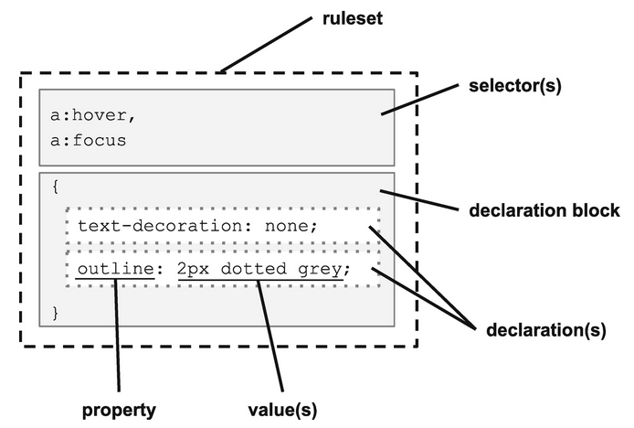

# CSS

Cascading Style Sheets (CSS) is a **style sheet language** used to describing the presentation of a document written in HTML or XML.

- It is one of the three building block any web application (**[HTML](../HTML)**, **CSS**, and **[JavaScript](../JavaScript)**).
- CSS is a declarative language.

## Usage

For styling the HTML document, we can add CSS in two ways:

1. **Inline styles**: The CSS is directly written in the HTML document as an attribute of the HTML element.

   ```html
   <p style="color: red; font-size: 20px;">This is my first paragraph.</p>
   ```

2. **Internal stylesheet**: The CSS is written inside the `<style>` element in theHTML document.

   ```html
   <head>
     <style>
       p {
         color: red;
         font-size: 20px;
       }
     </style>
   </head>
   ```

3. **External stylesheet**: The CSS is written in a separate file, which is then referenced by the HTML document through the use of `<link>` element. The external file has a file extension as `.css`.

   - CSS inside external file, like `styles.css`:

   ```css
   p {
     color: red;
     font-size: 20px;
   }
   ```

   - Linking the external style sheet inside the HTML document:

   ```html
   <head>
     <link rel="stylesheet" href="./index.css" />
   </head>
   ```

## Syntax



The basic building blocks are:

- The **property** which is an identifier, that is a human-readable name, that defines which feature is considered.

- The **value** which describe how the feature must be handled by the engine. Each property has a set of valid values, defined by a formal grammar, as well as a semantic meaning, implemented by the browser engine.

## Selectors

This is the HTML element name at the start of the ruleset. It defines the element(s) to be styled.

1. **Universal selector** - `*`: Selector that matches every element on the page.

   ```css
   * {
     box-sizing: border-box;
     padding: 0;
     margin: 0;
   }
   ```

2. **(Element or Tag or Type) Selector**: Selecting an element using the tag name.

   ```css
   a {
     text-decoration: none;
   }
   ```

3. **Class Selector**: Selecting an element using its class names assigned to its class attribute. Class names have to be prefixed with a dot `.` and as HTML element can have multiple classes, multiple class selectors may be combined.

   ```css
   .invisible {
     visibility: hidden;
   }
   ```

4. **ID Selector**: Selecting an element using its ID assigned to its id attribute. As all ids inside a HTML are unique, there should not be duplicate ID selectors.

   ```css
   #ok {
     font-size: 1.5rem;
     font-weight: bold;
   }
   ```

5. **[Pseudo-Class Selector](#pseudo-classes)**: Selecting an element, but only when in the specified state. (For example, when a cursor hovers over a link change the color.).

   ```css
   a:hover {
     color: red;
   }
   ```

6. **Attribute Selector**: Selecting an element based upon one of its attributes. This selector uses square brackets to contain the attribute match and may be optionally combined with a type selector.

   ```css
   a[target="_blank"] {
     background-color: yellow;
   }
   ```

   ::: tip NOTE

   Because class and ID are both HTML attributes, the class and ID selectors have attribute selector equivalents.

   | Type            | Basic Selector | Attribute Selector   |
   | :-------------- | :------------- | :------------------- |
   | Select by ID    | `#contactForm` | `[id=contactForm]`   |
   | Select by Class | `.outline`     | `[class~="outline"]` |

   :::

### Combinators

Combinators help in combing different selectors. They also provide a hierarchical context based upon the element's relationship within the DOM:

| Name             | Combinator  | Example         | Description                                                                         |
| :--------------- | :---------- | :-------------- | :---------------------------------------------------------------------------------- |
| Descendant       | " " (space) | `nav a`         | All anchor tags inside of a `<nav>` element                                         |
| Child            | ">"         | `nav > ul > li` | First list items inside a navigation list, ignoring any items after the first level |
| Sibling          | "~"         | `p ~ p`         | All paragraphs (after the first) that share the same parent element                 |
| Adjacent Sibling | "+"         | `h2 + p`        | All paragraphs that immediately follow an `<h2>` tag on the same hierarchy          |

### Pseudo Elements

Pseudo-Element is a keyword added to a selector that lets you style a specific part of the selected element(s):

```css
/* The first line of every <p> element. */
p::first-line {
  color: blue;
  text-transform: uppercase;
}
```

List of Pseudo Elements:

- `::first-letter`: Select the first letter of the element.
- `::first-line`: Select the first visible line of the element.
- `::before`: Select or Add content before the first child of the element.
- `::after`: Select or Add content after the last child of the element.
- `::placeholder`: represents the placeholder text in an `<input>` or `<textarea>` element.
- `::backdrop`:
- `::selection`: Apply styles to the part of a document that has been highlighted by the user (such as clicking and dragging the mouse across text).

::: warning NOTE

The CSS specification calls for a two-colon prefix before a pseudo element, such as `::after`. However, most browsers support pseudo elements with just a single colon (`:after`) without throwing an error.

Best practice is to use two-colon prefix for two reasons:

1. It adheres to the CSS specification.
2. It clearly distinguishes pseudo elements from pseudo classes.

:::

### Pseudo Classes

Pseudo-Class is a keyword added to a selector that specifies a special state of the selected element(s). For example, `:hover` can be used to change a button's color when the user's pointer hovers over it.

Some Pseudo Classes:

- `:hover`: Match when an element is being hovered over (such as using the mouse)

- `:focus`: Match an element selected with the keyboard (by tabbing), or with the mouse (by clicking the element)

  - Example:

  ```css
  /* For links and other elements */
  a:focus {
    outline: 2px solid var(--clr-primary);
    outline-offset: 4px;
  }

  /* For buttons */
  button:focus {
    outline: none;
    box-shadow:
      0 0 0 2px var(--clr-bg),
      0 0 0 4px var(--clr-primary);
  }
  ```

- `:focus-visible`: Matches the `:focus` pseudo-class and the UA (User Agent) determines via heuristics that the focus should be made evident on the element.

  - Example:

  ```css
  .element:focus-visible {
    background-color: pink; /* Something to get the user's attention */
  }
  ```

- `:active`: Match an element in the process of being activated (such as clicking, while the mouse button is depressed)

  - Example:

  ```css
  button:active {
    background-color: #333;
    border-color: #333;
    color: #eee;
  }
  ```

- `:target`: Select an element that has an ID matching the URL's fragment (the portion after the #)

## Properties

The properties in CSS refer to the various aspects of layout and style that can be affected. These are ways in which you can style an HTML element.

## Units

Types of units:

1. Absolute:

   - `px`: Unit of measure for computer graphics; this is only suitable for screen-based displays.
   - `in`: Inch. _1in. = 6pc = 72pt = 2.54cm_. This will be a true inch on printers, but defined relative to a reference pixel for screens which is _96px_ regardless of the screen resolution.
   - `pc`: Pica. Unit of measure in typography.
   - `pt`: Point. Unit of measure in typography.
   - `cm`: Centimetre. _1cm = 10mm_.
   - `mm`: Millimetre.

2. Font-Relative:

   - `ch`: Represents the width of the **0** character in the element's font (consisting of both typeface and size).
   - `ex`: Represents the height of the **x** character in the element's font (consisting of both typeface and size).
   - `em`: The calculated font-size of the element. If this unit is used on the font-size property, it will be relative to the inherited font-size.
   - `rem`: Exactly the same as `em`, but always relative to the font-size of the root element (which is the `<html>` for HTML documents). This is the preferred default unit for many web designers as it allows for manageable fluid layouts while addressing accessibility concerns.

3. Viewport-Relative:

   - `vh`: Equal to _1%_ of the height of the viewport
   - `vw`: Equal to _1%_ of the width of the viewport

   - `vmin`: Equal to the smaller of `vh` or `vw`
   - `vmax`: Equal to the larger of `vh` or `vw`

   - `lvh` and `lvw`: The large viewport-percentage units are defined with respect to the large viewport size: the viewport sized assuming any UA interfaces that are dynamically expanded and retracted to be retracted.

   - `svh` and `svw`: The small viewport-percentage units are defined with respect to the small viewport size: the viewport sized assuming any UA interfaces that are dynamically expanded and retracted to be expanded.

   - `dvh` and `dvw`: The dynamic viewport-percentage units are defined with respect to the dynamic viewport size: the viewport sized with dynamic consideration of any UA interfaces that are dynamically expanded and retracted. This allows authors to size content such that it can exactly fit within the viewport whether or not such interfaces are present.

4. Percentage:

   - Many CSS properties will accept a _percentage_ or a _length-percentage_ (meaning either a length or a percentage). While the rem is the best choice for many purposes, especially those relating to content and accessibility, percentage works relative to any inherited size including font-relative, view-relative, or even absolute units.

## Functions

CSS has a large number of available functions to perform a variety of tasks. But CSS dose not allow user-defined functions.

- **Shape**: There are a number of non-rectangular shapes supported through the functions `circle()`, `ellipse()`, `inset()`, and `polygon()`. Combine with the shape-outside property to wrap text to a specific shape, or with clip-path to crop an image or container.

- **Transformation**: There are a large number of transformation functions, including `rotateX()`, `scale()`, and `skewY()`. There are also 3D transformations such as `perspective()`, `matrix3d()`, and `scaleZ()`. These transformations can adjust the shape, orientation, and position of elements on the screen to create a wide range of visual effects and layouts.

- **Gradients**: There are a large number of functions to support the creation of gradients, including `linear-gradient()`, `radial-gradient()`, `repeating-linear-gradient()`, and `repeating-radial-gradient()`. The blending of colors enabled by gradients supports a large number of visual effects.

- **Effects**: There are other visual effects beyond just gradients. The `blur()` function will produce a Gaussian blur on the selected element, even an image. This can be useful for the backdrop of a modal dialog. The `drop-shadow()` adds some dimension to a theme. And `opacity()` allows elements to be somewhere between fully opaque and fully transparent, to allow dimensional overlays. (Note that if you want opaque text but a semitransparent background, you may want to consider using the `rgba()` or `hsla()` color functions as described in the following text.)

- **Color**: The most common way of specifying color in CSS is with the 3- or 6-digit hex code preceded by a hash symbol, such as _#FF0000_ for the color red. Colors can also be specified by hue, saturation, and lightness using the `hsl()` and `hsla()` functions, or as RGB (red, green, blue) using `rgb()` or `rgba()`. The _"a"_ in each of these function sets refers to the alpha channel which specifies level of opacity or transparency.

- **Colors**: also be manipulated in a consistent fashion using the filter property with alterations such as `contrast()`, `saturate()`, and `hue-rotate()` and effects applied such as `grayscale()` or `sepia()`. These functions are particularly useful because they can apply to an image as well as text on the page.

- **Resources**: The `url()` function is used to add image resources to a design through CSS. This allows the `` tag in HTML to be reserved for images that are relevant to the content, rather than to the layout and design.

- **Counting**: The counting functions `counter()`, `counters()`, and `symbols()` are used to manage counter variables.

- **Math**: Sometimes the built-in units aren't enough and you need to calculate size or position based upon other elements. The `calc()` function makes it possible to do some basic math with a mix of units. Addition, subtraction, multiplication, and division are supported along with parentheses. As an example, you could use height: `calc(10vh - 1rem)` to calculate the height of a header that was _10%_ of the viewport height, but accounted for a _1rem_ border.

## Variables

CSS has support for variables.

- **Custom properties**: These variables are defined much like any other CSS property and can contain any value that would be valid in CSS. They can then be referenced later in a style sheet using the `var()` function.

- **Attributes**: Using the `attr()` function , you can pull in the value from an HTML attribute. Combine this with the content property to display attribute data in unique ways.

- **Counters**: Every HTML element can have _0_ to many named counters associated within the document tree and manipulated using CSS. HTML lists generate a _"list-item"_ counter automatically, incrementing by _1_ with every list element unless explicitly reset. This also includes unordered lists. Use counter-set, counter-increment, or counter-decrement properties to adjust the counters and use `counter()` or `counters()` to display the value of a named counter in a way you choose. This exists to support nested lists, but may have many other uses.

_Example:_

```html
<h1>Variables</h1>
<ul>
  <li category="fruit">Apple</li>
  <li category="vegetable">Lettuce</li>
  <li category="starch">Corn</li>
</ul>
```

```css
ul {
  counter-reset: li;
}

li::before {
  display: inline-block;
  padding: 0.5rem 1rem;
  margin: 0 1rem 1rem 0;
  text-transform: capitalize;
  content: counter(li) "-" attr(category) ": ";
  counter-increment: li;
  background: lightblue;
  border-radius: 25px;
}
```

- CSS variables can be consumed using `var()`, which takes CSS variable as the first argument and an optional default value

```css
:root {
  --color-primary: #fff;
}

h1 {
  color: var(--color-primary);
}

h3 {
  color: var(--color-secondary, #aaa);
}
```

## At-Rules

The CSS at-rules (so-named because of the **@** or _"at"_ symbol in the name of each) are language features that provide some control over the structure of your styles. Among other things these rules provide a mechanism for collecting or grouping other rulesets.

### Media Queries

Media queries are useful when you want to modify your site or app depending on a device's general type (such as print vs screen) or specific characteristics and parameters (such as screen resolution or browser viewport width).

`@media` at-rule is used to perform queries against the system, environment, or user agent. These media queries can be used to build responsive layouts.

#### Media Types

Media types describe the general category of a device. Except when using the `not` or `only` logical operators, the media type is optional and the `all` type will be implied.

- `all`: Suitable for all devices
- `print`: Intended for paged material and documents viewed on a screen in print preview mode
- `screen`: Intended primarily for screens
- `speech`: Intended for speech synthesizers

#### Media Features

Media features describe specific characteristics of the [user agent](https://developer.mozilla.org/en-US/docs/Glossary/User_agent), output device, or environment.

- Visit [MDN - Media features](https://developer.mozilla.org/en-US/docs/Web/CSS/Media_Queries/Using_media_queries#media_features) for the list of all media features expression.

1. Prefers-Color-Scheme: The prefers-color-scheme CSS media feature is used to detect if the user has requested the system to use a light or dark color theme.

   - `no-preference`: Indicates that the user has made no preference known to the system. This keyword value evaluates as false in the boolean context.

   - `light`: Indicates that the user has notified the system that they prefer an interface that has a light theme.

   - `dark`: Indicates that the user has notified the system that they prefer an interface that has a dark theme.

   ```css
   body {
     background: #e78900;
     color: #fff;
   }

   @media (prefers-color-scheme: light) {
     body {
       background: #e78900;
     }
   }

   @media (prefers-color-scheme: dark) {
     body {
       background: #191a1a;
     }
   }
   ```

2. Prefers-Reduced-Motion: The prefers-reduced-motion CSS media feature is used to detect if the user has requested that the system minimize the amount of animation or motion it uses.

   - `no-preference`: Indicates that the user has made no preference known to the system.

   - `reduce`: Indicates that the user has notified the system that they prefer an interface that minimizes the amount of movement or animation, preferably to the point where all non-essential movement is removed.

   ```css
   .square-inner-box {
     animation: fill 1.7s infinite ease-in;
   }

   @keyframes fill {
     0% {
       height: 0px;
     }
     100% {
       height: 80px;
     }
   }

   @keyframes roll {
     0% {
       transform: rotate(180deg);
     }
     100% {
       trasform: rotate(360deg);
     }
   }

   @media (prefers-reduced-motion: reduce) {
     .square-box {
       animation: none;
     }
     .square-inner-box {
       animation: none;
     }
   }

   @media (prefers-reduced-motion: no-preference) {
     .square-box {
       animation: roll 2s infinite ease-out;
     }
     .square-inner-box {
       animation: fill 1.7s infinite ease-in;
     }
   }
   ```

3. `pointer`: tests whether the user has a pointing device (such as a mouse), and if so, how accurate the primary pointing device is

- `none`: The primary input mechanism does not include a pointing device

- `coarse`: The primary input mechanism includes a pointing device of limited accuracy, such as mobile or remote pointer

- `fine`:The primary input mechanism includes an accurate pointing device, such as mouse

```css
button {
  min-height: 32px;

  @media (pointer: coarse) {
    min-height: 48px;
  }
}
```

### Logical Operators

The logical operators `not`, `and`, and `only` can be used to compose a complex media query

- `and`: It is used for combining multiple media features together into a single media query, requiring each chained feature to return true for the query to be true. It is also used for joining media features with media types

- `not`: It is used to negate a media query

- `only`: It is used to apply a style only if an entire query matches, and is useful for preventing older browsers from applying selected styles

- `,` (comma): Commas are used to combine multiple media queries into a single rule. Each query in a comma-separated list is treated separately from the others. Thus, if any of the queries in a list is true, the entire media statement returns true. In other words, lists behave like a logical or operator

### Import

`@import` helps in importing styles from a different style sheet

### Supports

`@supports` at-rule allows rules to be applied based upon specific support of CSS features by the user agent

```css
p {
  text-decoration: underline;
  text-underline-offset: 1rem;
}

@supports not (text-underline-offset: 1rem) {
  p {
    display: inline-block;
    padding-bottom: 1rem;
    text-decoration: none;
    border-bottom: solid 3px orange;
  }
}
```

## Order of Importance

One of the important features of CSS is the ability for the user, browser, and web developer to all exert influence over the final output of the page. To dictate what property value "wins", a multi-step calculation is performed.

### Inheritance

Inheritance is the mechanism by which CSS allows a value set on a parent element (such as `<body>`) to propagate to its descendants. This helps determine what value is used when no property is declared on an element property. The inherited value is determined by the computed value of a parent or ancestor. If none exists, the initial value, or default set by the browser, is used.

Not all property values are inherited by default. Properties that do are generally related to theming such as typography-related properties (font-size, line-height, letter-spacing, etc.). Layout-related properties such as display, border, width, and height are generally not. If there is no declared value on a non-inheritable property, then the initial value is used.

### Global Values

Inherit, unset, and initial are available on all properties and can either reset a value to default or to a new value.

```css
p:nth-of-type(2) {
  padding: unset;
}
p:nth-of-type(3) {
  padding: default;
}
p:nth-of-type(3) {
  padding: initial;
}
p:nth-of-type(4) {
  padding: inherit;
}
```

#### Unset

Unset works differently depending upon the property to which it is being assigned. If the value can be inherited from the parent, it will inherit; otherwise, it will set the property value to initial.

#### Initial

The initial value for a property may be set by the browser and can vary depending on the user agent. If an initial value is declared in the CSS specification, then initial should return that value.

#### Inherit

The property value will equate that of the parent's property whether the property is by default inherited or not.

## Resets or Neutralizers CSS

Each browsers has its own set of default styles applied to the page. This may cause some problems with the uniformity of the CSS across different browsers. So, we can reset or neutralizer these default CSS behaviour of browsers.

There are plenty of available presets, one such example:

```css
/* 1. Use a more-intuitive box-sizing model. */
*,
*::before,
*::after {
  box-sizing: border-box;
}

/* 2. Remove default margin */
* {
  margin: 0;
}

/* 3. Allow percentage-based heights in the application */
html,
body {
  height: 100%;
}

/*
  Typographic tweaks!
  4. Add accessible line-height
  5. Improve text rendering
*/
body {
  line-height: 1.5 or calc(1em + 0.725rem);
  -webkit-font-smoothing: antialiased;
}

/* 6. Improve media defaults */
img,
picture,
video,
canvas,
svg {
  display: block;
  max-width: 100%;
}

/* 7. Remove built-in form typography styles */
input,
button,
textarea,
select {
  font: inherit;
}

/* 8. Avoid text overflows */
p,
h1,
h2,
h3,
h4,
h5,
h6 {
  overflow-wrap: break-word;
}

/* 9. Create a root stacking context */
#root,
#__next {
  isolation: isolate;
}
```

## Height And Width

- `width` of an element is calculated based on its parent
- `height` of an element is calculated based on its children

## Images

- Images are considered inline elements

## Inputs

- Buttons and inputs don't inherit Typographical styles from their parents. Instead, they have their own styles

## Typography

It is if not the most important part of the web page. As even today most of the content on the page is presented in the form of text. So, focusing on the usual aspects of the text is very important.

In Typography, _Typeface_ is the overall design of an entire family of fonts like _Helvetica_ and the _Font_ is the graphical representation of text characters, like font size, font weight, italic, boldness, etc.

Choosing a font:

- Choose `Sans-serif` font for heading and Serif for the body or vice-versa

- Fonts should have good contrasts, like the more important text must be emphasized

- Font selection must be consistent through out the application (web page)

- Proper use of white spaces (negative space).

- Alignment

- Text colour

The default **HTML font size is `16px`** in most common browsers, it can be changed to `10px` by setting `font-size: 62.5%` (**not a best practice**), this makes calculations easier while using [font-relative units](#units)

- Create a function in Sass that converts pixel unit to `rem` unit:

  ```scss
  @use "sass:math";

  $html-font-size: 16px;

  @function pxToRem($pxValue) {
    @return math.div($pxValue, $html-font-size) * 1rem;
  }

  div {
    width: pxToRem(400px); /* 25rem */
  }
  ```

TODO: Create a doc on [Typography](https://careerfoundry.com/en/blog/ui-design/beginners-guide-to-typography)

### Fluid Font Sizes

Fluid typography is the idea that `font-size` (and perhaps other attributes of type, like `line-height`) change depending on the screen size (or perhaps container queries if we had them)

Please test these as they are _not a foolproof solution for all accessibility issues_:

- Using media Queries (variable but not actually fluid):

  ```css
  /* minimum value */
  .fluid {
    font-size: 16px;
  }

  /* increase font-size based of screen size */
  @media screen and (min-width: 568px) {
    .fluid {
      font-size: 32px;
    }
  }

  @media screen and (min-width: 768px) {
    .fluid {
      font-size: 48px;
    }
  }

  /* and so on ... */
  ```

- Using `calc`:

  ```css
  .fluid {
    font-size: calc(32px + ((100vw - 1025px) * (22 - 18) / (1920 - 1024)));
  }

  /* or */

  .fluid {
    font-size: calc(16px + 6 * ((100vw - 320px) / 680));
  }

  /* or */

  /* Fixed minimum value below the minimum breakpoint */
  .fluid {
    font-size: 16px;
  }

  /* Fluid value from 568px to 768px viewport width */
  @media screen and (min-width: 568px) {
    .fluid {
      font-size: calc(16px + 16 * ((100vw - 568px) / (768 - 568));
      /* font-size: calc([value-min] + ([value-max] - [value-min]) * ((100vw - [breakpoint-min]) / ([breakpoint-max] - [breakpoint-min]))); */
    }
  }

  /* Fixed maximum value above the maximum breakpoint */
  @media screen and (min-width: 768px) {
    .fluid {
      font-size: 48px;
    }
  }
  ```

- Using `clamp` (Close to ideal):

  ```css
  /* not widely supported */
  .fluid {
    font-size: min(max(16px, 4vw), 22px);
  }

  /* using clamp instead of min and max */
  .fluid {
    font-size: 16px; /* Fallback value */
    /* font-size: clamp([value-min], [value-preferred], [value-max]) */
    font-size: clamp(16px, 4vw, 48px); /* `4vw` is 4% of current viewport */

    /* better as rem will scale if user changes their preferred font size */
    font-size: clamp(1rem, 4vw + 1rem, 3rem); /* using rem instead of px */

    /* for consistent change from 36px to 52px*/
    font-size: clamp(2.25rem, 2vw + 1.5rem, 3.25rem);
  }

  /* or */

  .fluid {
    font-size: clamp(105%, calc(100% + 0.5vw), 150%);
  }
  ```

::: tip REFERENCE

- For more info on `calc`, `min` and `max` go to [w3.org](https://www.w3.org/TR/css-values-4/#calc-notation).

- [Modern Fluid Typography Using CSS Clamp](https://www.smashingmagazine.com/2022/01/modern-fluid-typography-css-clamp/)

- [Modern fluid typography editor](https://modern-fluid-typography.vercel.app/)

- Also watch [Video](https://twitter.com/i/status/1252140444231712769).

- Using device-width-ration see [Github Gist](https://gist.github.com/scottkellum/1438467)

:::

## CSS Layouts

### Flexbox

- It is a **1-dimensional layout system**

- `display: inline-flex`: makes the _flex container_ display inline

  - does not make _flex items_ display inline

[A complete guide to flexbox](https://css-tricks.com/snippets/css/a-guide-to-flexbox/)

### Grid

CSS Grid Layout is the most **powerful layout system** available in CSS

- It is **2-dimensional system**

```css
.container {
  display: grid;
}
```

- fixed dimensions
- `fr` is _greedy_: take all leftover space
- `auto` is _shy_: take minimum space if available

_Example:_

- `1fr 1fr 1fr`: 3 equal columns
- `auto auto auto`: 3 adaptive-width columns

1. `grid-template-columns`: Set the proportions for tracks along the inline axis of the grid container.

[A complete guide to grid](https://css-tricks.com/snippets/css/complete-guide-grid/)

## CSS Animation

CSS animation is divided into 2 categories:

1. **CSS transitions**: are animations made by **interpolating values between two distinct states, a start state and an end state**.

2. **CSS keyframe**: animations allow for more complex animations with **control over intermediary steps besides start and end** using keyframes.

### Transition Animations

CSS transitions are controlled with the `transition` property.

`transition` property accepts 4 attributes:

- The **element property name to animate** (such as color or width). **If omitted, all properties** that can be animated will transition.
- **Duration** of the animation.
- Optional **timing function** to control the acceleration curve (such as **ease-in and ease-out**).
- Optional **delay** before the animation starts.

### Keyframe Animations

CSS keyframe are controlled with the `keyframe` property.

TO use keyframes, we need to specify animation steps in a separate block with a `@keyframes`rule and a name to reference it.

_Example:_

```css
@keyframes pulsing-heart {
  0% {
    transform: none;
  }
  50% {
    transform: scale(1.4);
  }
  100% {
    transform: none;
  }
}
```

## Topics

- Sticky Positioning
- aspect-ration
- Flexbox
- Grid
- Transforms
- `@layer`: Cascade Layers: Simplified style ordering, control of the cascade
- Color Spaces & Functions:
  - accent-color
  - `hwb()`: Hue, Whiteness and Blackness
- Containment: `@container` queries
- `<dialog>`
- Form Compatibility
- Scrolling
- Subgrid: Grid lines made available for children and grandchildren
- Typography
- Viewport Units
- Web Compat

## CSS Modules

- [CSS Modules](https://github.com/css-modules/css-modules)
- **Can only scope class names**, when elements are directly used in CSS modules they are applied globally

## Styling Techniques

- CSS vs `CSS-in-JS`
- `atomic` vs `BEM`

### Different ways to deal with CSS

1. Global CSS:

   - Good for small applications but is not scalable
   - Naming becomes hard, can use naming conventions like BEM

2. [CSS Modules](#css-modules):

   - Scoped to individual component
   - File name should contain `module` like `button.module.css`
   - **No name collisions**

3. Preprocessor:

   - Sass (superset of CSS) (`.scss`), Less
   - Do programmatic stuff
   - Different language
   - Decoupled from JS

4. CSS-In-JS:

   - Styled components, Emotion, JSS, styletron, Styled JSX (Next.js)
   - Write CSS in JS
   - Do programmatic stuff
   - Create dynamic styles
   - Scoped styles

5. Utility Class Library:

   - tailwindcss, Windi CSS
   - Extra config
   - Complex HTML
   - No components

6. CSS Frameworks:

   - Bootstrap, Bulma

7. Component Library:

   - Mantine, React Bootstrap, ANT, Material Design, Rebase, chakra, tamagui

### Sorting CSS properties

1. Initial State: (random)

   ```css
   .wrapper {
     top: 20px; /* is it absolute? fixed? You begin searching downwards */
     margin-left: 20px; /* Any other margins applied? */
     display: flex; /* How is this flexed?  searching for justify / align / flex rules */
     position: absolute; /* ah absolute */
     height: 100%; /* and width? */
     margin-bottom: 20px;
     border-radius: 5px; /* Is there even a border? */
     color: red;
     justify-content: center;
     margin-left: 2px;
     left: 0px;
     width: 100%; /* and height? */
     border: 1px solid red;
   }
   ```

2. ABCSS: (alphabetical ordering)

   ```css
   .wrapper {
     border: 1px solid red;
     border-radius: 5px;
     color: red;
     display: flex;
     height: 100%;
     justify-content: center;
     left: 0px;
     margin-bottom: 20px;
     margin-left: 20px;
     margin-left: 2px; /* ouch? */
     position: absolute;
     top: 20px;
     width: 100%;
   }
   ```

   - Duplicates easily identifiable: like `margin-left`

   - The main **advantage** of alphabetical sorting - easier property location. You are just scanning a table, like a glossary, and yep, here is the property I am looking for.

   - The main **disadvantage**: `height` goes before `width`, `left` goes before `top` and there is some _distance_ between them. There is even `position:absolte` between `height` and `width`, as well as between `left` and `top`.

   - Alphabetical sorting is **scattering context**.

3. Groups: Sorting based on groups, cohorts, buckets, clusters.

   ```css
   .wrapper {
     position: absolute;
     top: 20px;
     left: 0;

     display: flex;
     justify-content: center;

     width: 100%;
     height: 100%;
     margin-bottom: 20px;
     margin-left: 20px;
     margin-left: 2px;

     color: red;

     border: 1px solid red;
     border-radius: 5px;
   }
   ```

   - Properties are grouped (clustered) into buckets by a sense.
   - The ordering principle is known as "Outside-in":

     - Layout Properties (`position`, `float`, `clear`, `display`)
     - Box Model Properties (`width`, `height`, `margin`, `padding`)
     - Visual Properties (`color`, `background`, `border`, `box-shadow`)
     - Typography Properties (`font-size`, `font-family`, `text-align`, `text-transform`)
     - Misc Properties (`cursor`, `overflow`, `z-index`)

   - The problem: there is more than one standard around it (more than 5)

   - The main **disadvantage**: you have to learn how to separate concerns (to write grouped CSS). But it's a tool job, not yours. So it's not the problem at all.

## Performance

- First Paint
- Critical rendering path

- [Website response times](https://www.nngroup.com/articles/website-response-times/)

## Dark Mode

- [CSS Variables with styled-components](https://www.joshwcomeau.com/css/css-variables-for-react-devs/)

## Color Scheme

- If not sure on what colors to work with, use black and white

## UI Libraries

- Extensions of CSS ([Sass](./Sass.md), Less, [Tailwind](https://tailwindcss.com))

  - [Ready-to-use Tailwind CSS blocks](https://tailblocks.cc/)
  - [Free Tailwind CSS Templates, Components and Resources](https://www.tailwindtoolbox.com/)
  - [CSS to TailWind](https://transform.tools/css-to-tailwind)

- behaviour Libraries ([HeadlessUI](https://headlessui.com), [Radix](https://www.radix-ui.com), React Aria, [MUI](https://mui.com/))

  - [Master.co](https://css.master.co/): A Virtual CSS language with enhanced syntax

- Style systems ([TailwindUI](https://tailwindui.com), [DaisyUI](https://daisyui.com), [Mantine](https://mantine.dev))

## Tools

### PostCSS

[PostCSS](https://postcss.org/) is a tool for transforming CSS with JavaScript plugins

Plugins:

- Autoprefixer: Generates needed presets

- postcss-preset-env: Use cutting edge CSS features

- precss: Use Sass-like syntax

- Stylelint: Linting for your styles

- PostCSS Assets: Asset manager

- CSSNano: Optimize and minify CSS

Config:

- Create `postcss.config.js` file in the root directory of the project

```javascript
module.exports = {
  plugins: [
    require("autoprefixer"),
    require("postcss-nested"),
    require("postcss-preset-env")({ stage: 0 }),
  ],
};
```

### Others

1. [Browserslist](https://github.com/browserslist/browserslist) - Helps to share target browsers and Node.js versions between different front-end tools

2. [CSS Generators](https://www.smashingmagazine.com/2021/03/css-generators/):

   - [Shadow Generator](https://shadows.brumm.af/)

   - [CSS Scroll Shadows!](https://css-scroll-shadows.vercel.app/?bgColor=c4c5fc&shadowColor=222222&pxSize=15)

   - [Fancy Border Radius](https://9elements.github.io/fancy-border-radius/#30.30.42.33--.)

   - [Cubic-Bezier Curves Generator (Animations)](https://cubic-bezier.com/#.17,.67,.83,.67)

   - [Animations](https://keyframes.app/animate)

   - [Tint & Shade Generator](https://maketintsandshades.com/)

   - [Vivid Color Gradients](https://www.learnui.design/tools/gradient-generator.html)

   - [Color Gradients](https://larsenwork.com/easing-gradients/#editor)

   - [CSS Gradients](https://cssgradient.io/)

   - [Color Gradients](https://colordesigner.io/gradient-generator)

   - [Color gradient generator](https://mybrandnewlogo.com/color-gradient-generator)

   - [Data Color Picker](https://www.learnui.design/tools/data-color-picker.html)

   - [Accessible color generator](https://www.learnui.design/tools/accessible-color-generator.html)

   - [CSS Color Palette](https://coolors.co/3f3f37-d6d6b1-494331-878472-de541e)

   - [Curated colors in context](https://www.happyhues.co/)

   - [Omatsuri: CSS Tools App](https://omatsuri.app/)

   - [Text Overlay on Images](https://codepen.io/yaphi1/pen/oNbEqGV): `background: linear-gradient(0deg, #00000088 30%, #ffffff44 100%`

   - [google-webfonts-helper](https://google-webfonts-helper.herokuapp.com/fonts)

   - [Modular Scale: font-size generator](https://www.modularscale.com/)

   - [Type-Scale: font-size generator](https://type-scale.com/)

   - [Typographic Scale: font-size generator](https://www.layoutgridcalculator.com/type-scale/)

   - [Line Height Calculator](https://www.thegoodlineheight.com/)

   - [Fluid typography](https://fluid-typography.netlify.app/)

   - Type Scale Clamp: Fluid Type (maximeroudier.com/typeScaleClampGenerator)

   - [How to avoid layout shifts caused by web fonts](https://simonhearne.com/2021/layout-shifts-webfonts/)

   - [Variable Fonts](https://v-fonts.com/)

   - [Font style matcher](https://meowni.ca/font-style-matcher/)

   - [CSS selectors](https://quantityqueries.com/)

   - [About Us Pop-Out Effect](https://codepen.io/ainalem/pen/QWGNzYm)

   - [CSS `clip-path` Generator](https://bennettfeely.com/clippy/)

   - [Flexbox Patterns](https://flexboxpatterns.com/)

   - [Flexbox playground and code generator](https://the-echoplex.net/flexyboxes/)

   - [CSS Grid Generator](https://cssgrid-generator.netlify.app/)

   - [Griddy: CSS Grid Generator](https://griddy.io/)

   - [CSS Grid Generator](https://alialaa.github.io/css-grid-cheat-sheet/)

   - [CSS Grid Generator](https://grid.layoutit.com/)

   - [Hero Generator](https://hero-generator.netlify.app/)

   - [CSS Image Filters](https://cssduotone.com/)

   - [Blurred Image Placeholders Generator](https://plaiceholder.co/)

   - [BlurHash Images](https://blurha.sh/)

   - [Image Maps Generator](https://www.imagemaps.net/)

   - [Animista: CSS Animations Generator](https://animista.net/)

   - [Ladda: Loading Animations](https://lab.hakim.se/ladda/)

   - [Epic Spinners](https://epic-spinners.epicmax.co/)

   - [A whimsical twist on hover transitions](https://www.joshwcomeau.com/react/boop/)

   - [Scale with Pseudo-elements](https://www.joshwcomeau.com/snippets/html/scale-with-pseudoelements/)

   - [CSS Doodles Generator](https://css-doodle.com/)

   - [Useful Little Web Dev Helpers](https://tiny-helpers.dev/)

   - [Feather Icons](https://feathericons.com/)

   - [Icons and Photos For Everything](https://thenounproject.com/)

   - [Colorblind Web Page Filter](https://www.toptal.com/designers/colorfilter)

   - [Accessibility visualization toolkit](https://khan.github.io/tota11y/)

   - [Accessibility Tool](https://www.deque.com/axe/)

   - [unDraw: Illustrations](https://undraw.co/illustrations)

   - [CSS triangle generator](http://apps.eky.hk/css-triangle-generator/)

   - [Unicode Char Recognition from drawing](https://shapecatcher.com/)

   - SVG to JSX and other tools

   - [px to em](http://pxtoem.com/)

   - [Neumorphism](https://neumorphism.io/)

   - [SVG wave generator](https://getwaves.io/)

   - [Collection of CSS animations](https://xsgames.co/animatiss/)

   - [Glassmorphism CSS generator](https://markodenic.com/tools/glassmorphism-css-generator/)

   - [CSS glass](https://css.glass/)

## Reference

- [Animation Handbook](https://www.designbetter.co/animation-handbook)

- [AST Explorer](https://astexplorer.net/)

- [Code Editor Snippet Generator](https://snippet-generator.app/?description=&tabtrigger=&snippet=&mode=vscode)

- [Tiny Teachers](https://tiny-teachers.dev/)

- [UI Tests](https://uitest.com/)

- [CSS Stats](https://cssstats.com/)

- [CSS Analyzer Local](https://github.com/katiefenn/parker)

- [Yellow auditing web performance](https://yellowlab.tools/)

- [CSS Specificity Visualizer](https://isellsoap.github.io/specificity-visualizer/)

- [How to bulk find unused CSS and JavaScript with Puppeteer](https://willmanntobias.medium.com/how-to-bulk-find-unused-css-and-javascript-with-puppeteer-and-chrome-coverage-f79f7d885d59)

- [Style Checker](https://style-check.austingil.com/)

- [Writing efficient CSS selectors](https://csswizardry.com/2011/09/writing-efficient-css-selectors/)

- [CSS used to highlight potential performance issues](https://gist.github.com/tkadlec/683b26344cde774170b94c0fcf0088b4)

- [Request Map](https://requestmap.webperf.tools/)

- [JavaScript Loading Priorities in Chrome](https://addyosmani.com/blog/script-priorities/)
