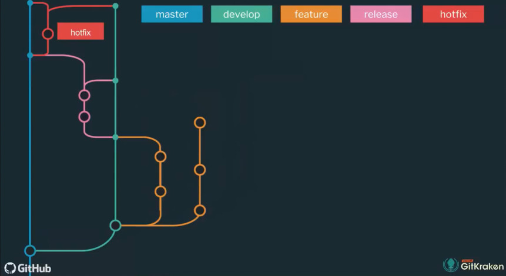
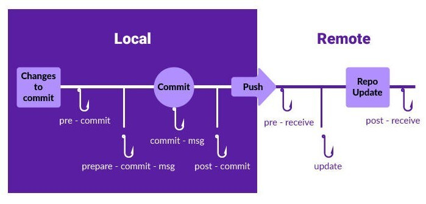

# Git

It is a **distributed Version Control System (VCS)**. Version control is a way to save changes over time without overwriting previous versions (Version Control is a system which records the changes made to a file so that you can recall a specific version later).

It helps in **tracking changes in the project** and **coordinating work** on those files among multiple people.

- VCS also know as Source Code Management (SCM)

Types of Version Control Systems:

1. **Local**: It allows you to copy files into another directory and rename it (For example, project.1.1). This method is error-prone and introduces redundancy.

2. **Centralized**: All version files are present in a single central server. For example, CVS, SVN, and Perforce.

3. **Distributed**: All changes are available in the server as well as in local machines. Being distributed means that every developer working with a Git repository has a copy of that entire repository. For example, _Git_ and _Mercurial_.

## History

Old VCS that predate Git:

- Source Code Control System (SCCS):
  - 1972: closed source, free with Unix
  - Stored original version and sets of changes
- Revision Control System (RCS):
  - 1982: open source
  - Stored latest version and sets of changes
- Concurrent Version System (CVS):
  - 1986-1990: open source
  - Multiple files, entire project
  - Multi-user repositories
- Apache Subversion (SVN):
  - 2000: open source
  - Track text and images
  - Track file changes collectively (track directory)
- BitKeeper SCM:
  - 2000: closed source, proprietary
  - Distributed version control
- Git:
  - April 2005
  - Linus Tovalds
  - Distributed version control
  - Open source and free software
  - Faster than other SCMs (100 times in some cases)
  - Better safeguards against data corruption

### Distributed Version Control

- Different users maintain their own repositories
- No central repository
- Changes are stored as change sets:
  - Track changes, not versions
  - Different from CVS and SVN, which tracked versions
  - Change sets can be exchanged between repositories
  - "Merge in change sets" or "apply patches"
- No single master repository
- Many working copies
- No need to communicate with a central server
- No network access required
- No single failure point

## Git Internals

Git uses 3 Tree architecture:

- Repository
- Staging Index
- Working

These 3 stages are:

| #   | Stages            | Details                                                       |
| --- | ----------------- | ------------------------------------------------------------- |
| 1   | Working Directory | Un-tracked new files and modified directories are found here. |
| 2   | Staging Area      | Things we want to commit and ignore which we don't want.      |
| 3   | Remote Repository | `.git` directory(Repository)                                  |

The `.git` folder contains different files and folders:

- `hooks/`:
- `info/`:
- `objects/`:
- `ref/`:
- `config`: file contains configurations specific to that repository
- `description`:
- `HEAD`: A link to a point in
- `logs/`: Created after first commit,
- `index`: Created after first commit,
- `COMMIT_EDITMSG`: Created after first commit,

The `objects` folder consists of 4 types of objects:

1. _Blob_ (Binary large object): Copy of contents of the file.
2. _Tree_
3. _Commit_: Creates a snapshot of the project at a given point.
4. _Annotated tag_

- `git cat-file`: Provide content or type and size information for repository objects:

  ```bash
  # find the type of object
  git cat-file -t [commitSHA]
  ```

### Repositories

When working on a Git project most of the time the user will have to deal with two repositories:

- _Remote Repository_: They are versions of your project that are hosted on the Internet or network somewhere.

- _Local Repository_: It is a copy of the remote repository that exists on the user's workstation. This is the repository where the user works on the project.

### Head

**HEAD** is a reference variable that always **points to the tip of your current (working) branch, that is, recent commit of your current branch**.

- The `HEAD` file inside the `.git/` directory holds the reference value

  ```bash
  cat .git/HEAD

  # output
  # ref: refs/heads/master

  cat refs/heads/master
  # returns a SHA value which is the
  # SHA of a commit to which HEAD currently points to
  ```

HEAD can be used with the following symbols to refer to other commits:

- _Tilde symbol (`~`)_: Used to point to the previous commits from base HEAD
- _Caret symbol (`^`)_: Used to point to the immediate parent commit from the current referenced commit

Usage:

- **HEAD:** current branch
- **HEAD^:** parent of HEAD
- **HEAD~4:** the great-great grandparent of HEAD

The git commands that require commit-hash will default to HEAD if no commit-hash is provided.

### Dot Operators

## Installation

Git can be installed on the most common operating systems like Windows, Mac, and Linux.

Download Git from this [link](https://git-scm.com/downloads) and install it

## Configuration

All the Git configurations are stored in a file:

1. The **configurations specific to the users** resides in home directory as `~/.gitconfig` or `~/.config/git/config` file.

   - To add configurations to this file we pass `--global` option in the CLI.

2. The **configurations specific to a repository** resides as `.git/config` file.

   - To add configurations to this file we pass `--local` option or just `git config` in the CLI.

3. The **configurations specific to that machine** resides as `/etc/gitconfig` file.

   - To add configurations to this file we pass `--system` option in the CLI.

The **priority** in which these configuration files are used is: **local** > **global** > **system**

Git config commands:

```bash
# list all configurations
git config --list

# check specific configuration
git config [config name]
git config user.name

# check in which file a specific configuration resides
git config --show-origin [config name]
git config --show-origin user.name
```

- For the **initial setup** the user must provide their identity such as full name and email address, this is required as it helps in identifying the person making the commits (saving changes).

  ```bash
  # add username and email
  git config --global user.name "First Last"
  git config --global user.email "myemail@domain.com"

  # change the core editor
  git config --global core.editor [editor name]
  git config --global core.editor vim

  # colorize user interface (might be on by default) [true, auto]
  git config --global color.ui true
  ```

We can modify configurations from the CLI or by directly modifying the configuration file.

- Add this to automatically create a new upstream branch for your local branch

  ```bash
  git config --global push.autoSetupRemote true
  ```

::: tip WINDOWS
In windows Git looks for `.gitconfig` file in `$HOME` directory (`C:\Users\$USER`).
:::

### SSH

Set-up SSH keys for authenticating to a remote repository hosting service:

```bash
ssh-keygen -t rsa -b 4096 -C "string"
```

## Git Commands

Git was initially a **toolkit for a VCS** and hence consists of a number of subcommands divided into:

1. _Plumbing_: Subcommands that do low-level work and were designed to be chained together UNIX-style or called from scripts.

2. _Porcelain_: More user-friendly commands.

### Help

You can get information about any of the Git commands by:

```bash
git help [git command name]
git help config

# or

git [git command name] --help
git config --help

# or

man git-[command name]
man git-config
```

### Initialize Git

This command can be used:

- To create a new project with Git
- Or initializes the current folder to track its changes by Git:

```bash
# transform the current directory into a git repository
git init

# transform a directory in the current path into a git repository
git init [directory name]

# create a new bare repository
git init --bare

# create shared repository
git init --bare --shared=all
```

The above command creates a hidden `.git` folder. That directory stores all of the [objects and refs](#git-internals) that Git uses and creates as a part of your project's history.

This hidden `.git` directory is what separates a regular directory from a Git repository.

### Clone Repository

Git clone gets the complete project from remote to your local machine (used to create a copy of a specific repository or branch within a repository).

```bash
git clone [repo https url/ssh link]

# you can also provide your own repo name
git clone [repo https url/ssh link] [repo name]

# clone a repository but without the ability to edit any of the files
git clone --mirror

# clone only a single branch
git clone --single-branch
```

`git init` vs `git clone`:

- `git init`: One Person Starting a New Repository Locally or Initializing Existing Folder

- `git clone`: The Remote Already Exists

### Remote Repository

When we clone a remote repository, a reference of that remote repository will be added to your local repository configuration. This reference is used to communicate changes between the local repository and the remote repository.

- URL can be HTTPS or SSH

```bash
# list all remote connections
git remote

# list all remote connections with URL
git remote -v

# add new remote connection
git remote add [name] [URL]

# remove a remote connection
git remote remove [name]

# change remote connection URL
git remote set-url [URL]

# rename a remote connection
git remote rename [old-name] [new-name]
```

When a repo is clone a default remote URL is added with the name `origin`. And if the repository has multiple remotes then typically the new URL is added with the name `upstream`.

### Remove Git Tracking

To remove Git tracking from the project, just delete the hidden `.git` folder.

```bash
rm -rf .git
```

::: danger NOTE
If you remove this folder you will permanently loose the project history, unless you have a remote copy.
:::

### Status

Displays the current state of the staging area and the working directory, that is, which files are added/removed/modified in the working directory and which files are staged.

```bash
git status

# give output in short format
git status -s

# "verbose" output
git status -v

# get short status with branch name
git status -sb
```

### Add File

Adds new or changed files in your working directory to the Git staging area. If you have added a new file, Git starts tracking that file.

- Staging area is like a rough draft space, where files are placed for the next [commit](#commit)

- You can select all files, a directory, specific files, or even specific parts of a file for staging and committing.

```bash
git add [filename]

# add the entire directory recursively,
# including files whose names begin with a dot
git add .
git add -A

# stage modified and deleted files only, not new files
git add -u

# interactively stage hunks of changes (patch)
git add -p
```

Add empty directory, as Git ignores empty directories:

- Add a dot file inside the directory: `.gitkeep`

#### Interactive Staging

- Stage changes interactively
- Allows staging portions of changed files
- Helps to make smaller, focused commits

```bash
git add --interactive
git add -i
```

Patch Mode:

- Allows staging portions of a changed file
- "Hunks": an area where two files differ
- Hunks can be staged, skipped, or split into smaller hunks

Split a Hunk (automatically):

- Hunks can contain multiple changes
- Tell Git to try to split a hunk further
- Requires one or more unchanged lines between changes

Edit a Hunk (split manually):

- Hunk can be edited manually
- Most useful when a hunk cannot be split automatically
- Diff-style line prefixes: `+`, `-`, `#`, `space`

### Commit

Create a commit, which is like a snapshot of your repository. These commits are snapshots of your entire repository at specific times.

- Make new commits often, based around logical units of change.

- Over time, commits should tell a story of the history of your repository and how it came to be the way that it currently is.

- Commits include lots of metadata in addition to the contents and message, like the author, timestamp, and more.

- Each commit contains an unique hash number.

- To view the details of a commit including the metadata and the changes made in the commit use the [git show](#show) command.

```bash
# start commit process
git commit

# include commit message and body at the same time
git commit -m [commit message]
git commit -m [commit message] -m [commit body]

# interactively commit hunks of changes (patch)
git commit -p

# replace the most recent commit with a new commit
git commit --amend

# amend commit with new message
# if no file changes are there this will just update the commit message
git commit --amend -m "NEW MESSAGE"
```

Git commit amend should be used only if:

- That commit hasn't been pushed to the remote yet
- There is a spelling error in the commit message
- It doesn't contain the changes that you'd like to contain

::: danger NOTE
Amending commits is not advisable. It changes the commit-hash and hence changing the history.
:::

Make Atomic commits:

- Small commits
- Only affect a single aspect
- Easier to understand, to work with, and to find bugs
- Improves collaboration

Commit best practice:

- Add the _right_ changes
- Compose a _good commit message_:

  - Subject (50 chars): concise summary of what happened
  - Body (150 chars): mode detailed explanation:

    - What is now different than before?
    - What's the reason for the change?
    - Is there anything to watch out for/anything particularly remarkable?

_Example:_ [Angular commit convention](https://github.com/angular/angular/blob/main/CONTRIBUTING.md#commit)

```text
<type>(<scope>): <short summary>
  │       │             │
  │       │             └─⫸ Summary in present tense. Not capitalized. No period at the end.
  │       │
  │       └─⫸ Commit Scope: animations|bazel|benchpress|common|compiler|compiler-cli|core|
  │                          elements|forms|http|language-service|localize|platform-browser|
  │                          platform-browser-dynamic|platform-server|router|service-worker|
  │                          upgrade|zone.js|packaging|changelog|docs-infra|migrations|ngcc|ve|
  │                          devtools
  │
  └─⫸ Commit Type: build|ci|docs|feat|fix|perf|refactor|test
```

Types:

- `build`: Changes that affect the build system or external dependencies (example scopes: gulp, broccoli, npm)
- `ci`: Changes to our CI configuration files and scripts (examples: CircleCi, SauceLabs)
- `docs`: Documentation only changes
- `feat`: A new feature
- `fix`: A bug fix
- `perf`: A code change that improves performance
- `refactor`: A code change that neither fixes a bug nor adds a feature
- `test`: Adding missing tests or correcting existing tests

### Pull

It updates your current local working branch and all of the remote tracking branches.

- `git pull` is a combination of `git fetch` + `git merge`, updates some parts of your local repository with the changes from the remote repository.

```bash
# update local with commits from remote
# (merge is used)
git pull

# update from a specific remote branch
git pull --force

# fetch all remotes
git pull --all
```

- Run `git pull` regularly

Pull Rebase:

- Fetch from remote, then rebase instead of merging
- Keeps history cleaner by reducing merge commits
- Only use on local commits not shared to a remote

```bash
# update but rewrite history so any local commits occur after all new commits
git pull --rebase

git pull --rebase=preserve
git pull --rebase=interactive
```

Pull Requests: Not core Git feature, but provided by Git hosting platforms

- communicating about and reviewing code
- appeal request invites reviewers to provide feedback before merging
- contributing code to other repositories, to which you don't have write access. Contributing to an open source repository
- _Fork_ is your personal copy of a GIT repository

Checking out pull requests locally:

```bash
# Provide pull request ID
git fetch origin pull/ID/head:NewLocalBranchName

# Switch to the newly created branch
git checkout [branch name]
```

### Merge

Git Merge dose not provide a dry run option, so we can do this:

```bash
# pass --no-commit to stop auto commit
# and also stopping fast-forward with --no-ff

git merge --no-commit --no-ff $BRANCH

# to examine the staged changes
git diff --cached

# and you can undo the merge, even if it is a fast-forward merge
git merge --abort
```

Merge Conflicts occur when contradictory changes happen:

- `git merge`
- `git rebase`
- `git pull`
- `git stash apply`
- `git cherry-pick`

### Push

It uploads all local branch commits to the corresponding remote branch.

```bash
git push

# pushing new branch, this creates an upstream tracking branch
git push -u origin [branch]

# push all branches
git push --all

# force push
git push -f
```

Reasons to force push:

- Local version is better than the remote version
- Remote version went wrong and needs repair
- Versions have diverged and merging is undesirable

::: danger NOTE
Use force push with extreme caution. Disruptive for others using the remote branch. Commits disappear. Subsequent local commits are orphaned for others.
:::

### Rename File

Change file name or file path and prepare it for commit.

```bash
git mv [original filename] [new filename]
```

### Delete Files

Delete the file from the _working area_ or _staging area_ and add the deletion to the _staging area_.

```bash
git rm [filename]
```

Remove (untrack) a file from version control but preserve the file locally:

```bash
git rm --cached [filename]
```

### Patch

Create Diff Patches:

- Share changes via files
- Useful when changes are not ready for a public branch
- Useful when collaborators do not share a remote
- Discussion, review, approval process

```bash
# direct output to a file
git diff [from-commit] [to-commit] > [output-name].diff
```

Apply Diff Patches:

- Apply changes in a diff patch file to the working directory
- Makes changes, but not commits
- No commit history transferred

```bash
git apply [filename].diff
```

Create Formatted Patches:

- Export each commit in Unix mailbox format
- Useful for email distribution of changes
- Includes commit messages
- One commit per file by default

```bash
# export all commits in the range
git format-patch [start-commitSHA]..[end-commitSHA]

# export all commits on current branch
# which are not in master branch
git format-patch master

# export a single commit
git format-patch -1 [commitSHA]

# put patch files into a directory
git format-patch master -o [directory-name]

# output patches as a single file
git format-patch master --stdout > [filename].patch
```

Apply Formatted Patches:

- Extract author, commit message, and changes from a mailbox message and apply them to the current branch
- Similar to cherry-picking: same changes, different SHAs
- **Commit history is transferred**

```bash
# apply single patch
git am [directory-name]/[patch-filename].patch

# apply all patches in a directory
git am [directory-name]/*.patch
```

### Git Clean

Git clean undoes files from the repository. It **primarily focuses on untracked files**

- Remove untracked files

```bash
# do a dry run
git clean -n

# remove untracked files
git clean -f

# remove untracked directories
git clean -fd
```

### Restore File

Restore a deleted file which was tracked by git.

- Find the commit where the file was deleted:

  ```bash
  git rev-list -n 1 HEAD -- [filename]
  ```

- Checkout to that commit to get the file back:

  ```bash
  git checkout [commitSHA]^ -- [filename]
  ```

### Ignoring File

Untracked files or folders can be ignored so that Git dose not track them. For that create a file named `.gitignore` and add all the file or folder listing patterns.

We can use:

- Pattern matching (basic regular expressions):
  - `*?[aeiou][0-9]`
  - `logs/*.txt`
- Negative expressions:

  - `*.php`
  - `!index.php`

- Add comments using `#`
- Blank lines are skipped

Example:

```gitignore
# ignore all .a files
*.a

# but do track lib.a, even though you're ignoring .a files above
!lib.a

# only ignore the TODO file in the current directory, not sub-dir/TODO
/TODO

# ignore all files in a directory named build
# add a trailing slash
build/

# ignore doc/notes.txt, but not doc/server/arch.txt
doc/*.txt

# ignore all .pdf files in the doc/ directory and any of its subdirectories
doc/**/*.pdf
```

- Lists all ignored files in this project

  ```bash
  git ls-files --other --ignored --exclude-standard
  ```

Ideas on what to ignore:

- Compiled source code
- Packages and compressed files
- Logs and databases
- OS generated files
- [Useful .gitignore templates](https://github.com/github/gitignore)

Globally ignore files:

- Ignore files in all repositories
- Settings are not tracked in repo
- User specific instead of repository specific

```bash
git config --global core.excludesfile ~/.gitignore_global
```

### Log

- Log is the primary interface to Git
- Log has many options
- Sorting, filtering, output formatting

List version history for the current branch:

```bash
git log

# useful for visualizing branches
git log --graph --all --decorate --oneline

# list commits as patches (diffs)
git log --patch

# list edits to lines 100-150 in filename.txt
git log -L 100,150:filename.txt
```

List version history for a file, including renames:

```bash
git log --follow [filename]
```

### Branch

```bash
# create new branch
git branch [branch name]

# list all branches
git branch -a

# rename branch
git branch -m [name]

# delete a branch
git branch -d [branch name]
git branch -D [branch name]

# delete branch from remote repo
git push origin -d [remote] [branch name]           # git v2.8.0+
git push origin --delete [remote] [branch name]     # git v1.7.0+
git push origin :[remote branch name]               # old way

# see all the merged branches
git branch --merged

# merge branch (from the branch to merge into)
git merge [other branch]
```

- To delete a branch, current must be on a different branch
- To delete a branch hows commits are not merged use `-D` flag

Identify merge branches:

- List branches that have been merged into a branch
- Useful for knowing what features have been incorporated
- Useful for clean-up after merging many features

```bash
# list branches merged into the current branch
git branch --merged

# list branches not merged into the current branch
# branches that have commits that are not merged
# into current branch
git branch --no-merged

# list remote branches merged into the current branch
git branch -r --merged
```

Checkout [Branching Strategies](#branching-strategies)

#### Prune Stale Branches

- Delete all stale remote-tracking branches
- Remote-tracking branches, not remote branches
- Stale branch: a remote-tracking branch that no longer tracks anything because the actual branch in the remote repository has been deleted

Remote branches:

1. Branch on the remote repository (bugfix)
2. Local snapshot of the remote branch (origin/bugfix)
3. Local branch, tracking the remote branch (bugfix)

```bash
# delete stale remote-tracking branches
git remote prune origin
git remote prune origin --dry-run


# prune while fetching
# prune, then fetch
git fetch --prune


# always prune before fetch
# destructive
git config --global fetch.prune true
```

### Reset

Git reset as the name suggests resets things. Reset the working area to a specific commit.

It can **undo the changes that are already committed**

```bash
# reset local working directory to
# remote branch head
git reset --hard origin/master

# un-stages the file, but preserve its contents
# move file from staging area back to working directory
git reset [filename]
# or
git reset HEAD [filename]

# discard changes
git reset --hard

# reset everything to the latest snapshot
git reset --hard HEAD

# undoes all commits after [commit], preserving changes locally
git reset [commit]

# discards all history and changes back to the specified commit
git reset --hard [commit]

# interactively reset hunks of changes (patch)
git reset -p
```

Reset commit with the following options:

- `--soft`: **Moves the commit changes into staging area** and does not affect the current working area.

- `--hard`: **Deletes all the commit changes. Be cautious with this flag**. Might lose all changes from both staging and working area to match the commit.

- `--mixed`: Default operation. Moves commit changes to the _working area_.

Apply reset command on:

- Staged files
- Commits

#### Reset last Rebase or Merge

```bash
# undo, unless ORIG_HEAD has changed again
# (rebase, reset, merge change ORIG_HEAD)
git reset --hard ORIG_HEAD
```

::: tip NOTE
Use revert whenever possible
:::

### Revert

Undo changes made in a commit (revert a commit).

Git revert is similar to reset however, **`git revert` inverses the changes from that old commit and creates a new revert commit**.

- A new commit is made which contains the changes needed to revert a commit.

```bash
git revert [commitSHA]
```

### Diff

Compares contents of the working directory with the staging area.

```bash
git diff

# show words that changed
git diff --color-words
```

Compare staging to the HEAD of the branch of the repository:

```bash
git diff --cached

# or use its alias

git diff --staged
```

Compare changes of a file between current state and last commit:

```bash
git diff [filename]

# using tags
git diff [tag-name-1]...[tag-name-2]
```

Compare two branches:

```bash
git diff [first branch]...[second branch]
```

::: tip TOOL
We can use a GUI tool or an external diff viewing program.

```bash
git difftool
```

To get help and add your preferred tool:

```bash
git difftool --tool-help

# ADD A TOOL
git difftool --tool=[tool]
```

:::

### Checkout

Git checkout is **used to switch**. Switch between _branches_, _commits_, and _files_.

Go back to the head:

```bash
git checkout master

# discard changes of a file in working area
git checkout -- [filename]
```

Go to a specific snapshot (commit).

- This command **creates a detached head**, meaning, this will **give a temporary branch to work and debug**. Line being on an unnamed branch.
- **Do not commit in this temporary branch**. As new commits will not belong to any branch
- Detached commits will be garbage collected (~2 weeks)

```bash
git checkout [commitSHA]
```

- To preserve commits made in detached head state:

```bash
# tag the commit (HEAD detached)
git tag [tag name]

# create a branch (HEAD detached)
# but the detached HEAD needs to be reattached
# to this new branch
git branch [new branch name]

# better option is to create a branch and reattach HEAD
git checkout -b [new branch name]
```

Undo or revise old changes: You can pull a snapshot of a file from old commit and work on it with the intent to commit the new changes:

- The file will be put into staging area

```bash
git checkout [commitSHA] -- [filename]
```

You can apply checkout command on:

- Working file
- Commit

### Fetch File

Fetch all:

```bash
# fetch commits and tags
git fetch

# fetch only tags (with necessary commits)
git fetch --tags

# fetch all
git fetch --progress --all

# prune, then fetch
git fetch --prune
```

### Rebase Commits

- Take commits from a branch and replay them at the end of another branch
- Useful to integrate recent commits without merging
- Maintains a cleaner, more linear project history
- Ensures topic branch commits apply cleanly

```bash
# rebase current branch to tip of master
git rebase master

# rebase new_feature to tip of master
git rebase master new_feature

# return commit where topic branch diverges
git merge-base master new_feature
```

The Golden Rule of Rebasing:

- **Thou shalt not rebase a public branch**
- Rebase abandons existing, shared commits and creates new, similar commits instead
- Collaborators would see the project history vanish
- Getting all collaborators back in sync can be a nightmare

#### Merging vs. Rebasing

- 2 ways to incorporate changes from one branch into another branch
- Similar ends, but the means are different

| Merging                                   | Rebasing                                              |
| ----------------------------------------- | ----------------------------------------------------- |
| Adds a merge commit                       | No additional merge commit                            |
| Non-destructive                           | Destructive: SHA changes, commits are rewritten       |
| Complete record of what happened and when | No longer a complete record of what happened and when |
| Easy to undo                              | Tricky to undo                                        |
| Logs can become cluttered, non-linear     | Logs are cleaner, more linear                         |

How to choose?

- **Merge** to allow commits to stand out or to be clearly grouped
- **Merge** to bring large topic branches back into master
- **Merge anytime the topic branch is already public** and being used by others (The Golden Rule of Rebasing)
- **Rebase** to add minor commits in master to a topic branch
- **Rebase** to move commits from one branch to another

#### Handle Rebase Conflicts

- Rebasing creates new commits on existing code
- May conflict with existing code
- Git pauses rebase before each conflicting commit
- Similar to resolving merge conflicts

```bash
# after resolving the conflict use
# --continue to commit and proceed to next commit
git rebase --continue

# skipping a commit
git rebase --skip

# abort rebase
git rebase --abort
```

#### Rebase onto other branches

```bash
git rebase --onto [new-base] [upstream-branch] [branch]
```

#### Undo Rebase

- Can undo simple rebases
- Rebase is destructive
- Undoing complex rebases may lose data
- Use [git reset](#reset-last-rebase-or-merge)

Or rebase back to former merge-base SHA:

```bash
# undo by rebasing to former merge-base SHA
git rebase --onto [merge-base-SHA] [merge-base] [branch]
```

#### Interactive Rebasing

- Chance to modify commit as they are being replayed
- Opens the `git-rebase-todo` file for editing
- Can reorder or skip commits
- Can edit commit contents

Options:

- `pick`, `drop`
- `reword`, `edit`
- `squash`, `fixup`
- `exec`

```bash
# interactive rebase
git rebase -i master new_feature

# rebase last 3 commits onto the same branch
# but with the opportunity to modify them
git rebase -i HEAD~3
```

Squash Commits:

- Fold two or more commits into one
- `squash`: combine change sets, concatenate messages
- `fixup`: combine change sets, discard this message
- Uses first author in the commit series

### Cherry-Pick

- Apply the changes from one or more existing commits
- Can be used to apply commit from one branch to another
- Each existing commit is recorded as a new commit on the current branch
- Conceptually similar to copy-paste
- New commits have different SHAs

```bash
git cherry-pick [commitSHA]

# cherry-pick range of commits
git cherry-pick [commitSHA-of-3]..[commitSHA-of-5]

# edit the commit message
git cherry-pick [commitSHA] --edit
```

- Cannot cherry pick a merge commit as merge commits have two parents
- Use `-m` flag to specify the parent if cherry-picking merge commit

  ```bash
  git cherry-pick [commitSHA] -m [parent-number]
  ```

- Can result in conflicts which must be resolved (same as merge conflicts)

### Stash

Git stash temporarily saves the changes made in working directory and work on some other changes.

```bash
# save current changes
git stash

# save with a message
git stash save [message]

# retrieve the saved changes (it will not remove the stash from the list)
git stash apply [stash@{id}]

# get the list of all stashes
git stash list

# get the latest stash and apply it in the working area
git stash pop [stash@{id}]

# delete a stash
git stash drop [stash@{id}]

# interactively stash hunks of changes (patch)
git stash -p
```

::: tip NOTE
Git stash is branch agnostic. All branches use the same stash list. This is helpful when moving the changes from one branch to another branch.
:::

::: warning UNTRACKED FILES
By default, Git will not stash changes made to untracked or ignored files

```bash
# TO STASH UNTRACKED FILES
git stash -u or --include-untracked [filename]
```

:::

### Show

Outputs metadata and content changes of the specified commit.

```bash
git show [commitSHA]

# using tags
git show [tag-name]
```

Allows us to see git objects details:

```bash
git show [object-sha]

git show --pretty=raw [object-sha]
```

### ls-tree

Show the object details:

```bash
git ls-tree [object-tree-sha]
```

Output:

```text
FILE PERMISSIONS / TYPE OF FILE / objectSHA / FILE NAME
100644 blob e69de29bb2d1d6434b8b29ae775ad8c2e48c5391    README.md
```

### Reflog

- Git reflog has the superpower to **track the head**.

- The difference between log and reflog is that:

  - `git log` will track every commit that you make and record it as a snapshot at a particular time, whereas `git reflog` will keep track of commits that are made as well as the commits that are discarded.

- This is provided in a rolling buffer for 30 days

- The `git reflog` command will list down the logs whenever the HEAD changes like the branch was created, cloned, checked-out, renamed, or any commits made on the branch.

```bash
git reflog
```

### Blame

Shows what revision and author last modified each line of a file.

- Browse annotated file
- Determine who changed which lines in a file and why
- Useful for probing the history behind a file's contents
- Useful for identifying which commits introduced a bug

```bash
# annotate file with commit details
git blame [filename]

# ignore whitespace
git blame -w [filename]

# annotate lines 100-105
git blame -L 100,105 [filename]
git blame -L 100,+5 [filename]

# annotate file at revision commitSHA
git blame [commitSHA] [filename]
git blame [commitSHA] -- [filename]

# similar to blame, different output format
git annotate [filename]
```

Options:

- `-s`: to suppress the author's name and time stamp from the output.
- `-e`: to show the author's email instead of the author's name.
- `-f`: to show the filename in the original commit.
- `-n`: to show the line number in the original commit.

### Bisect

- Find the commit that introduced a bug or regression
- Mark last good revision and first bad revision
- Resets code to mid-point
- Mark as good or bad revision
- Repeat

Git bisect will:

1. Perform a binary search in the commits.
2. Allow us to check it manually.
3. Allow us to declare its status as good or bad.

Start bisecting:

```bash
# start bisect session
git bisect start
```

Provide a commit/branch/tag to start from:

```bash
git bisect good [treeish]
```

Now add the current commit as bad, Git will go through all the commits between the start commit and the current bad commit.

```bash
git bisect bad

or

git bisect bad [treeish]
```

From now check the application and verify if the application has the bug or not,
if the commit dose not have bug then mark it as good and if you find the commit that has the bug then mark it as bad. Repeat this process till the tool narrows down to the commit that introduced the bug.

- `git bisect log`: To find the flow of Git Bisect, that is, to see what has been done so far.
- `git bisect reset`: To reset if something went wrong.

### Prune

Prune all unreachable objects

```bash
# do not need to use!
git prune

# part of garbage collection
git gc
```

## Branching Strategies

Agree on a Branching Workflow in your team:

- GIT allows you to create branches but it doesn't tell you how to use them

- you need a written best practice of how work is ideally structure in your team - to avoid mistakes and collisions

- it is highly depends on your team / team size on your project and how you handle releases
  -it helps to onboard new team members ("this is how we work here")

Integrating changes and structuring releases:

1. mainline development ("Always Be Integrating"):

   - few branches
   - relatively small commits
   - high quality testing and QA standards

2. Stale, release and feature branches:

   - different types of branches
   - fulfil different types of jobs

**GIT Flow vs Trunk based dev**:

1. GitHub Flow: very simple, very lean:

   - only one long-running branch (_"main"_) + feature branches

2. GitFlow: more structure, more rules,

   - long-running branches: _"main"_, _"development"_
   - short-lived branches: _"features"_, _"releases"_, _"hotfixes"_

   | Branch Name | Create from       | Merge back into    |
   | ----------- | ----------------- | ------------------ |
   | develop     | master            | -                  |
   | feature     | develop           | develop            |
   | release     | develop           | master and develop |
   | hotfix      | master or develop | master and develop |

   

## Tagging

- Tag allows you to capture a reference point in your project history, such as release versions.

- Tags allow making points in history as important

- A **named reference** to a commit

- An **annotated tag** (most common) contains additional information such as name, message, and email of the person who created the tag.

- A **lightweight tag** points to just a commit hash.

- Create a tag (lightweight):

  ```bash
  # add lightweight tag
  git tag [tag name]

  # create a tag for older commit
  git tag [tag name] [commitSHA]
  ```

- Annotated tags:

  ```bash
  git tag -a [tag name] -m [message] [commitSHA]
  ```

- List tags:

  ```bash
  # list tags
  git tag
  git tag --list
  git tag -l

  # list tags with annotations
  git tag -l -n
  git tag -l -n [number of lines from the annotation]

  # filter tags
  # list tags beginning with "v2"
  git tag -l "v2*"
  ```

- Push tags to remote repository:

  ```bash
  git push origin [tag name]

  # push all tags
  git push origin --tags

  git push --tags
  ```

- `git fetch` automatically retrieves shared tags

- To delete the tag:

  ```bash
  git tag -d or --delete [tag name]

  # delete remote tags like remote branches
  git push origin :[tag name]
  git push origin --delete [tag name]
  git push origin -d [tag name]
  ```

### Checking Out Tags

- Tags are not branches
- Tags can be checked out, just like any commit
- `git checkout -b [new branch name] [tag name]`
- `git checkout [tag name]`: same as checking a commit

## Git Submodule

It often happens that while working on one project, you need to use another project from within it. Git addresses this issue using submodules.

Submodules allow you to keep a Git repository as a subdirectory of another Git repository. This lets you clone another repository into your project and keep your commits separate.

```bash
git submodule add [url of repo]

# view status (working, staging, or indexed files) of all the submodules.
git submodule status

# updates submodules after switching branches.
git submodule update

# after cloning a new repo, if you need to add submodules to it from .gitmodules file, use this command.
git submodule update --init

# if the submodules inside a newly cloned repo are nested, then use this.
git submodule update --init --recursive

# pulls all changes in the submodules.
git submodule update --remote
```

A `.gitmodules` file is created when we add a submodule to the project. This is a configuration file that stores the mapping between the project's URL and the local subdirectory you've pulled it into:

```text
[submodule "DbConnector"]
    path = DbConnector
    url = https://github.com/chaconinc/DbConnector
```

## Git Hooks

Git Hooks are shell scripts that get triggered when we perform a specific action in Git

- Git hooks reside in the `[project-dir]/.git/hooks/` directory



Based on the git operation, any one of the following `git hooks` will be triggered.

1. **Client-side**:

   - Committing workflow hooks:

     - pre-commit
     - prepare-commit-msg
     - commit-msg
     - post-commit

   - Email workflow hooks

     - applypatch-msg
     - pre-applypatch
     - post-applypatch

   - Other client hooks

     - pre-rebase
     - post-rewrite
     - post-checkout
     - post-merge

2. **Server-side**:

   - update
   - pre-receive
   - post-receive

- Hooks are simple text files.
- Hooks can be written in any _scripting language_ like python, Ruby, and so on.
- The script **filename should match the hooks' name**. For `post-commit` hook the script filename should be `post-commit`.

## Github Folder

The below mentioned files can be created in the `.github` folder:

- `CODE_OF_CONDUCT.md`: Defines standards for how to engage in a community.

- `CONTRIBUTING.md`: Communicates how people should contribute to your project. (making pull request, setting development environment...)

- `FUNDING.yml`: Displays a sponsor button in your repository to increase the visibility of funding options for your open source project.

- `ISSUE_TEMPLATE`: Folder that contains a templates of possible issues user can use to open issue (such as if issue is related to documentation, if it's a bug, if user wants new feature etc)

  - `config.yml`: Customize the issue template chooser that people see when creating a new issue in your repository by adding a `config.yml` file to the .`github/ISSUE_TEMPLATE` folder.

- `PULL_REQUEST_TEMPLATE.md`: How to make a pull request to project

- `stale.yml`: Probot configuration to close stale issues. There are many other apps on Github Marketplace that place their configurations inside .github folder because they are related to GitHub specifically.

- `SECURITY.md`: Gives instructions for how to report a security vulnerability in your project

- `SUPPORT.md`: Lets people know about ways to get help with your project. For more information

- `workflows`: Configuration folder containing yaml files for GitHub Actions

- `CODEOWNERS`: Pull request reviewer rules. More info here.

- `dependabot.yml`: Configuration options for dependency updates. More info here.

## References and Guides

- [git book](https://git-scm.com/book/en/v2)
- [GitHub: git-guides](https://github.com/git-guides/)
- [Bitbucket: learn git](https://www.atlassian.com/git/tutorials/learn-git-with-bitbucket-cloud)
- [Practice Git online](https://git-school.github.io/visualizing-git)
