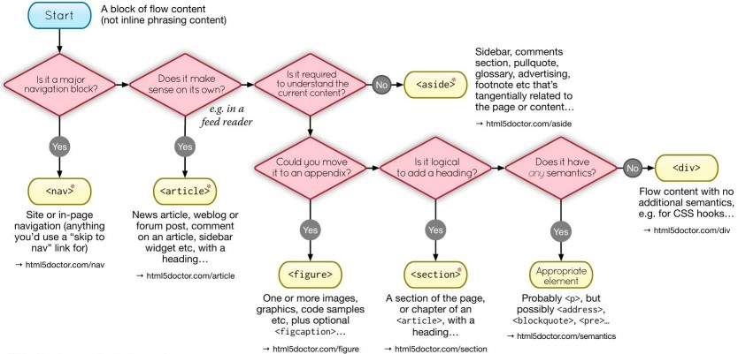

# HTML

HTML (HyperText Markup Language) is the standard markup language for documents designed to be displayed in a web browser.

- It defines the structure of the web content

- _"Hypertext"_ refers to links that connect web pages to one another, either within a single website or between websites.

## Element

An **element** is a part of a webpage. In XML and HTML, an element may contain a data item or a chunk of text or an image, or perhaps nothing.

- A typical element includes an opening tag with some [attributes](#attribute), enclosed text content, and a closing tag.


_Example:_

```html
<p>This is an amazing website!</p>
```

## Tag

A tag is used for creating an [element](#element).

In HTML element `<p>This is an amazing website!</p>`:

- `<p>` is opening tag
- `</p>` is closing tag

## Attribute

## Lint Guide

Following a set of rules to right HTML helps in readability and maintenance of the code.

### Attribute order

HTML attributes should come in this particular order for easier reading of code:

- `class`
- `id`, `name`
- `data-*`
- `src`, `for`, `type`, `href`, `value`
- `title`, `alt`
- `role`, `aria-*`

Classes make for great reusable components, so they come first. Ids are more specific and should be used sparingly (e.g., for in-page bookmarks), so they come second.

```html
<a class="..." id="..." data-toggle="modal" href="#"> Example link </a>

<input class="form-control" type="text" />


```

## Accessibility

1. Tab order - Use `inert.js` polyfill. `tabindex=0`. `document.querySelector('[tabindex="-1"]').focus()`. Don't use tabindex greater than 0.

2. Use native elements instead of creating one using div.

3. Rowing Tabindex technique.

Custom tags:

- To create a custom tag like `radio-button`:

  ```javascript
  class RadioButton extends HTMLElement {
    constructor() {
      super();
    }

    connectedCallback() {
      this.setAttribute("role", "radio");
      this.setAttribute("tabindex", -1);
      this.setAttribute("aria-checked", false);
    }
  }

  window.customElements.define("radio-button", RadioButton);
  ```

- Now create a parent element `radio-group`:

  ```javascript
  const VK_LEFT = 37;
  const VK_UP = 38;
  const VK_RIGHT = 39;
  const VK_DOWN = 40;

  class RadioGroup extends HTMLElement {
    constructor() {
      super();
    }

    connectedCallback() {
      this.setAttribute("role", "radiogroup");
      this.radios = Array.from(this.querySelectorAll("radio-button"));

      // SETUP INITIAL STATE
      if (this.hasAttribute("selected")) {
        let selected = this.getAttribute("selected");
        this._selected = selected;
        this.radios[selected].setAttribute("tabindex", 0);
        this.radios[selected].setAttribute("aria-checked", true);
      } else {
        this._selected = 0;
        this.radios[0].setAttribute("tabindex", 0);
      }

      this.addEventListener("keydown", this.handleKeyDown.bind(this));
      this.addEventListener("click", this.handleClick.bind(this));
    }

    handleKeyDown(e) {
      switch (e.keycode) {
        case VK_UP:
        case VK_LEFT: {
          e.preventDefault();

          if (this.selected === 0) {
            this.selected = this.radios.length - 1;
          } else {
            this.selected--;
          }
          break;
        }
        case VK_DOWN:
        case VK_RIGHT: {
          e.preventDefault();

          if (this.selected === this.radios.length - 1) {
            this.selected = 0;
          } else {
            this.selected++;
          }
          break;
        }
      }
    }

    handleClick(e) {}

    set selected(idx) {
      if (isFinite(this.selected)) {
        // SET THE OLD BUTTON TO TABINDEX -1
        let previousSelected = this.radios[this.selected];
        previousSelected.tabIndex = -1;
        previousSelected.removeAttribute("aria-checked", false);
      }

      // SET THE NEW BUTTON TO TABINDEX 0 AND FOCUS IT
      let newSelected = this.radios[idx];
      newSelected.tabIndex = 0;
      newSelected.focus();
      newSelected.setAttribute("aria-checked", true);

      this.setAttribute("selected", idx);
      this._selected = idx;
    }

    get selected() {
      return this._selected;
    }
  }
  ```

References:

- [A Complete Guide To Accessible Front-End Components](https://www.smashingmagazine.com/2021/03/complete-guide-accessible-front-end-components/#accessible-cookie-consent-prompts)

### Accessible Design

1. Color contrast:

   - Background to text color contrast ratios (WCAG recommendations):

     - Small text (23x or less): 4.5
     - Small bold text (17x or less): 4.5
     - Large text (24x or more): 3

   - [Contrast Checker](https://webaim.org/resources/contrastchecker/)
   - [Adobe Color Pallet Accessibility](https://color.adobe.com/create/color-accessibility)
   - [Adobe Color Contrast Analyzer](https://color.adobe.com/create/color-contrast-analyzer)

2. Color blindness:

   - Up to 8% male population are red-green color blind

   - There are several other types of color blindness, some of which primarily affect the female population

   - User interface often use red and green to distinguish between "on" and "off" states

   - Don't rely on color difference only when indicating state (supplement with text)

3. Typography:

   - Larger font sizes (within reason) are preferred

     - Default size of _16px_ is OK
     - _18px_ or _20px_ is better

   - Avoid complex fonts for anything but decoration

     - Handwriting and decorative fonts look good
     - Are difficult to read

   - Avoid mono-space fonts unless share code

   - Avoid "fancy" fonts with unusual Features

     - Fonts with stylish ligaments and non-standard glyphs are difficult to read

   - Keep max sentence length between 70 and 80 characters

     - `max-width: 70ch;` and you'r done!

4. Hierarchies and Flows

### Hiding and Showing Content

If something is set tod `display: none;` or otherwise hidden, screen readers might not read tis content

1. Use CSS to hide elements in such a way that they are hidden visually but are accessible for screen readers

   _Example:_

   ```css
   .sr-only {
     /* make the element 0x0 px */
     clip: rect(1px, 1px, 1px, 1px);
     clip-path: inset(50%);
     height: 1px;
     width: 1px;
     margin: -1px;
     padding: 0;
     position: absolute;
     overflow: hidden;
   }
   ```

2. Use **`aria-hidden="true"`** attribute of the element that should be **hidden from screen readers**

   - This attribute applies to current element and all its children

### Semantic Elements

Semantic HTML elements are those that clearly **describe their meaning** in a human- and machine-readable way

- HTML semantic elements help describe different types of content

- Semantic elements have implicit roles describing their role in the document

Roles and Landmarks:

| Element     | Role          | Landmark      |
| ----------- | ------------- | ------------- |
| `<header>`  | banner        | banner        |
| `<div>`     | -             | -             |
| `<aside>`   | complementary | complementary |
| `<main>`    | main          | main          |
| `<article>` | article       | -             |
| `<footer>`  | contentinfo   | contentinfo   |



> [Image from HTML5 Doctor](https://html5doctor.com/)

### Links and Buttons

**[Links](./HTML_Elements.md#anchor-element) and [Buttons](./HTML_Elements.md#button)** Pseudo Classes:

- `:hover`: The user hovers a pointing device (usually a mouse) over the item

- `:active`: The item is activated by the user clicking or selecting it

- `:focus`: The element currently has focus (is selected)

- `:focus-visible`: The element has focus and should be visibly focused

**Link-Specific** Pseudo Classes:

- `:link`: The link target has not yet been visited

- `:visited`: The link target has been visited

- `:local-link`: The absolute URL of the current page and link target match

Good Practices:

- Try to keep _underline_ for clear communication
- Add more info for links which have same text

```html
<a href="/pickle-health.html">
  Continue reading <span class="sr-only">pickled cheese is healthy.</span>
</a>

<a href="/cricket.html">
  Continue reading <span class="sr-only">about cricket</span>
</a>
```

**Buttons**:

- Don't do anything out of the box

- Button behaviour is added by hooking them to browser events or using JavaScript

- Add more info for buttons

  ```html
  <button id="close-modal">
    <svg>(...)</svg>
    <span class="sr-only">Close order form modal popup.</span>
  </button>
  ```

_Example:_ Button CSS reset

```css
button {
  font-family: inherit;
  font-style: 100%;
  line-height: 1.15;
  margin: 0;
  overflow: hidden;
  text-transform: none;
  /* -webkit-appearance: button; */
  border: 0;
  background: none;
}

button:hover {
  cursor: pointer;
}

button:hover,
button:focus,
button:active {
  background: none;
  border-color: inherit;
  border-radius: 0;
}
```

### Icons

Use SVGs for icons

- They can be made accessible, and they don't interfere with assistive technologies the way icon fonts do (screen readers might read them out)

_Example:_

```html
<a href="https://www.linkedin.com/" aria-label="Go to LinkedIn">
  <svg aria-hidden="true" focusable="false">
    <!-- svg content -->
  </svg>
</a>

<!-- Or use hidden text-->

<a href="https://www.linkedin.com/">
  <svg aria-hidden="true" focusable="false">
    <!-- svg content -->
  </svg>
  <span class="sr-only">Go to LinkedIn</span>
</a>
```

- Print button:

```html
<button>
  <svg aria-hidden="true" focusable="false">
    <!-- svg content -->
  </svg>
  Print <span aria-hidden="true"> this page</span>
  <span class="sr-only">Pickled Cheese Recipes.</span>
</button>
```

### Images, Graphics, and Media

#### Static Assets

[Images](./HTML_Elements.md#images) and graphics

- Used as:

  - Information
  - Link/Button
  - Decoration

- Provide `src`, `alt`, `height`, and `width` attributes

- `alt` attribute must be provided (can be empty)

- What to write in `alt` attribute: [An `alt` Decision Tree](https://www.w3.org/WAI/tutorials/images/decision-tree/)

- Use `srcset` and `size` when working with large images

- `title` attribute can be omitted

_Example:_ Image CSS reset

```css
/* standard */
img {
  display: block;
  width: 100%;
  height: auto;
}

/* modern CSS remedy */
img {
  display: block;
  max-width: 100%;
  height: auto;
}
```

Accessible [`<svg>`](./HTML_Elements.md#svg-element):

- [Creating Accessible SVGs](https://www.deque.com/blog/creating-accessible-svgs/)

```html
<svg role="img" aria-labelledby="icon-title icon-desc">
  <title id="icon-title">Pickling Solution</title>
  <desc id="icon-desc">
    The secret to good pickled cheese is good pickling.
  </desc>
  <!-- svg content -->
</svg>
```

#### Dynamic Assets

Video and audio

- Used as:

  - Information
  - Decoration

Transcripts for Video and Audio:

- Make information accessible to anyone through text

- Make information searchable, copyable, and auto-translatable

- Make information indexable for search engines

**Load embedded media only when necessary**, load them only when user interacts with them

Embedded media issues:

- The embed loads even if the visitor never interacts with it

- The embed slows down rendering of the page

- The embed iframe can create a keyboard navigation trap where the user can't escape the embed to get back to the current page

_Example:_ Better way to embedded videos

```html
<body>
  <main>
    <iframe
      src="https://www.youtube.com/c/MortenRandHendriksen"
      width="720"
      height="540"
      srcdoc="
      <style>
        * {
          padding: 0;
          margin: 0;
          overflow: hidden;
        }
        html,
        body {
          height: 100%;
        }
      </style>
      <a href=https://www.youtube.com/embed/dQw4w9WgXcQ?autoplay=1>
        
        <span>&#x25BA;</span>
      </a>      
      "
      frameborder="0"
      allow="accelerometer; autoplay; clipboard-write; encrypted-media; gyroscope; picture-in-picture"
      allowfullscreen
      title="Variable Fonts Explained: Morten Rand-Hendriksen"
      loading="lazy"
    ></iframe>
  </main>
</body>
```

### Good Practices

- Use only one `<h1>` element

- Try not to skip heading levels: `<h1>` --> `<h2>` --> `<h3>`

- Use the `<figure>` element to add captions to your images in HTML

  ```html
  <!-- Don't do this -->
  <div>
    
    <p>This is a picture of a man working on his computer</p>
  </div>

  <!-- use the `<figcaption>` element to add captions -->
  <figure>
    
    <figcaption>This is a picture of a man working on his computer</figcaption>
  </figure>
  ```

- Use `<header>` and `<footer>` for headers and footers respectively

- Don't place block-level element within inline elements

  ```html
  <!-- Don't do this -->
  <a href="#">
    <p>Click me</p>
  </a>
  ```

- Use non-breaking space: is a space character that prevents an automatic line break at its position.

  ```html
  <p>This book can read in 1&#xA0;hour.</p>
  ```

[Link](https://github.com/hail2u/html-best-practices) to a collection of HTML best practices

## Read More

- SEO
