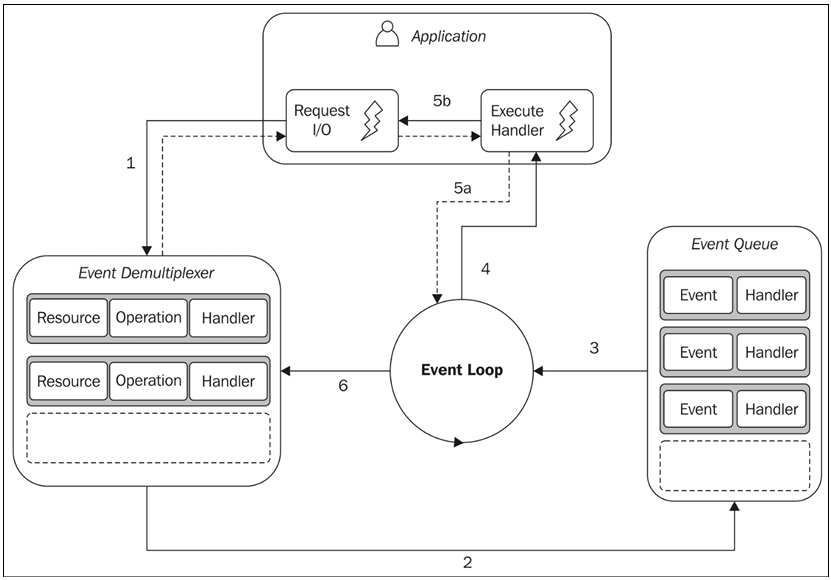
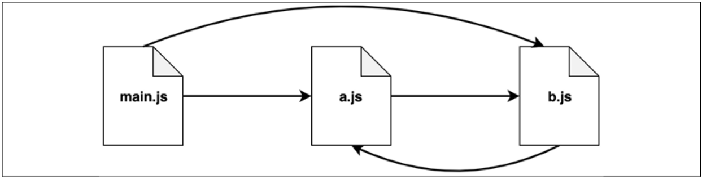

# Node.js

Node.js is a JavaScript runtime built on Google's open-source _V8 JavaScript engine_

> Created by _Ryan Dahl_

## Introduction

1. **Small core**: Node.js runtime and built-in modules are so-called Node.js core is small. Containing only the bare minimum functionalities leaving the rest to the so-called _userland_. Where modules can be created and experimented to provide better solutions.

2. **Small modules**: A _module_ is the fundamental means for structuring the code of a program.

   Unix Philosophy:

   - Small is beautiful.
   - Make each program do one thing well.

3. **Small surface area**: Exposing a minimal set of functionalities to the outside world.

4. **Simplicity and pragmatism**: _Keep It Simple, Stupid (KISS)_ principle.

In his essay _The Rise of "Worse is Better"_ Richard P. Gabriel says:

> "The design must be simple, both in implementation and interface. It is more important for the implementation to be simple than the interface. Simplicity is the most important consideration in a design."

## How Node.js Works?

1. **I/O is slow**: Accessing disk or the network is slow. Sometimes the input comes form humans which are much slower.

2. **Non-blocking I/O**: In this way, the system call always returns immediately without waiting for the data to be read or written.

   The most basic pattern for dealing with this type of non-blocking I/O is to actively poll the resource within a loop until some actual data is returned. This is called **busy-waiting**. This method consumes precious CPU time and results in a huge amount of wasted CPU time.

   - Event-Driven
   - Non-Blocking

   > Deferences between node and JavaScript?

3. **Event demultiplexing**: Demultiplexing is a process where the multiplexed signal is split again into its original components. The synchronous event demultiplexer that we were talking about watches multiple resources and returns a new event (or set of events) when a read or write operation executed over one of those resources completes. The advantage here is that the synchronous event demultiplexer is, of course, synchronous, so it blocks until there are new events to process.

4. **The reactor pattern**: The main idea behind the reactor pattern is to have a handler associated with each I/O operation. A handler in Node.js is represented by a callback (or cb for short) function.

   This is what happens in an application using the reactor pattern:

   - The application generates a new I/O operation by submitting a request to the Event Demultiplexer. The application also specifies a handler, which will be invoked when the operation completes. Submitting a new request to the Event Demultiplexer is a non-blocking call and it immediately returns control to the application.

   - When a set of I/O operations completes, the Event Demultiplexer pushes a set of corresponding events into the Event Queue.

   - At this point, the [Event Loop](../JavaScript.md#the-event-loop) iterates over the items of the Event Queue.

   - For each event, the associated handler is invoked.

   - The handler, which is part of the application code, gives back control to the Event Loop when its execution completes (5a). While the handler executes, it can request new asynchronous operations (5b), causing new items to be added to the Event Demultiplexer (1).

   - When all the items in the Event Queue are processed, the Event Loop blocks again on the Event Demultiplexer, which then triggers another cycle when a new event is available.

   

   ::: tip NOTE
   A Node.js application will exit when there are no more pending operations in the event demultiplexer, and no more events to be processed inside the event queue.
   :::

5. **Building blocks**:

   - A set of bindings responsible for wrapping and exposing `libuv` and other low-level functionalities to JavaScript.
   - **V8**, the JavaScript engine.
   - A core JavaScript library containing Node.js API.

## Module System in JavaScript and Node.js

JavaScript did not have a built-in module system until 2015

Two module systems became popular and were a community initiatives:

- _asynchronous module definition_ (AMD)
- _Universal Module Definition_ (UMD)

Node.js came up with an implementation of the **[CommonJS specification (CJS)](#commonjs-modules)**, which was designed to provide a module system for JavaScript in browserless environments

In 2015 _ECMAScript 6_ (ES6 or ES2015) proposed for a standard module system known as **[ESM (ECMAScript modules)](../JavaScript.md#esm-ecmascript-modules)**

- Node.js has two module systems: CommonJS modules and **ESM** (support from _v13.2_):

  - To use ESM in Node.js change `type` in `package.json` to `module`

  ```json
  // package.json
  {
    "type": "module"
  }
  ```

### Revealing Module Pattern

- JavaScript in the browser lacks namespacing. Every script runs in the global scope. So, if a third-party dependency instantiates a global variable called utils then any other library or the application code itself might accidentally override or alter utils. Causing unpredictable side effects.

- The [_revealing module pattern_](../../../Concepts/Design_Patterns/README.md#revealing-module-pattern) is used to solve this class of problems

```javascript
const myModule = (() => {
  // private
  const privateFoo = () => {};
  const privateBar = [];

  // public
  return {
    publicFoo: () => {},
    publicBar: () => {},
  };
})(); // once the parenthesis here are parsed, the function
// will be invoked
console.log(myModule);
console.log(myModule.privateFoo, myModule.privateBar);
```

- This pattern leverages a self-invoking function also referred to as **Immediately Invoked Function Expression (IIFE)**.

- In JavaScript, variables created inside a function are not accessible from the outer scope (outside the function). Functions can use the return statement to selectively propagate information to the outer scope.

- This pattern is essentially exploiting these properties to keep the private information hidden and export only a public-facing API.

### CommonJS modules

The two main concepts of the CommonJS specification:

1. **`require`** is a function that allows you to import a module from the local filesystem.

2. **`exports`** and **`module.exports`** are special variables that can be used to export public functionality from the current module.

#### Homemade module loader

Below code mimics a subset of the functionality of the original `require()` function:

```javascript
function loadModule(filename, module, require) {
  const wrappedSrc = `(function (module, exports, require) {
        ${fs.readFileSync(filename, "utf8")}
      })(module, module.exports, require)`;
  eval(wrappedSrc);
}
```

- There parameters are passed to the function `filename`, `module`, and `require`.
- The `exports` argument of the wrapping function is initialized with the content of `module.exports`.

Mimicking the `require()` function:

```javascript
function require(moduleName) {
  console.log(`Require invoked for module: ${moduleName}`);
  const id = require.resolve(moduleName); // (1)
  // (2)
  if (require.cache[id]) {
    return require.cache[id].exports;
  }
  // module metadata
  // (3)
  const module = {
    exports: {},
    id,
  };
  // Update the cache
  require.cache[id] = module; // (4)
  // load the module
  loadModule(id, module, require); // (5)
  // return exported variables
  return module.exports; // (6)
}
require.cache = {};
require.resolve = (moduleName) => {
  /* resolve a full module id from the moduleName */
};
```

The functions contains:

1. A module name is accepted as input, and the first thing that we do is resolve the full path of the module, which we call `id`. This task is delegated to `require.resolve()`, which implements a specific resolving algorithm.

2. If the module has already been loaded in the past, it should be available in the cache. If this is the case, we just return it immediately.

3. If the module has never been loaded before, we set up the environment for the first load. In particular, we create a `module` object that contains an `exports` property initialized with an empty object literal. This object will be populated by the code of the module to export its public API.

4. After the first load, the `module` object is cached.

5. The module source code is read from its file and the code is evaluated, as we saw before. We provide the module with the `module` object that we just created, and a reference to the `require()` function. The module exports its public API by manipulating or replacing the `module.exports` object.

6. Finally, the content of `module.exports`, which represents the public API of the module, is returned to the caller.

```javascript
// load another dependency
const dependency = require("./anotherModule");
// a private function
function log() {
  console.log(`Well done ${dependency.username}`);
}
// the API to be exported for public use
module.exports.run = () => {
  log();
};
```

::: tip NOTE
The essential concept to remember is that everything inside a module is private unless it's assigned to the `module.exports` variable. The content of this variable is then cached and returned when the module is loaded using `require()`.
:::

#### `module.exports` VS `exports`

- The `exports` variable is just a reference to the initial value of `module.exports`.
- Only new properties can be attached to the object referenced by the `exports` variable.

```javascript
exports.hello = () => {
  console.log("Hello");
};
```

- Reassigning the `exports` variable doesn't have any effect, because it doesn't change the content of `module.exports`. It will only reassign the variable itself. The following code is therefore wrong:

```javascript
exports = () => {
  console.log("Hello");
};
```

- To export something other than an object literal, such as a function, an instance, or even a string, we have to reassign `module.exports` as follows:

```javascript
module.exports = () => {
  console.log("Hello");
};
```

::: tip NOTE
The `require` function is synchronous.
:::

::: danger Asynchronous `exports`
Any assignment to `module.exports` must be synchronous.

```javascript
// THE BELOW CODE IS INCORRECT
setTimeout(() => {
  module.exports = function () {...};
}, 100);
```

:::

#### The resolving algorithm

- The term **dependency hell** describes a situation whereby two or more dependencies of a program in turn depend on a shared dependency, but require different incompatible versions.

- Node.js solves this problem elegantly by loading different version of a module depending on where the module is loaded from.

The 3 major branches of resolving algorithm:

1. **File modules**: If `moduleName` starts with `/`, it is already considered an _absolute path_ to the module and it's returned as it is. If it starts with `./`, then `moduleName` is considered a _relative path_, which is calculated starting from the directory of the requiring module.

2. **Core modules**: If `moduleName` is not prefixed with `/` or `./`, the algorithm will first try to _search within the core Node.js modules_.

3. **Package modules**: If no core module is found matching `moduleName`, then the search continues by looking for a matching module in the _first node_modules directory that is found navigating up in the directory structure_ starting from the requiring module. The algorithm continues to search for a match by looking into the next node modules directory up in the directory tree, until it reaches the root of the filesystem.

For file and package modules, both files and directories can match `moduleName`. The algorithm will try to match the following:

- `<moduleName>.js`
- `<moduleName>/index.js`
- The directory/file specified in the main property of `<moduleName>/package.json`

::: tip NOTE
Complete formal documentation of the resolving algorithm can be found at [Node.js Org](https://nodejs.org/api/modules.html#modules_all_together)
:::

#### The Module Cache

- Every module is only loaded and evaluated the first time it is required.
- Any subsequent call of `require()` will simply return the cached version.
- It makes it possible to have cycles within module dependencies.
- It guarantees, to some extent, that the same instance is always returned when requiring the same module from within a given package

::: tip NOTE
`require.resolve(<moduleName>)` can be used directly.
`require.cache` variable is exposes the module cache.
:::

#### Circular Dependencies

- A module called `main.js` requires `a.js` and `b.js`.
- In turn, `a.js` requires `b.js`.
- But `b.js` relies on `a.js` as well!
- Now this is a circular dependency as module `a.js` requires module `b.js` and module `b.js` requires module `a.js`.



Contents of the modules:

- Module `a.js`:

  ```javascript
  exports.loaded = false;
  const b = require("./b");
  module.exports = {
    b,
    loaded: true, // overrides the previous export
  };
  ```

- Module `b.js`:

  ```javascript
  exports.loaded = false;
  const a = require("./a");
  module.exports = {
    a,
    loaded: true,
  };
  ```

- Module `main.js`:

  ```javascript
  const a = require("./a");
  const b = require("./b");
  console.log("a ->", JSON.stringify(a, null, 2));
  console.log("b ->", JSON.stringify(b, null, 2));
  ```

- Output of `main.js`:

  ```bash
  a -> {
    "b": {
      "a": {
        "loaded": false
      },
      "loaded": true
    },
    "loaded": true
  }
  (node:13214) Warning: Accessing non-existent property 'toJSON' of module exports inside circular dependency
  (Use `node --trace-warnings ...` to show where the warning was created)
  ```

This result reveals the caveats of circular dependencies with CommonJS, that is, different parts of our application will have a different view of what is exported by module a.js and module b.js, depending on the order in which those dependencies are loaded. While both the modules are completely initialized as soon as they are required from the module main.js, the a.js module will be incomplete when it is loaded from b.js. In particular, its state will be the one that it reached the moment b.js was required.

## Heroku

Add the ssh keys to heroku:

```bash
heroku keys:add
```

Create heroku application

```bash
heroku create app-name
```

Promise chaining.
