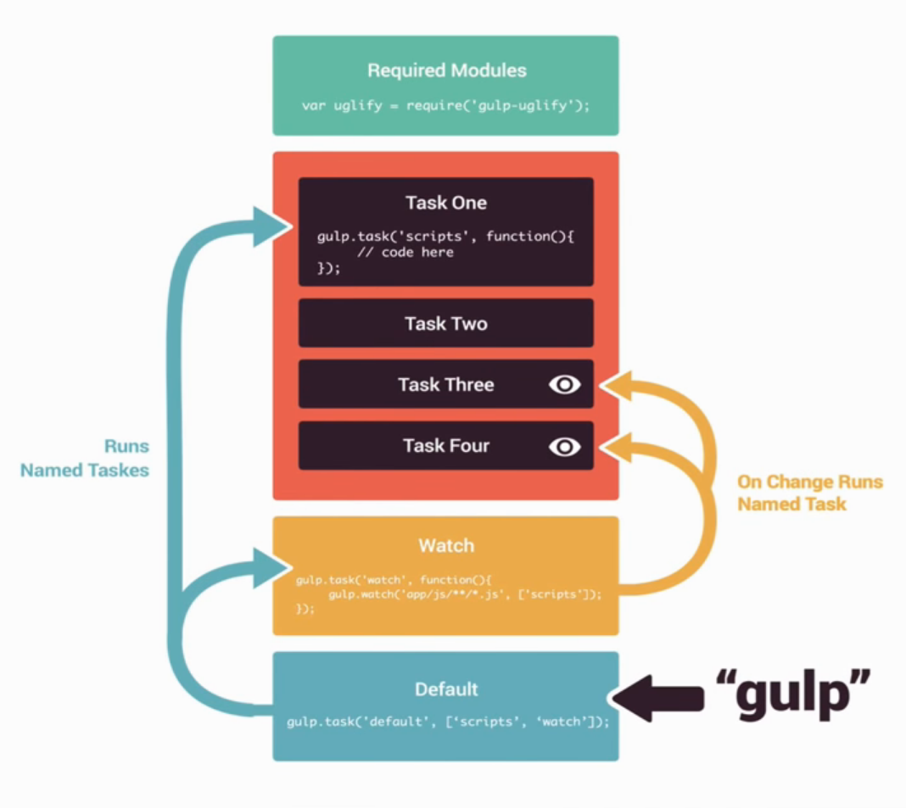

# Gulp.js

It's open source JavaScript toolkit and **task runner** (build system) that utilizes **[Node.js](./../../Node.js/Node.js.md)**.

## Automating Repetitive Tasks

- **Compressing** images
- **Generating HTML** from templates and content files
- **Compiling Sass** to CSS
- **Removing** unwanted development related statements from scripts
- **Transpiling** latest versions of JavaScript to cross-browser-compatible version
- Code **testing, linting, and validation**
- **Concatenation and minifying** of scripts, styles, and other files
- **Cache busting** (Letting browser know new version of cache is available)
- Creating local **development servers**
- **Deploying files** to various servers

## How Gulp works

- Built on **node [streams](#streams)**. Which is piping output from one task as an input to the next.
- It reads a **file once**, process it through **multiple times**, and then writes the final output file.
- Pipeline/`.pipe()` operator is used.
- Files not affected until all plugins are processed.
- Single purpose plugins.
- Gulp makes use of call-back functions to run tasks.
- It is **faster** as it dose not create and read intermediary files on hard drive.

## Gulp vs Grunt

1. Gulp is code over configuration, Grunt is the opposite.
2. Gulp is easier to read than Grunt.
3. Gulp is based on [streams](#streams), Grunt is based on files.

## Instruction

1. First install [Node.js](./../../Node.js/Node.js.md) which will install npm (node package manager) along with it. In latest versions `npx` as well is installed.

2. Install `gulp-cli` globally, it helps to maintain different versions of gulp.js.

   ```bash
   npm install gulp-cli -g
   ```

3. In the current project directory create `package.js` file (it's like a manifest file for node based projects) with the help of `npm` (node package manager).

   ```bash
   npm init
   ```

4. Then install `gulp.js` locally in each project as a development dependency package.

   ```bash
   npm install gulp --save-dev
   ```

5. Now install the required Gulp [plugins](#plugins) that perform tasks.

6. Create a `gulpfile.js` file where all the tasks are written.

7. Run `gulp` in command line to execute the tasks.

## Structure of Gulp File

Structure of Gulp file can be divided into 4 parts as shown below.

1. Required modules (plugins).

   ```javascript
   // import gulp
   const gulp = require("gulp");

   // import gulp plugins
   const autoprefixer = require("gulp-autoprefixer");
   ```

2. Create tasks using the plugins.

   ```javascript
   // create tasks
   gulp.task("css-prefix", () =>
     gulp
       .src("css/*.css")
       .pipe(
         autoprefixer({
           cascade: false,
         }),
       )
       .pipe(gulp.dest("dist/")),
   );
   ```

3. Automate tasks by watching for changes in files and run tasks accordingly.

   ```javascript
   gulp.task("watch", () => gulp.watch("src/js/*.js", ["scripts"]));
   ```

4. Create a default task that run when we run `gulp`.

   ```javascript
   // run task in series or parallel
   gulp.task("default", gulp.series("scripts", "watch"));
   ```



::: tip NOTE
All sample codes are working in `gulp -v` = **4.0.2**
:::

### Functions

There different levels for functions.

#### Top level functions

- `gulp.task` - Defines tasks.
- `gulp.src` - Defines path to the input files.
- `gulp.dest` - Defines path to the output directory.
- `gulp.watch` - Watch files and folders for changes and run tasks accordingly.

### Streams

- Streams allows us to pass X data through a number of small useful functions.
- Once the data is processed by a function, it is passed on to the next function.
- When the last functions finishes data processing it outputs the final processed data.
- Streams are asynchronous, they use callbacks to interact with other functions.

Streams separate concerns because they restrict the implementation surface area into a consistent interface which could be reused.

`.pipe()` is a mere function that takes a readable source stream `src:` and hooks the output to a destination writeable stream `dst:`.

Pipes can be chained together: `one.pipe(two).pipe(three).pipe(four)`

Types of steams:

1. Readable
2. Writeable
3. Transform
4. Duplex
5. Classic

## Plugins

1. JavaScript File Plugins:

   1. [gulp-concat](https://github.com/gulp-community/gulp-concat) - Concatenate files into one single file:

      ```javascript
      const concat = require("gulp-concat");

      gulp.task("scripts", () =>
        gulp
          .src("./lib/*.js")
          .pipe(concat("all.js"))
          .pipe(gulp.dest("./dist/")),
      );
      ```

   2. [gulp-useref](https://github.com/jonkemp/gulp-useref) - Concatenate JS files. Better at concatenating files present in different directories than **gulp-concat**:

      ```javascript
      const useref = require("gulp-useref");

      gulp.task("useref", () =>
        gulp.src("app/*.html").pipe(useref()).pipe(gulp.dest("dist")),
      );
      ```

   3. **[gulp-uglify](https://github.com/terinjokes/gulp-uglify)** - JavaScript parser, minifies, compressor and beautifier:

      ```javascript
      const uglify = require("gulp-uglify");
      const gulpIf = require("gulp-if");

      gulp.task("useref", () =>
        gulp
          .src("app/*.html")
          // Minifies only if it's a JavaScript file
          .pipe(gulpIf("*.js", uglify()))
          .pipe(gulp.dest("dist")),
      );
      ```

   4. [gulp-babel](https://github.com/babel/gulp-babel) - Gulp plugin for Babel:

      ```javascript
      const gulp = require("gulp");
      const babel = require("gulp-babel");

      gulp.task("default", () =>
        gulp
          .src("src/app.js")
          .pipe(
            babel({
              presets: ["@babel/preset-env"],
            }),
          )
          .pipe(gulp.dest("dist")),
      );
      ```

2. CSS File Plugins:

   1. [gulp-clean-css](https://github.com/jakubpawlowicz/clean-css) - Minify CSS:

      ```javascript
      const cleanCSS = require("gulp-clean-css");

      gulp.task("css", () =>
        gulp
          .src("css/*.css")
          .pipe(cleanCSS({ compatibility: "ie8" }))
          .pipe(gulp.dest("./dist/")),
      );
      ```

   2. [gulp-autoprefixer](https://github.com/sindresorhus/gulp-autoprefixer) - Auto prefixes vendor prefixes for CSS. You can use editor plugin for this like, [Sublime Text](https://developers.google.com/web/tools/setup/setup-editor#autoprefixer):

      ```javascript
      const autoprefixer = require("gulp-autoprefixer");

      // Set the browser that you want to support
      const AUTOPREFIXER_BROWSERS = [
        "ie >= 10",
        "ie_mob >= 10",
        "ff >= 30",
        "chrome >= 34",
        "safari >= 7",
        "opera >= 23",
        "ios >= 7",
        "android >= 4.4",
        "bb >= 10",
      ];

      gulp.task("css-prefix", () =>
        gulp
          .src("css/*.css")
          .pipe(
            autoprefixer({
              cascade: false,
            }),
          )
          .pipe(gulp.dest("dist/")),
      );
      ```

   3. **[gulp-sass](https://github.com/dlmanning/gulp-sass)** - Generate CSS from Sass files:

      ```javascript
      const sass = require("gulp-sass");

      gulp.task("sass", () =>
        gulp
          .src("source-files")
          .pipe(sass()) // Using gulp-sass
          .pipe(gulp.dest("destination")),
      );
      ```

   4. [gulp-csso](https://github.com/ben-eb/gulp-csso) - Minify CSS, alternative to **gulp-cssnano**:

      ```javascript
      const csso = require("gulp-csso");

      gulp.task("default", () =>
        gulp.src("./main.css").pipe(csso()).pipe(gulp.dest("./out")),
      );

      gulp.task("development", () =>
        gulp
          .src("./main.css")
          .pipe(
            csso({
              restructure: false,
              sourceMap: true,
              debug: true,
            }),
          )
          .pipe(gulp.dest("./out")),
      );
      ```

3. Image File Plugins:

   1. **[gulp-imagemin](https://github.com/sindresorhus/gulp-imagemin)** - Minify and optimize images:

      ```javascript
      const imagemin = require("gulp-imagemin");

      gulp.task("images", () =>
        gulp
          .src("app/images/**/*.+(png|jpg|jpeg|gif|svg)")
          .pipe(
            imagemin({
              // Setting interlaced to true
              interlaced: true,
            }),
          )
          .pipe(gulp.dest("dist/images")),
      );
      ```

   2. **[sharp](https://github.com/lovell/sharp)** - Resize images:

4. HTML File Plugins:

   1. [gulp-htmlmin](https://github.com/jonschlinkert/gulp-htmlmin) - Minify HTML:

      ```javascript
      const htmlmin = require("gulp-htmlmin");

      gulp.task("pages", () =>
        gulp
          .src(["./*.html"])
          .pipe(
            htmlmin({
              collapseWhitespace: true,
              removeComments: true,
            }),
          )
          .pipe(gulp.dest("./dist/")),
      );
      ```

5. Font Plugins:

   1. [gulp-iconfont](https://github.com/nfroidure/gulp-iconfont) - Create SVG/TTF/EOT/WOFF/WOFF2 fonts from several SVG icons.

      ```javascript
      const iconfont = require("gulp-iconfont");
      const runTimestamp = Math.round(Date.now() / 1000);

      gulp.task("Iconfont", () =>
        gulp
          .src(["assets/icons/*.svg"])
          .pipe(
            iconfont({
              fontName: "myFont", // required
              prependUnicode: true, // recommended option
              formats: ["ttf", "eot", "woff"], // default, 'woff2' and 'svg' are available
              timestamp: runTimestamp, // recommended to get consistent builds when watching files
            }),
          )
          .on("glyphs", (glyphs, options) => console.log(glyphs, options))
          .pipe(gulp.dest("www/fonts/")),
      );
      ```

6. Local Server Plugins:

   1. [browser-sync](https://github.com/Browsersync/browser-sync) - Keep multiple browsers & devices in sync when building websites.

      ```javascript
      const gulp = require("gulp");
      const browserSync = require("browser-sync").create();

      // Static server
      gulp.task("browser-sync", () => {
        browserSync.init({
          server: {
            baseDir: "./",
          },
        });
      });

      // or...

      gulp.task("browser-sync", () => {
        browserSync.init({
          proxy: "yourLocal.dev",
        });
      });
      ```

7. Other Plugins:

   1. [gulp-changed](https://github.com/sindresorhus/gulp-changed) - Only pass through changed files:

      ```javascript
      const changed = require("gulp-changed");

      const SOURCE = "src/*.js";
      const DESTINATION = "dist";

      exports.default = () =>
        gulp
          .src(SOURCE)
          .pipe(changed(DESTINATION))
          // `plugin1` will only get the files that
          // changed since the last time it was run
          .pipe(plugin1())
          .pipe(gulp.dest(DESTINATION));
      ```

   2. [gulp-cache](https://github.com/jgable/gulp-cache) - A cache proxy task for Gulp. Optimizing images however, is an extremely slow process that you'd not want to repeat unless necessary. To do so, we can use this plugin.

      ```javascript
      const imagemin = require("gulp-imagemin");
      const cache = require("gulp-cache");

      gulp.task("images", () =>
        gulp
          .src("app/images/**/*.+(png|jpg|jpeg|gif|svg)")
          // Caching images that ran through imagemin
          .pipe(
            cache(
              imagemin({
                interlaced: true,
              }),
            ),
          )
          .pipe(gulp.dest("dist/images")),
      );
      ```

   3. [gulp-cached](https://github.com/gulp-community/gulp-cached) - A simple in-memory file cache for gulp. Alternative to **gulp-cache**:

      ```javascript
      const cache = require("gulp-cached");

      gulp.task("lint", () =>
        gulp
          .src("files/*.js")
          .pipe(cache("linting"))
          .pipe(jshint())
          .pipe(jshint.reporter()),
      );

      gulp.task("watch", () => gulp.watch("files/*.js", ["lint"]));

      gulp.task("default", ["watch", "lint"]);
      ```

   4. [gulp-newer](https://github.com/tschaub/gulp-newer) - Pass through newer source files only:

      ```javascript
      const newer = require("gulp-newer");
      const imagemin = require("gulp-imagemin");

      const imgSrc = "src/img/**";
      const imgDest = "build/img";

      // Minify any new images
      gulp.task("images", () =>
        gulp
          .src(imgSrc)
          .pipe(newer(imgDest)) // Add the newer pipe to pass through newer images only
          .pipe(imagemin())
          .pipe(gulp.dest(imgDest)),
      );

      gulp.task("default", () => gulp.watch(imgSrc, ["images"]));
      ```

   5. [gulp-load-plugins](https://github.com/jackfranklin/gulp-load-plugins) - Loads gulp plugins from package dependencies and attaches them to an object of your choice. We can use packages in our `package.json` file as plugins:

      ```javascript
      // load all devDependencies
      const $ = require("gulp-load-plugins")({
        pattern: ["*"],
        scope: ["devDependencies"],
      });

      const sass = require("gulp-sass");

      gulp.task("sass", () =>
        gulp.src("source-files").pipe($.sass()).pipe(gulp.dest("destination")),
      );
      ```

   6. [gulp-sourcemaps](https://github.com/gulp-sourcemaps/gulp-sourcemaps) - Generate source maps:

      ```javascript
      const plugin1 = require("gulp-plugin1");
      const plugin2 = require("gulp-plugin2");
      const sourcemaps = require("gulp-sourcemaps");

      gulp.task("javascript", () =>
        gulp
          .src("src/**/*.js")
          .pipe(sourcemaps.init())
          .pipe(plugin1())
          .pipe(plugin2())
          .pipe(sourcemaps.write())
          .pipe(gulp.dest("dist")),
      );
      ```

   7. [gulp-plumber](https://github.com/floatdrop/gulp-plumber) - Prevent pipe breaking caused by errors from plugins:

      ```javascript
      const plumber = require("gulp-plumber");

      gulp.task("javascript", () =>
        gulp
          .src("./src/*.ext")
          .pipe(plumber())
          .pipe(plugin1())
          .pipe(gulp.dest("./dist")),
      );
      ```

   8. [gulp-size](https://github.com/sindresorhus/gulp-size) - Display the size of your project:

      ```javascript
      const size = require("gulp-size");

      exports.default = () =>
        gulp.src("fixture.js").pipe(size()).pipe(gulp.dest("dist"));
      ```

## Alternative Tools

- [Grunt.js](https://gruntjs.com)
- [Broccoli.js](https://github.com/broccolijs/broccoli)
- [Brunch](https://brunch.io)
- [Webpack](https://webpack.js.org)
- [Rollup.js](https://rollupjs.org)
- [Parcel](https://parceljs.org)
- [Snowpack](https://www.snowpack.dev)

## References

- [GulpJS official docs](https://github.com/gulpjs/gulp/tree/master/docs/getting-started)
- [GulpJS Workflow](https://nystudio107.com/blog/a-gulp-workflow-for-frontend-development-automation)
- [Better package.json](https://nystudio107.com/blog/a-better-package-json-for-the-frontend)
- [browserslist](https://github.com/browserslist/browserslist)
