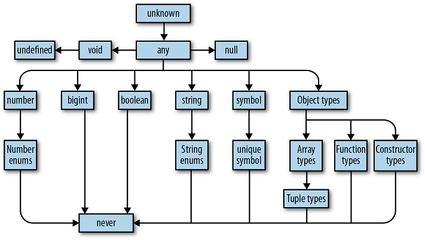
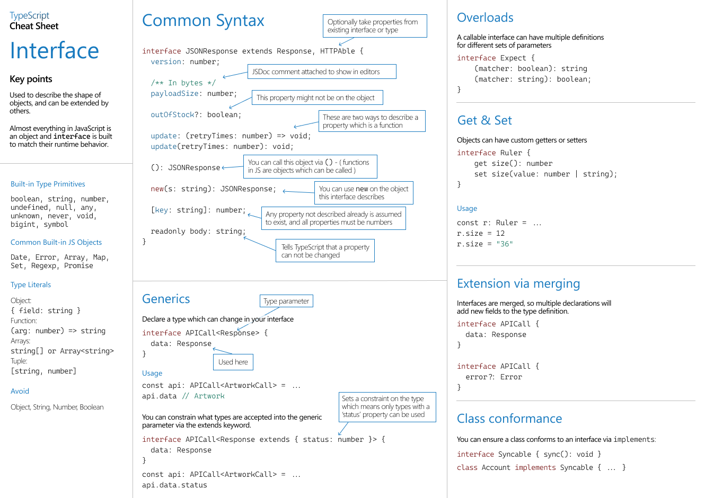

# TypeScript

TypeScript is JavaScript with syntax for types

## Introduction

TypeScript has _type safety_ (using types to prevent programs from doing invalid things)

- Strongly typed

- Wrapper around JavaScript

- TypeScript --compiles to--> JavaScript

Advantages:

- Static Type checking

- Can use Non-JavaScript features like [Interface](#interface) or [Generics](#generics)

- Use Next-gen JavaScript features now and compile it to older versions

- Meta-Programming features like [Decorators](#decorators)

- **TypeScript preserves the runtime behaviour of JavaScript**

- Type of a variable will be implicitly inferred if it is initialized during declaration.

## TypeScript Compiler

### How programs are compiled

Ans: Programs are files that contain a bunch of text. That text is parsed by a special program called a _compiler_, which transforms it into an **abstract syntax tree (AST)**, a data structure that ignores things like whitespace, comments, and where you stand on the tabs versus spaces debate. The compiler then converts that _AST_ to a lower-level representation called _bytecode_. You can feed that bytecode into another program called a _runtime_ to evaluate it and get a result.

- TypeScript dose not compile straight to bytecode.

- TypeScript **compiles** to… **JavaScript** code! This JavaScript code is run in browser or [Node.js](../Node.js)

::: tip NOTE
JavaScript compilers and runtime tend to be smashed into a single program called an engine; as a programmer, this is what you'll normally interact with. It's how V8 (the engine powering NodeJS, Chrome, and Opera), SpiderMonkey (Firefox), JSCore (Safari), and Chakra (Edge) work, and it's what gives JavaScript the appearance of being an interpreted language.
:::

_Example:_ Using TypeScript compiler

1. Install TypeScript compiler as global package

2. Setup TypeScript in individual projects (recommended) and use npm scripts or [`gulp`](../Tools/Gulp.js/Gulp.js.md) or any other tool

   ```bash
   # Initialize a new NPM project (follow the prompts)
   npm init

   # Install TSC, TSLint, and type declarations for NodeJS
   npm install --save-dev typescript tslint @types/node

   # Install Lite Server, for live reload
   npm install lite-server --save-dev
   ```

### `tsconfig.json`

Initialize project with TypeScript compiler.

The below command generates [`tsconfig.json`](https://www.typescriptlang.org/docs/handbook/tsconfig-json.html) file:

```bash
# Will create a tsconfig.json file
tsc --init

# After initializing, TypeScript compiler
# will look into this file for compilation configuration
tsc
```

- `tsconfig.json` file contains:

```json
{
  "compilerOptions": {
    "target": "es2016",
    "lib": [],
    "module": "commonjs",
    "outDir": "dist",
    "sourceMap": true,
    "strict": true
  },
  "include": ["src"]
}
```

- `"include": ["src"]`: Files and folders that should be compiled
- `"exclude": []`: Files and folders that should be excluded from compilation

Compiler Options:

- `"target":"es6` (default `es3`): Set the JavaScript language version for emitted JavaScript and include compatible library declarations.

- `"watch": true`: Re-compiles when files change

- `"lib": ["dom", "es2017"]`: Target runtime. Specify a set of bundled library declaration files that describe the target runtime environment.

- `"noEmitOnError": true`: Disable emitting files if any type checking errors are reported.

- `"noImplicitAny": true`: Enable error reporting for expressions and declarations with an implied `any` type. (enabled by default when in strict mode).

- `"strictNullChecks": true`: Complier gives error if a variable does not have a value assigned to it. When type checking, take into account `null` and `undefined`.

- `"noUnusedParameters": true"`: Raise an error when a function parameter isn't read.

- `"sourceMap": true`: Create source map files for emitted JavaScript files, this will allow debugging typescript in the browser itself.

- [For more Compiler Options](https://www.typescriptlang.org/docs/handbook/compiler-options.html)

_Example:_ Node.js Project

```json
{
  "compilerOptions": {
    "module": "NodeNext",
    "moduleResolution": "NodeNext",
    "target": "ES2020",
    "sourceMap": true,
    "outDir": "dist"
  },
  "include": ["src/**/*"]
}
```

### `tslint.json`

The following command will generate a _tslint.json_ file with a default TSLint configuration:

```bash
./node_modules/.bin/tslint --init
```

```json
{
  "defaultSeverity": "error",
  "extends": ["tslint:recommended"],
  "rules": {
    "semicolon": false,
    "trailing-comma": false
  }
}
```

::: tip LIST of RULES
For the full list of available rules, head over to the [TSLint documentation](https://palantir.github.io/tslint/rules/). You can also add custom rules, or install extra presets (like for [ReactJS](https://www.npmjs.com/package/tslint-react)).
:::

### Project's folder structure

```bash
project/
├──node_modules/
├──src/
│ └──index.ts
├──package.json
├──tsconfig.json
└──tslint.json
```

- Install `ts-node`, and use it to compile and run your TypeScript with a single command.

- Use a scaffolding tool like `typescript-node-starter` to quickly generate your folder structure for you.

## Data Types

A set of values and the things you can do with them.


### Core Types

1. `number` (floating point):

   ```typescript
   let variable: number;

   variable = 1;
   variable = 5.3;

   let vars: 24 = 24;
   ```

2. `string`:

   ```typescript
   let name: string;

   name = "Same";
   name = "As";
   name = `JavaScript`;
   ```

3. `boolean`: `true` or `false`

   ```typescript
   let d: boolean = true;
   let e: true = true;
   ```

4. [`Objects`](#objects)

5. Arrays: Any JavaScript [array](../JavaScript.md#array), can be flexible or strict (regarding element types)

6. `any` (default type): Any kind of value, no specific type assignment

   ```typescript
   // These variables can be of any type
   let a: any;

   // Implicit cast to type `any`
   let variable;

   variable = 1;
   variable = "Name";
   ```

7. [`unknown`](https://learning.oreilly.com/library/view/programming-typescript/9781492037644/ch03.html##unknown)

8. `bigint`: `2^53` numbers (_new_)

9. `symbol`

### TypeScript's type hierarchy



### Tuple Type

Fixed-length and fixed-type array:

- Order is important

```typescript
let tups: [number, string] = [25, "Types"];

// Error is thrown
tups[1] = 36;

// TypeScript will not throw Error
tups.push(366);
```

- Remove `push` function from tuple:

  ```typescript
  type StrictTuple<T extends any[]> = Omit<T, keyof any[]> extends infer O
    ? { [K in keyof O]: O[K] }
    : never;

  const x: StrictTuple<[number, string]> = [1, ""]; // {0: number; 1: string }

  x[1] = "okay";
  x[0] = 123;
  x.push(123); // error!

  //~~~~ Property 'push' does not exist on type { 0: number; 1: string; }
  ```

- Second option:

  ```typescript
  const testArray: readonly [number, string] = [10, "test"] as const;
  testArray.push("test"); // error
  ```

### Enum Type

Enums are used to define a set of named constants

```typescript
enum DIRECTION {
  Up,
  Down,
  Left,
  Right,
}

// Up has value: 0
// All of the following members are auto-incremented
```

- Initialize values:

```typescript
enum DIRECTION {
  Up = 1,
  Down,
  Left,
  Right,
}

// Up has value: 1
// Down has value: 2
```

- If string is used instead of numbers to initialize, we need to provide value to all the elements.

```typescript
enum ROLES {
  ADMIN = "ADMIN",
  READ_ONLY = 0,
  AUTHOR,
}
```

### Objects

Same as JavaScript objects, we can add types to the keys and values of the object.
Also, specify the what keys can be used in the object

```typescript
let userData: { name: string; age: string; wh: number } = {
  name: "Max",
  age: "22",
  wh: 22,
};
```

- Complex objects

```typescript
let complex: { data: number[]; output: (all: boolean) => number[] } = {
  data: [100, 3.99, 10],
  output: function (all: boolean): number[] {
    return this.data;
  },
};
```

- [type alias](###Type Aliases)

- Create an object type and use it multiple times

  ```typescript
  type Complex = { data: number[]; output: (all: boolean) => number[] };

  let complex: Complex = {
    data: [100, 3.99, 10],
    output: function (all: boolean): number[] {
      return this.data;
    },
  };
  ```

### Union Types

- The variable can be of two or more types

  ```typescript
  let myAge: number | string = 27;
  myAge = "27";

  myAge = true; // will cause error
  ```

#### Discriminated Unions

_Example:_

```typescript
type User = {
  id: number;
  name: string;
} & (
  | {
      role: "admin";
      adminPassword: string;
    }
  | {
      role: "user";
    }
  | {
      role: "super-admin";
      superAdminPassword: string;
    }
);

let usr: User = {
  id: 25,
  name: "JS",
  role: "user",
};

let admin: User = {
  id: 25,
  name: "TS",
  role: "admin",
  adminPassword: "****",
};

let suAdmin: User = {
  id: 25,
  name: "C",
  role: "super-admin",
  superAdminPassword: "******",
};
```

```typescript
interface Bird {
  type: "bird";
  flyingSpeed: number;
}

interface Horse {
  type: "horse";
  runningSpeed: number;
}

type Animal = Bird | Horse;

function moveAnimal(animal: Animal) {
  switch (animal.type) {
    case "bird":
      console.log(animal.flyingSpeed);
      break;

    case "horse":
      console.log(animal.runningSpeed);
      break;
  }
}
```

### Literal Types

```typescript
let myAge: 80;

myAge = 28; // will cause error as myAge can only have value 80
```

### Type Aliases

- Alias ay types

```typescript
type Combinable = number | string;

type ConversionResType = "as-number" | "as-text";

function combine(
  inp1: Combinable,
  inp2: Combinable,
  resultConversion: ConversionResType,
) {
  // ...
}
```

### Void Type

```typescript
function printName(name: string): void {
  console.log(name);
}
```

### Unknown Type

```typescript
let user: unknown;

user = 25;
user = "Name";
```

- Error is thrown if we try to assign a variable of `unknown` type to any other variable

```typescript
let user: unknown;
let userName: string;
let userAge: any;

user = 25;

userName = user; // Will throw an error

userAge = user; // No error
```

### Never Type

```typescript
function generateError(msg: string, code: number): never {
  throw { msg, code };
}
```

### Intersection Types

- Intersection of types:

```typescript
type Combinable = string | number;
type Numeric = number | boolean;

type Universal = Combinable & Numeric;
// Universal is of type number,
// as it is the only intersection between
// Combinable and Numeric
```

- Using `type`:

```typescript
type Admin = {
  name: string;
  privileges: string[];
};

type Employee = {
  name: string;
  startDate: Date;
};

type ElevatedEmployee = Admin & Employee;

const emp: ElevatedEmployee = {
  name: "Java",
  privileges: ["None"],
  startDate: new Date(),
};
```

- Using `interface`:

```typescript
interface Admin {
  name: string;
  privileges: string[];
}

interface Employee {
  name: string;
  startDate: Date;
}

interface ElevatedEmployee extends Admin, Employee {}

const emp: ElevatedEmployee = {
  name: "Java",
  privileges: ["None"],
  startDate: new Date(),
};
```

### Type Checking

`typeof` variable;

- check type of variable:

  ```typescript
  if (typeof variable == "string") {
    console.log(variable + " is a string.");
  }
  ```

`never`

- for functions which never returns anything:

  ```typescript
  function neverReturn(): never {
    throw new Error("An error!");
  }
  ```

Nullable types

- To do this add `"strictNullChecks": false` to `tsconfig.json` file.

- Now if we try to assign null to any other type variable, we get an error.

- To make variable null, add union to it:

  ```typescript
  let a: number | null = 12;
  ```

> Note: once a variable is set to null, will it give error if we assign different value to it.

### Type System

A set of rules that a type checker uses to assign types to your program.

- In general, it is good style to let TypeScript infer as many types as it can for you, keeping explicitly typed code to a minimum.

```typescript
// array of heterogeneous data
let arr: any[] = ["a", 25];

// tuples
let tup: [string, number] = ["yes", 99];

// enum
enum Color {
  Gray, // 0
  Green = 100,
  Blue, // 2
}
let myColor: Color = Color.Green;
```

### Type Casting

```typescript
const userInp = document.getElementById("username");

// Type: HTMLElement
// Error: as HTMLElement is generic, hence
// not all HTML elements have the 'value' property
userInp.value = "hello";

// Type Casting
const userInp = <HTMLInputElement>document.getElementById("username")!;

// alternative syntax
const userInp = document.getElementById("username") as HTMLInputElement;

userInp.value = "hello";
```

- Nullable:

```typescript
const userInp = document.getElementById("username");

if (userInp) {
  (userInp as HTMLInputElement).value = "hello";
}
```

### Type Guard

- Base types

```typescript
type Combinable = string | number;

function add(a: Combinable, b: Combinable) {
  // This will throw an error
  return a + b;
}

function add(a: Combinable, b: Combinable) {
  // Type guard
  if (typeof a === "number" || b === "number") {
    return a.toString() + b.toString();
  }
  return a + b;
}
```

- User defined types

```typescript
type Admin = {
  name: string;
  privileges: string[];
};

type Employee = {
  name: string;
  startDate: Date;
};

type ElevatedEmployee = Admin | Employee;

function show(a: ElevatedEmployee) {
  console.log(a.name);

  // Type guards
  if ("privileges" in a) {
    console.log(a.privileges);
  }

  if ("startDate" in a) {
    console.log(a.startDate);
  }
}
```

- Class

```typescript
class Car {
  drive() {
    console.log("Driving...");
  }
}

class Truck {
  drive() {
    console.log("Driving Truck...");
  }

  loadCargo(amount: number) {
    console.log(amount);
  }
}

type Vehicle = Car | Truck;

const v1 = new Car();
const v2 = new Truck();

function useVehicle(v: Vehicle) {
  v.drive();

  if (v instanceof Truck) {
    v.loadCargo(21);
  }
}
```

### Index Properties

- [Indexed Types](https://www.typescriptlang.org/play?q=101#example/indexed-types)

- `boolean` not allowed for keys

```typescript
interface ErrorContainer {
  [key: string]: string;
}
```

_Example:_

```typescript
type UserRoleAttr =
  | {
      role: "admin";
      adminPassword: string;
    }
  | {
      role: "user";
    }
  | {
      role: "super-admin";
      superAdminPassword: string;
    };

type Roles = UserRoleAttr["role"];
// "admin" | "user" | "super-admin"
```

### Utility Types

- `Partial<Type>`:

```typescript
interface Todo {
  title: string;
  description: string;
}

function updateTodo(todo: Todo, fieldsToUpdate: Partial<Todo>) {
  return { ...todo, ...fieldsToUpdate };
}

const todo1 = {
  title: "organize desk",
  description: "clear clutter",
};

const todo2 = updateTodo(todo1, {
  description: "throw out trash",
});
```

Example:

```typescript
interface Goal {
  title: string;
  date: Date;
}

function createGoal(title: string, date: Date): Goal {
  let newGoal: Partial<Goal> = {};

  // Perform validations if required
  newGoal.title = title;
  newGoal.date = date;

  return newGoal as Goal;
}
```

- [Utility Types](https://www.typescriptlang.org/docs/handbook/utility-types.html)

## Functions

- Specify function return type:

```typescript
function returnMyName(): string {
  return "Prabhu";
}

function voidFunc(): void {
  console.log("Hello!");
}
```

- Argument type:

```typescript
function returnMyName(name: string): string {
  return name;
}
```

- Functions as types:

```typescript
// Any function can be assigned
// Structure of the function not specified
let anyFunc: Function;

// Define the structure of the function that can be
// Assigned to it
let myName: (a: string) => string;

myName = returnMyName;
```

- Default parameters:

```typescript
function printName(name: string = "25") {
  console.log(name);
}
```

- Callback Function:

```typescript
function printAndHandle(name: string, cb: (age: number) => void) {
  console.log(name);
  cb(27);
}
```

### Function Overloads

```javascript
function add(a: string, b: string): string;
function add(a: number, b: string): string;
function add(a: string, b: number): string;
function add(a: Combinable, b: Combinable) {
  if (typeof a === "number" || b === "number") {
    return a.toString() + b.toString();
  }

  return a + b;
}

const res = add("Maxi", "mum");

res.split("");
```

## ES6 Features

- `let`, `const` and `var`

- **Arrow Functions**

- **Rest & Spread**

- **`Destructuring`** _Arrays_ and _Objects_

  ```typescript
  // arrays
  const myHobbies = ["Cooking", "Sports"];
  const [hobby1, hobby2] = myHobbies;

  // object
  const userData = { userName: "Max", age: 27 };
  const { userName: altName1, age: altName2 } = userData;
  ```

- Template Literals

  ```typescript
  const userName = "Max";
  const greetings = `This is a heading-
  I'm ${userName}.
  This is cool!`;
  ```

- symbols, iterators, generators

## Class

- There are some changes between _TypeScript_ class and _ES6_ class.

- Access modifier can be used `public`(default), `private`, `protected`

_Example:_

```typescript
class Person {
  name: string; // public (default)
  private typ: string;
  protected age: number;

  // userName will automatically assigned to this.userName
  constructor(
    name: string,
    typ: string,
    age: number,
    public userName: string,
  ) {
    this.name = name;
    this.typ = typ;
    this.age = age;
  }
}

const pers1 = new Person("Max", "admin", 27, "maxin");
```

- Shorthand Initializer:

```typescript
class Person {
  constructor(
    public name: string,
    private typ: string,
    protected age: number,
    public userName: string,
  ) {}
}

const pers1 = new Person("Max", "admin", 27, "maxin");
```

- `readonly` modifier mark a property that shouldn't be changed:

```typescript
class Car {
  constructor(
    public readonly seats: number = 36,
    private color: string,
  ) {}

  printCar(this: Car) {
    console.log(this.seats + this.color);
  }
}
```

- Methods don't have `function` keyword.

```typescript
class Car {
  seats: number;
  private color: string;

  constructor(seats: number, color: string) {
    this.seats = seats;
    this.color = color;
  }

  printCar() {
    console.log(this.seats + this.color);
  }
}
```

- Handling `this`:

```typescript
// The above class is used as an example
const newCar = new Car(25, "Red");

// Save the pointer to the function of the object
// So that it can be used later
const printDetails = { printCar: newCar.printCar };

// This will throw an error
// Because the `this` keyword inside
// the printCar method will not refer to the object of Car
// but to the object printDetails, which dose not have
// the seats and color properties
printDetails.printCar();
```

- To help us catch these mistakes we can explicitly define a type for `this`:

```typescript
class Car {
  seats: number = 20;
  private color: string;

  constructor(seats: number = 36, color: string) {
    this.seats = seats;
    this.color = color;
  }

  // The object calling this function
  // must be an object of Car
  printCar(this: Car) {
    console.log(this.seats + this.color);
  }
}
```


### Inheritance

- Multiple inheritance is not supported

```typescript
class Max extends Person {
  name = "Max";

  constructor(userName: string) {
    super("Max", "Hulk", 2, userName);
  }
}

const newMax = new Max("maxin");
```

### Setters And Getters

- Getters:

```typescript
class Car {
  constructor(
    public readonly seats: number = 36,
    private color: string,
  ) {}

  printCar(this: Car) {
    console.log(this.seats + this.color);
  }

  get colorValue(): string {
    return this.color;
  }
}

const newCar = new Car(25, "Red");

console.log(newCar.colorValue);
```

- Setter:

```typescript
class Car {
  constructor(
    public readonly seats: number = 36,
    private color: string,
  ) {}

  printCar(this: Car) {
    console.log(this.seats + this.color);
  }

  get colorValue(): string {
    return this.color;
  }

  set colorValue(v: string) {
    this.color = v;
  }
}

const newCar = new Car(25, "Red");

newCar.colorValue = "Pink";

console.log(newCar.colorValue);
```

### Abstract Class

- Abstract classes cannot be instantiated

```typescript
abstract class Car {
  constructor(
    public readonly seats: number,
    private color: string,
  ) {}

  abstract printCar(this: Car): void;
}
```

### Singletons And Private Constructors

```typescript
class Car {
  private static instance: Car;

  private constructor(
    public readonly seats: number,
    private color: string,
  ) {}

  printCar(this: Car) {
    console.log(this.seats + this.color);
  }

  static getInstance(seats: number, color: string) {
    if (this.instance) {
      return this.instance;
    }

    this.instance = new Car(seats, color);
    return this.instance;
  }
}

const newCar = Car.getInstance(25, "Red");
```

## Interface

```typescript
interface Car {
  seats: number;
  color: string;

  printCar(): void;
}

const newCar: Car = {
  color: "Red",
  seats: 5,
  printCar() {
    console.log(this.seats + this.color);
  },
};
```

- `readonly` properties
- Declaration merging

- Interfaces for functions:

```typescript
// type AddFunc = (a: number, b: number) => number;

// Same with interface
interface AddFunc {
  (a: number, b: number): number;
}
```

- Optional properties and functions

```typescript
interface Car {
  seats: number;
  color?: string;

  printCar?(a: string): void;
}
```

- `type` vs `interface`
- `abstract` vs `interface`

| Interfaces                        | [Type Aliases](#type-aliases)                         |
| --------------------------------- | ----------------------------------------------------- |
| Preferred for objects and classes | Preferred for functions and everything else           |
| Open for extensions               | Fixed object structure                                |
| Supports Inheritance              | Can be done using [Intersection](#intersection-types) |



## Generics

```typescript
const ages: Array<number | string | boolean> = ["a", 25, true];

const promise: Promise<number> = new Promise((resolve, reject) => {
  resolve(10);
});

promise.then((data) => data.toExponential());

function merge<T, U>(obj1: T, obj2: U) {
  return Object.assign(obj1, obj2);
}

const a = merge({ name: "Prabhu" }, { age: 27 });
```

- Generic Class

```typescript
class GenericNumber<NumType> {
  zeroValue: NumType;
  add: (x: NumType, y: NumType) => NumType;
}

let myGenericNumber = new GenericNumber<number>();
myGenericNumber.zeroValue = 0;
myGenericNumber.add = function (x, y) {
  return x + y;
};
```

- Type Constraints:

```typescript
function merge<T extends object, U extends object>(obj1: T, obj2: U) {
  return Object.assign(obj1, obj2);
}
```

- `keyof` type operator: Takes an object type and produces a string or numeric literal union of its keys.

```typescript
type Point = { x: number; y: number };
type P = keyof Point;

// Example
function extractAndConvert<T extends object, K extends keyof object>(
  obj: T,
  key: K,
) {
  return obj[key];
}
```

## Decorators

```typescript
function Logger(constructor: Function): void {
  console.log("Decorator called...");
  console.log(constructor);
}

@Logger
class Person {
  name = "Max";

  constructor() {
    console.log("Creating object");
  }
}

const per = new Person();

console.log(per);
```

- Decorator Factories

```typescript
function Logger(logString: string) {
  return function (constructor: Function): void {
    console.log(logString);
    console.log(constructor);
  };
}

@Logger("Logging - Person")
class Person {
  name = "Max";

  constructor() {
    console.log("Creating object");
  }
}
```

- Multiple Decorator: Bottom ones run first

- Runs when a class defined not when it is instantiated

## Modules

- Using `namespace`

  - Per-file or bundled compilation is possible (less imports to manage)

  - TypeScript specific

  ```typescript
  // Interface file: IPeople.ts
  namespace People {
    export interface IPeople {
      name: string;
      age: number;
    }

    export const defName = "Admin";
    export const defAge = 0;
  }

  // Class file: People.ts

  /// <reference path="IPeople.ts" />
  namespace People {
    class Person implements IPeople {
      name: string;
      age: number;

      constructor(name: string, age: number) {
        this.name = name ?? defName;
        this.age = age ?? defAge;
      }
    }
  }
  ```

  - Set `outfile`, to concatenate files into a single file

- Using ES6 Imports/Exports

  - Per-file compilation but single `<script>` import
  - Bundling via third-party tools (e.g. Webpack)

  ```typescript
  // Interface file: IPeople.ts
  export interface IPeople {
    name: string;
    age: number;
  }

  export const defName = "Admin";
  export const defAge = 0;

  // Class file: People.ts
  import { defAge, defName, IPeople } from "./counter";

  class Person implements IPeople {
    name: string;
    age: number;

    constructor(name: string, age: number) {
      this.name = name ?? defName;
      this.age = age ?? defAge;
    }
  }
  ```

## Globals

```typescript
// If a var is defined in script tag or
// in a JavaScript file
// <script>
//    var GLOBAL = "yes";
// </script>

// Declare in TypeScript file
declare var GLOBAL: string;

console.log(GLOBAL);
```

- `window` object;

```typescript
// STOP doing this:
(window as any).foo();
//              ^? any

// Do THIS instead:
declare global {
  interface Window {
    bar: () => void;
  }
}

window.bar();
//    ^? (property) Window.bar: () => void
```

## Check Out

- Opaque Type in Typed languages
- Nullish Coalescing

### `satisfies` Operator

`satisfies` (_v4.9_): Enforce a constraint on a variable, without changing its type

```typescript
type RGB = [red: number, green: number, blue: number];
type Color = RGB | string;

const myColor: Color = "red";

myColor.toUpperCase();
//     ^^^^^^^^^^^^^^ invalid operation as myColor can be string or RGB

const myColorNew = "red" satisfies Color; // works
const myIncorrectColor = 100 satisfies Color; // throws error

myColorNew.toUpperCase(); // valid operation as myColorNew is a string
```

## Examples

```typescript
const getDeepValue = <
  TObj,
  TFirstKey extends keyof TObj,
  TSecondKey extends keyof TObj[TFirstKey],
>(
  obj: TObj,
  firstKey: TFirstKey,
  secondKey: TSecondKey,
) => {
  return obj[firstKey][secondKey];
};

const obj = {
  foo: {
    a: true,
    b: 2,
  },
  bar: {
    c: "12",
    d: 28,
  },
};

const value = getDeepValue(obj, "foo", "a");
// typeof value === boolean
```

```typescript
type Animal = {
  name: string;
};

type Human = {
  firstName: string;
  lastName: string;
};

type GetRequiredInfo<TType> = TType extends Animal
  ? { age: number }
  : { socialSecurityNumber: number };

type RequiredInfoForAnimal = GetRequiredInfo<Animal>;
// typeof RequiredInfoForAnimal === { age: number }

type RequiredInfoForHuman = GetRequiredInfo<Human>;
// typeof RequiredInfoForHuman === { socialSecurityNumber: number }
```

```typescript
const deepEqualCompare = <Arg,>(
  a: Arg extends any[] ? `Don't pass an array!` : Arg,
  b: Arg,
): boolean => {
  return a === b;
};
```

```typescript
import second from "ts-toolbelt";

const query = `/home?a=foo&b=wow`;

type Query = typeof query;

type SecondQueryPart = String.Split<Query, "?">[1];

type QueryElements = String.Split<SecondQueryPart, "&">;

type QueryParams = {
  [QueryElement in QueryElements[number]]: {
    [Key in String.Split<QueryElement, "=">[0]]: String.Split<
      QueryElement,
      "="
    >[1];
  };
}[QueryElements[number]];

const obj: Uint8ArrayConstructor.Merge<QueryParams> = {
  a: "foo",
  b: "wow",
};
```

## Reference

- [10++ TypeScript Pro tips/patterns with (or without) React](https://medium.com/@martin_hotell/10-typescript-pro-tips-patterns-with-or-without-react-5799488d6680)
