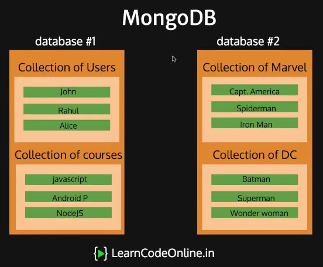
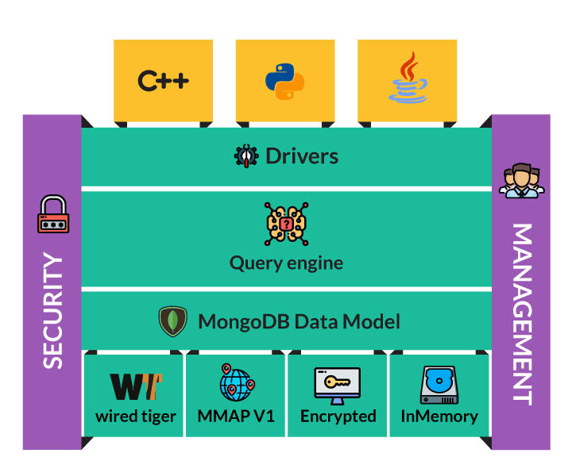

# MongoDB

MongoDB is a _NoSQL_ database, classified as document-oriented database created in 2007

> The word MongoDB is originated from _humongous_

## Introduction

- MongoDB is written in [C++](../../../C-CPP/CPP.md) language

- MongoDB pairs each key with a data structure named as **document**

- MongoDB stores data in flexible, _JSON-like_ documents. The document model map to the objects in your application code, making data easy to work with

- MongoDB is a collection of documents

- **Collections** in Mongo are equivalent to tables in relational databases. They can hold multiple JSON documents

- **Documents** are equivalent to records or rows of data in SQL. While a SQL row can reference data in other tables, Mongo documents usually combine that in a document

- **Fields** or attributes are similar to columns in a SQL table

- **Models** are higher-order constructors that take a schema and create an instance of a document equivalent to records in a relational database

- There is no schema enforcement in MongoDB by default (you may implement it). SQL defines a schema via the table definition. A [mongoose](https://mongoosejs.com/) schema is a document data structure (or shape of the document) that is enforced via the application layer

- MongoDB stores document in a binary-encoded format termed as BSON (Binary JSON) - [BSON and JSON](https://www.mongodb.com/json-and-bson). BSON is an extended format of JSON data model

- MongoDB is a distributed database at its core, so it has high availability, horizontal scaling, and geographic distribution built in and easy to use

- MongoDB creates database for each application and each database contains multiple collections of documents

  

- In MongoDB everything is stored in one place

- Tables are optional

- Great for applications with lot of read and writes

- It is very fast

MongoDB Flow:

- WiredTiger Storage Engine is the default storage engine used by MongoDB, we can use any other engine also

  

MongoDB can be used by any user, but usually it is used by the Three A's of MongoDB:

1. A - Application
2. A - Analytics
3. A - Admin

MongoDB is recommended:

- where _very minimal Total Cost of Ownership (TCO)_ is required

- when a need for replication across multiple data centers globally

- where rapid deployment and faster scaling are required

- when a need for easy loading of data at the beginning and overtime is needed

- when massive concurrency is demanded by a user

- when no downtime can be tolerated

- when the database needs to grow rapidly as per user needs

- when high uncertainty in sizing exists

- where seamless and consistent experience is expected

## NoSQL - Overview

NoSQL provides a mechanism for retrieval and storage of data other than relational databases

- NoSQL does not use the relational model
- NoSQL runs on clusters
- NoSQL is mostly used in Big data and Real-time web applications
- Commonly used Data structures are Document, Graph, Key-Value, and Wide Column

## Document Databases

Document-Oriented databases are a special type of NoSQL database used for managing semi-structured data

- Document databases pair each key with a complex data structure commonly with a block of XML or JSON termed as a _document_

- The document is the most basic unit of data here, its similar to a row in SQL

- Document databases contain collections (kind of a table in SQL terms), each collection contains many documents

  ```json
  {
    "BookID": "987-1-556-5546",
    "Title": "The Hobbit, or There and Back Again",
    "Author": "J. R. R. Tolkien"
  }
  ```

### Use Cases

1. Event logging
2. Blogs and website content management
3. Web analytics or Real-Time analytics
4. E-Commerce

### Features

1. Flexible data modelling
2. Fast querying
3. Faster write performance

Some of the commonly used Document databases are _MongoDB_, _Couchbase_, _OrientDB_, and _RavenDB_

## Features of MongoDB

### Indexing

Following are the indexes supported in MongoDB:

- **Default `_id`**: Each collection contains an index named default `_id`

- **Single Field**: Used for Single field or sort. Indexes can be either in ascending order or descending order

- **Compound Index**: Used for multiple fields.

- **Multikey Index**: These are used to index array data.

- **Geo-spacial Index**: Indexes used are two dimensional and 2D sphere (geolocation).

- Text Search Indexes

- Hashed Indexes

- Clustered Indexes

### Load Balancing

**Sharding** is a technique used for distribute data across multiple servers

- MongoDB supports Horizontal scaling by sharding

- Mongo leverages Sharding for splitting up of a large collection among multiple servers

- MongoDB supports deployments with very large data sets and high throughput operations through this

### Capped Collections

MongoDB supports _Capped collections_. It is a fixed type collection that maintains insertion order once the specified size has arrived

It acts as a circular queue. In this collection, you can restrain the size of the collection, or you can put a limit on the size of a collection

Syntax:

```bash
db.createCollection(<CollectionName>, {capped: <true/false>, size: Number, max:number })
```

Two types of capped collections used are:

1. `fs.files` is used to store the meta-data
2. `fs.chunks` is used to store the file chunks

Example:

Suppose we have an eCommerce application. We are logging user data and should restrict data not to go more than four documents.
In such scenario, we use capped collection.

```bash
db.createCollection("LogUsers", {capped : true,size : 100, max :4})
```

### Adhoc Querying

MongoDB supports:

- Single value field

- Range fields

- Conditional operators

- Regular expression search queries

### Replication

MongoDB uses replica sets for high availability

Replica sets contain two or more copies of the data. Each replica set may act as a primary or secondary replica set. By default, read and write operations are performed on the primary replica. The secondary replica will maintain a copy of primary data

### Storage Mechanisms

MongoDB supports different storage engines:

1. **MMAPv1**: Default Storage engine till MongoDB version 3.2

2. **WiredTiger**: Default storage engine starting from MongoDB 3.2

3. **In-Memory Storage Engine**: This storage engine will be available in Enterprise version. It retains documents in-memory

MongoDB uses _GridFS_ specification for storing and retrieving large collections

_GridFS_ is a special type of file system in which data can be stored within MongoDB collections. GridFS splits a larger file into smaller chunks and stores each chunk of data in a separate document with a size of 255k

### Aggregation

In MongoDB, aggregation process records and return computed results.

Aggregation can be categorized as :

- Pipeline Aggregation: Documents are piped through processing pipeline and executes in different stages and transforms the documents into a final aggregated result.

- Map-Reduce: It splits a larger problem into smaller chunks and sends to different machines for processing. It comprises two phases: reduce and map.

- Single Purpose: These operations will aggregate documents from a single collection.

## MongoDB Architecture



The architecture of MongoDB comprises:

- Application Driver

- Databases

- Collections

- Documents

- Indexes

- Security Features

- Storage Engine

### Application Drivers

- Drivers are client libraries that provide interfaces and methods for applications to interact with MongoDB database

- Drivers will handle the translation of documents between BSON objects and mapping structures

- C++, Java, .NET, Ruby, PHP, JavaScript, Node.js, Python, Perl, PHP, and Scala are some of the widely used drivers supported by MongoDB

### Database

The database can be defined as a physical container of collections. MongoDB server can have one or more databases.

The default database for MongoDB is test. In the absence of any database, collections will be stored in the test database.

The command to check databases in MongoDB Server:

```bash
show dbs
```

### Document

A document is a set of key-value pairs that support dynamic schema. A document is similar to Row in RDBMS. In Relational databases, schemas should be defined before we add any data whereas MongoDB allows the insertion of data without a predefined schema.

Dynamic schema implies that the documents stored in the database can have different fields, with different types for each field.

## CRUD

[**C**](#create-operations) - Create operations

[**R**](#read-operations) - Read operations

[**U**](#update-operations) - Update operations

[**D**](#delete-operations) - Delete/Restore operations

### Create Operations

Creating a schema and inserting data are the operations performed.

We can add single or multiple entries in one go.

Each entry will have an auto generated **\_id** added to the it. We can add over own **\_id** by just including the value for it (Not Recommended).

::: danger REMEMBER
**\_id** must always be unique for each entry.
:::

- `db.collectionName.insertOne({.}, options)` - Creates a collection if not present and inserts one document.
- `db.collectionName.insertMutiple([{.},..,{.}], options)` - Creates a collection if not present and inserts multiple documents.
- `db.collectionName.insert({.}, options)`

### Read Operations

Reading operations include searching a document.

That is done using:

- `db.collectionName.find(filter, options)` - Get all matches.
- `db.collectionName.findOne(filter, options)` - Get the first match.

There are read operations used mostly using the respective driver like:

- `db.collectionName.find().forEach((a) => {printjson(a)})` - Loop through and perform an operation on each entry.

`find().foEach()` runs on the clients system, this mean `find()` will fetch all the data and `forEach()` is used to filter out only the necessary information. This is method eats up lot of network bandwidth as more data is received then necessary.

So, we use options inside the `find()` function to get only the information that is necessary. Options are nothing but _0_ or _1_ flags against the particular field, where _1_ means include the field and _0_ include everything except this field. Like, `db.collectionName.find({}, {email: 1, _id: 0})`.

When we fetch information form the database, a cursor (metafile that contains metadata) is returned.

### Update Operations

Update operations include updating documents or replace a document.

That is done using:

- `db.collectionName.updateOne(filter, data, options)` - Update a document that matches the filters.
- `db.collectionName.updateMany(filter, data, options)` - Update many documents that match the filters.
- `db.collectionName.replaceOne(filter, data, options)` - Replace a document that matches the filters.

### Delete Operations

Delete/Restore operations include deleting documents.

That is done using:

- `db.collectionName.deleteOne(filter, options)` - Delete a document that matches the filters.
- `db.collectionName.deleteMany(filter, options)` - Delete documents that match the filters.

> Delete operations need to used very carefully and add options to make it failsafe.

## MongoDB Schema

Schema

### Modelling Database

1. What are the predefined data sets needed?
2. Where the data is being used?
3. How much filter is there per query?
4. How many queries are being fired?
5. How often will you change the data?

> Database Design for Mere Mortals: A Hands-On Guide to Relational Database Design (3rd Edition)

### Relations

Relation is a way in which one document interacts with another document.

- One to One Relationship
- One to Many Relationship
- Many to Many Relationship

## Practices

1. First create a schema for the collection

   1. The schema is stored in a separate file for each collection. Use singular noun for file names

   2. Import mongoose module: `const mongoose = require("mongoose");`

   3. We are creating a schema, so lets define a constant for that: `const Schema = mongoose.Schema;`

   4. Now define your schema

      ```javascript
      const StudentSchema = new Schema({
          name: String;
      });
      ```

   5. Now give a name for this model: `const Student = mongoose.model("student", StudentSchema);`

   6. Export this schema to use it other places to create **Student**

2. Now lets make a connection to the MongoDB

   1. Import **mongoose**, then connect to the database: `mongoose.connect("mongodb://localhost/<databaseName>", {useNewUrlParser: true});`

## Example

1. Create a new Database named: `mycustomers`:

   ```javascript
   use mycustomers
   ```

2. Add user to the database:

   ```javascript
   db.createUser({
     user: "accountUser",
     pwd: passwordPrompt(), // Or  "password"
     roles: ["readWrite", "dbAdmin"],
   });
   ```

3. Add collections (similar to tables):

   ```javascript
   db.createCollection("customers");
   ```

4. Add document to the collection:

   ```javascript
   db.customers.insert({ first_name: "Prabhu", last_name: "Hiremath" });
   ```

5. Now update the document:

   ```javascript
   db.customers.update(
     { first_name: "Prabhu" },
     { first_name: "Prabhu", last_name: "Hiremath", age: 25 },
   );

   // or update a specific property
   db.customers.update({ first_name: "Prabhu" }, { $set: { age: 25 } });
   ```

6. Remove a field:

   ```javascript
   db.customers.update({ first_name: "Prabhu" }, { $unset: { age: 1 } });
   ```

> Keys in MongoDB need not be enclosed within "".

## MongoDB Cheat Sheet

### Show All Databases

```javascript
show dbs
```

### Show Current Database

```javascript
db;
```

### Create Or Switch Database

```javascript
use acme
```

### Drop

```javascript
db.dropDatabase();
```

### Create Collection

```javascript
db.createCollection("posts");
```

### Show Collections

```javascript
show collections
```

### Insert Row

```javascript
db.posts.insert({
  title: "Post One",
  body: "Body of post one",
  category: "News",
  tags: ["news", "events"],
  user: {
    name: "John Doe",
    status: "author",
  },
  date: Date(),
});
```

### Insert Multiple Rows

```javascript
db.posts.insertMany([
  {
    title: "Post Two",
    body: "Body of post two",
    category: "Technology",
    date: Date(),
  },
  {
    title: "Post Three",
    body: "Body of post three",
    category: "News",
    date: Date(),
  },
  {
    title: "Post Four",
    body: "Body of post three",
    category: "Entertainment",
    date: Date(),
  },
]);
```

### Get All Rows

```javascript
db.posts.find();
```

### Get All Rows Formatted

```javascript
db.find().pretty();
```

### Find Rows

```javascript
db.posts.find({ category: "News" });
```

### Sort Rows

```javascript
# asc
db.posts.find().sort({ title: 1 }).pretty()
# desc
db.posts.find().sort({ title: -1 }).pretty()
```

### Count Rows

```javascript
db.posts.find().count();
db.posts.find({ category: "news" }).count();
```

### Limit Rows

```javascript
db.posts.find().limit(2).pretty();
```

### Chaining

```javascript
db.posts.find().limit(2).sort({ title: 1 }).pretty();
```

### Foreach

```javascript
db.posts.find().forEach(function (doc) {
  print("Blog Post: " + doc.title);
});
```

### Find One Row

```javascript
db.posts.findOne({ category: "News" });
```

### Find Specific Fields

```javascript
db.posts.find(
  { title: "Post One" },
  {
    title: 1,
    author: 1,
  },
);
```

### Update Row

```javascript
db.posts.update(
  { title: "Post Two" },
  {
    title: "Post Two",
    body: "New body for post 2",
    date: Date(),
  },
  {
    upsert: true,
  },
);
```

### Update Specific Field

```javascript
db.posts.update(
  { title: "Post Two" },
  {
    $set: {
      body: "Body for post 2",
      category: "Technology",
    },
  },
);
```

### Increment Field (\$inc)

```javascript
db.posts.update(
  { title: "Post Two" },
  {
    $inc: {
      likes: 5,
    },
  },
);
```

### Rename Field

```javascript
db.posts.update(
  { title: "Post Two" },
  {
    $rename: {
      likes: "views",
    },
  },
);
```

### Delete Row

```javascript
db.posts.remove({ title: "Post Four" });
```

### Sub-Documents

```javascript
db.posts.update(
  { title: "Post One" },
  {
    $set: {
      comments: [
        {
          body: "Comment One",
          user: "Mary Williams",
          date: Date(),
        },
        {
          body: "Comment Two",
          user: "Harry White",
          date: Date(),
        },
      ],
    },
  },
);
```

### Find By Element in Array (\$elemMatch)

```javascript
db.posts.find({
  comments: {
    $elemMatch: {
      user: "Mary Williams",
    },
  },
});
```

### Add Index

```javascript
db.posts.createIndex({ title: "text" });
```

### Text Search

```javascript
db.posts.find({
  $text: {
    $search: '"Post O"',
  },
});
```

### Greater & Less Than

```javascript
db.posts.find({ views: { $gt: 2 } });
db.posts.find({ views: { $gte: 7 } });
db.posts.find({ views: { $lt: 7 } });
db.posts.find({ views: { $lte: 7 } });
```
