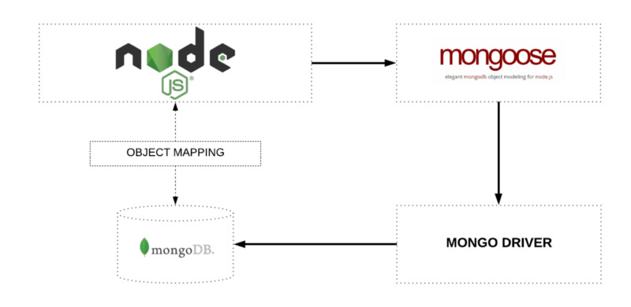

# MongoDB

MongoDB is a:

- Flexible
- Scalable (scale-out)
- General-purpose
- **Document-Oriented** database

Features of MongoDB:

- **Indexing**: MongoDB supports generic secondary indexes and provides unique, compound, geospatial, and full-text indexing capabilities as well. Secondary indexes on hierarchical structures such as nested documents and arrays are also supported and enable developers to take full advantage of the ability to model in ways that best suit their applications

- **Aggregation**: MongoDB provides an aggregation framework based on the concept of data processing pipelines. Aggregation pipelines allow you to build complex analytics engines by processing data through a series of relatively simple stages on the server side, taking full advantage of database optimizations

- **Special collection and index types**: MongoDB supports time-to-live (TTL) collections for data that should expire at a certain time, such as sessions and fixed-size (capped) collections, for holding recent data, such as logs. MongoDB also supports partial indexes limited to only those documents matching a criteria filter in order to increase efficiency and reduce the amount of storage space required

- **File Storage**: MongoDB supports an easy-to-use protocol for storing large files and file metadata

Applications send query for data to MongoDB Server. MongoDB Server gets the data through a Storage Engine, which handles the actual reading and writing of the data to the database

## Setup

Installation steps for both (L)UNIX and Windows systems

### Linux Setup

1. Install MongoDB using your favourite package manager for your distro or build one for your system

2. After installation, configure MongoDB. `mongod` (MongoDB Demon) will be used for configuration:

   ```bash
   # create directory for database storage
   sudo mkdir -p /data/db
   sudo chown -Rv $(whoami) /data/db
   ```

3. Start the mongo server: `mongod`

4. Open a new terminal and start working on MongoDB: `mongo`

5. Every time we want to work on MongoDB. We need to start the `mongod` every time. So, we have to add MongoDB as a service, this will start the MongoDB service every time system boots up

6. Optionally provide database and log path:

   ```bash
   mongod --dbpath /data/db --logpath /data/logs/
   ```

   - `.mongorc.js` Loads whenever the shell is started

### Windows Setup

1. Download and install MongoDB from [MongoDB Site](https://www.mongodb.com/), use the default settings (customize the paths is you need to)

2. Add the MongoDB installed path to your Environment variable Path (change the version number accordingly i.e. 4.2 to the installed version) `C:\Program Files\MongoDB\Server\4.2\bin\`

3. Open _command prompt_ and run `mongo` to start the MongoDB shell to interact with the DB

Other applications required are:

- Install **Robo 3T** (Robomongo), a GUI to interact with the MongoDB database. It's an alternative to MongoDB Compass

## Databases, Collections, And Documents

- A **document** is the basic unit of data for MongoDB and is roughly equivalent to a row in a relational database management system (but much more expressive)

- A **collection** can be thought of as a table with a dynamic schema that contains documents

- A single instance of MongoDB can host multiple independent **databases**, each of which contains its own _collections_

- Databases and Collections are created "lazily" or implicitly (when a Document is inserted)

### Documents

- Document is an ordered set of keys with associated values.

- A value can be one of several different [Data Types](#data-types) supported by MongoDB.

- Every document has a special key, **`_id`**, that is unique within a collection. By default a unique `_id` is generated if explicitly not provided.

- Documents can have embedded documents and array fields.

- MongoDB is _type-sensitive_ and _case-sensitive_.

  ```javascript
  // THE BELOW DOCUMENTS ARE DIFFERENT FROM EACH OTHER
  // TYPE-SENSITIVITY OF VALUE, NUMBER VS STRING
  {"count" : 5}
  {"count" : "5"}

  // CASE-SENSITIVITY OF KEY
  {"count" : 5}
  {"Count" : 5}
  ```

#### Keys

Keys can be any UTF-8 character, with some exceptions:

- Keys must not contain the character **\0** (the `null` character). This character is used to signify the end of a key.
- The `.` and `$` characters are reserved characters.
- All the keys inside a document **must be unique** to that document.

_Embedded Documents_:

- Up to **100 Levels of Nesting**
- Maximum size of each documents is **16 MB**.

### Collections

A _collection_ is a group of documents

Collection names can be any UTF-8 string, with few restrictions:

1. The **empty string** ("") is not valid

2. Collection names may not contain the character **\0** (the `null` character), because this delineates the end of a collection name

3. **system** should not be used as it is a **reserved for internal collections**

4. Also `$` and `.` is a reserved word and should not be used in the collection names

5. Collections can be organized using **namespace sub-collections** separated by the `.` character

Commands:

- `show collections`: List of collections

- `db.collectionName.insertOne({.})`: Creates a collection if not present and inserts one document

- `db.<collectionName>.find().pretty()`: List of all documents present in the collection

- `db.<collectionName>.drop()`

### Databases

MongoDB groups collections into _databases_

- Database names:

  - The **empty string** ("") is not valid

  - Special characters such as `/`, `*`, `.`, `"*`, `**`, `<`, `>`, `:`, `|`, `?`, `$`, (a single space), or `\0` (the `null` character) should not be used in database names

  - Database names are **case-insensitive**

  - Database names are limited to a **maximum of 64 bytes**

Commands:

- `show dbs`: List of databases
- `use newDBName`: Creates a new database
- `db`: To check which database is in use
- `db.createUser({ ... })`: Create user for the database

Some reserved database names:

- `admin`: The _admin_ database plays a role in authentication and authorization

- `local`: This database stores data specific to a single server. In replica sets, _local_ stores data used in the replication process. The _local_ database itself is never replicated

- `config`: Sharded MongoDB clusters use the config database to store information about each shard

## Data Types

1. **String**: Any strings of UTF-8 and must be enclosed in double or single quotes.

2. **Boolean**: `true` and `false`.

3. **Number**: By default all numeric values are stored as (in mongo shell) _64-bit floating-point numbers_, which have much less precision than decimal numbers.

   - **Integer** (int32): `55` written using `NumberInt(55)`.
   - **NumberLong** (int64): `10000000000`
   - **NumberDecimal** Doubles (64bit): `12.99`
   - **High Precision Doubles** (128bit):

4. **ObjectID**: Unique 12-byte IDs (temporal component) - `ObjectID("UUID")`.

5. **Date**: Stores dates in ISO format - `ISODate("2018-09-09")` and `{"today" : new Date()}`.

   - **Timestamp**: It is a special type for internal MongoDB use and not directly associated with the regular Date type.

6. **Embedded Documents**: Documents can contain entire documents embedded as values in a parent document:

7. **Array**: A collection of items.

8. **Null**: A key with value as `null` or a non-existent value.

9. **Regular Expression**: Values can be JavaScript's regular expression syntax - `{"regex" : /foobar/i}`.

10. **Binary Data**: Binary data is a string of arbitrary bytes. It cannot be manipulated from the shell. Binary data is the only way to save non-UTF-8 strings to the database.

11. **Code**: MongoDB also makes it possible to store arbitrary JavaScript in queries and documents - `{"x" : function() { /* ... */ }}`.

## Operations

### CRUD Operations

- `find()` **returns a cursor**, not a list of documents.
- Filters and operators (`$gt`...) can be used to retrieve specify particular documents and also limit the number of documents.

#### CREATE Documents

- `insertOne()`: Insert one document at a time with or without user defined `_id`.

  ```javascript
  // UNIQUE ID GIVEN BY MongoDB
  db.collectionName.insertOne({key: "value"})

  // UNIQUE ID GIVEN BY THE USER
  db.collectionName.insertOne({_id: "4984" key: "value"})
  ```

- `insertMany()`: Insert multiple documents by passing an array of documents.

  ```javascript
  db.collectionName.insertMany([{ key: "value" }, { key: "value" }]);
  ```

  > MongoDB dose not accept message longer than 48MB and will split into batches of 48MB if message is large.

- `insert()`: Insert one or more documents at a time. It is not recommended to use. Also, this command dose not return the _ID_ of the inserted document.

  ```javascript
  db.collectionName.insert();
  ```

- `mongoimport`: Import documents from an external file.

  ```bash
  mongoimport -d cars -c carsList --drop --jsonArray
  ```

Insert Options:

1. **Ordered Insert**: MongoDB by default inserts documents in a Ordered Insert method i.e. While inserting multiple documents, each document is processed and inserted separately. If one of the document insertion fails, MongoDB stops insertion of rest of the documents. All the documents before the error were inserted.

   - **MongoDB will not rollback** documents inserted before the error.

   - Ordered insert can be disabled, so that the documents after the error are also inserted.

     ```javascript
     db.collectionName.insertMany(
       [
         { _id: "yoga", name: "Yoga" },
         { _id: "yoga", name: "Yoga" },
         { _id: "Cooking", name: "Cooking" },
       ],
       { ordered: false },
     );

     // IN THIS EXAMPLE DOCUMENT WITH _id: "Cooking" WILL BE INSERTED EVEN THOUGH THERE WAS AN ERROR IN THE PREVIOUS DOCUMENT
     ```

2. **Write Concern**: Write concern describes the level of acknowledgment requested from MongoDB for write operations.

   - Here, **`w: 1`** is acknowledgment is requested on a write operation and it is **`w: 0`** if no acknowledgment is needed. If `w` is **greater than 1** then it requires acknowledgment from the primary and as many data-bearing secondaries as needed to meet the specified write concern. Specifying `w: 2` would require acknowledgment from the primary and one of the secondaries. Specifying `w: 3` would require acknowledgment from the primary and both secondaries.

   - The `j` option requests acknowledgment from MongoDB that the write operation has been written to the [on-disk journal](https://docs.mongodb.com/manual/core/journaling/).

   - This option specifies a time limit, in milliseconds, for the write concern. `wtimeout` is only applicable for `w` values greater than `1`. `wtimeout` causes write operations to return with an error after the specified limit, even if the required write concern will eventually succeed. When these write operations return, MongoDB **does not** undo successful data modifications performed before the write concern exceeded the `wtimeout` time limit. If you do not specify the `wtimeout` option and the level of write concern is unachievable, the write operation will block indefinitely. Specifying a `wtimeout` value of `0` is equivalent to a write concern without the `wtimeout` option.

     ```javascript
     db.collectionName.insertOne({_id: "yoga", name: "Yoga"}, { w: <value>, j: <boolean>, wtimeout: <number> });
     ```

**Atomicity**: If an operation fails on a document, then the operation will be rolled back for only that document. The document is either saved or not saved.

##### Import Documents from JSON File

`mongoimport JSONFileName.json -d dataBaseName -c collectionName --jsonArray --drop`

#### READ Documents

##### Operators

1. Query Operator: Used to locate the data. Example - `$eq`.
2. Projection Operator: Used to modify the data presentation. Example - `$`.
3. Update operator: Used to modify/add additional data. Example - `$inc`.

#### DELETE Documents

- `deleteOne()`: Deletes the first document that matches the filter. It takes a filter document as first parameter. This filter specifies a set of criteria to match against a document that needs to be removed.
- `deleteMany()`: Similar to `deleteOne()`, this deletes many documents at a time.
- `deleteMany({})` will remove all the documents in a collection.

> `remove` is still supported but should not be used.

#### DROP

- Select the database: `use databaseName`.
- Drop the database: `db.dropDatabase()`.
- Similarly, to drop a collection use: `db.collectionName.drop()`.

#### UPDATE Documents

- `updateOne()`: Updates one document. Takes a filter document as the first parameter and a modifier document, which describes changes to make, as the second parameter.
- `updateMany()`: Updates many documents. Parameters are same as in `updateOne()`.
- Updating a document is **atomic**: if two updates happen at the same time, whichever one reaches the server first will be applied, and then the next one will be applied.

> Expect value of `_id` every other value can be modified.

Update Operators:

- `$set`: Sets the value of a field. If the field dose not yet exist, it will be created.
- `$unset`: Removes the required field.
- `$inc`: Increments the value of type integer, long, decimal, or decimal. It will create the field if not already present. It is used as the second parameter to update operations. `db.movies.updateOne({'title': 'Matrix'}, {'$inc': {'rating': 1}})`
- `$rename`: Rename a field. `db.collection.updateMany({}, {$rename: {oldFieldName: "newFieldName"}})`.

##### Array Operations

- `$push`: Adds elements to the end of an array if the array exists and creates a new array if it does not.

  - If you want to add or append an array, use `$each`. `db.movies.updateOne({"genre" : "horror"}, {"$push" : {"hourly" : {"$each" : [562.776, 562.790, 559.123]}}})`

  - If you want to limit the size of an array, use `$slice`. It will replace old values to fit the new ones. `db.movies.updateOne({"genre" : "horror"}, {"$push" : {"top10" : {"$each" : ["Nightmare on Elm Street", "Saw"], "$slice" : -10}}})`.

  - If you want to sort the values inside an array before slicing them, use `$sort`.

  - To prevent insertion of duplicate values we can use `$ne` (not-equal-to) operator. `db.movies.updateOne({"titles" : {"$ne": "Jaws"}, {$push: {"titles": "Jaws"}}},`

  - To prevent duplicates and treat an array as a set, use `$addToSet`. The `$each` operator can be used along with this operator, not with `$ne` operator.

    ```javascript
    db.movies.updateOne({ name: 1 }, { $addToSet: { genre: "Comedy" } });

    // ALONG WITH "$each"
    db.movies.updateOne(
      { name: 1 },
      { $addToSet: { genre: { $each: ["Comedy", "Drama", "Horror"] } } },
    );
    ```

- `$pop`: Remove elements from an array,

  - `{"$pop": {"key": 1}}`: Removes an element from the end of an array.
  - `{"$pop": {"key": -1}}`: Removes an element from the beginning.

- Updates on an array element can be done through:

  - The index value of the element. MongoDB uses 0-based indexing. We can directly reference the required element in an array. `db.tv.findOne({"genres.2": "Family"})`.

  - If the index of an element is unknown, then the position operator `$` can be used. `db.tv.findOne({"reviews.$.author": "Jim"})`.

  - To update all the elements in an arrary, use `$[]`

    ```javascript
    db.blog.updateOne(
       {"post" : post_id },
       { $set: { "comments.$[].hidden" : true } },
       }
    )
    ```

- Array filtering using `arrayFilters`:

  ```javascript
  db.blog.updateOne(
    { post: post_id },
    { $set: { "comments.$[elem].hidden": true } },
    {
      arrayFilters: [{ "elem.votes": { $lte: -5 } }],
    },
  );
  ```

  This command defines `elem` as the identifier for each matching element in the `"comments"` array. If the `votes` value for the comment identified by `elem` is less than or equal to `-5`, we will add a field called `"hidden"` to the `"comments"` document and set its value to `true`.

> `$each` needs to used before using any of the array operators.

#### Document Replacement

- `replaceOne()`: Replace a document fully with a new one. Takes a filter as the first parameter, but as the second parameter it expects a document with which it will replace the document matching the filter.

### Joining Documents

`$lookup` is used to join two documents.

```javascript
// CUSTOMERS DOCUMENT
{
    uerName: 'ABD',
    favBooks: ['id1', 'id2']
}
```

```javascript
// BOOKS
{
    _id: 'id1',
    name: 'Lord of the Rings'
}
```

```javascript
customers.aggregate([
  {
    $lookup: {
      from: "books",
      localField: "favBooks",
      foreignField: "_id",
      as: "favBookData",
    },
  },
]);
```

## Schema

MongoDB supports **dynamic schemas** (dose not enforces any schema), i.e. documents don't have to use the same schema inside of one collection.

### Schema Validation

1. Validation Level:
   - Which documents get validated?
   - **strict**: All inserts and updates are validated.
   - **moderate**: All inserts and updates to correct documents are validated.
2. Validation Action:
   - What happens if validation fails?
   - **error**: Throw error and don't insert or update the document.
   - **warn**: Log warning but proceed with the operation.

**Adding Validation**:

```javascript
db.createCollection("posts", {
  validator: {
    $jsonSchema: {
      bsonType: "object",
      required: ["title", "text", "creator", "comments"],
      properties: {
        title: {
          bsonType: "string",
          description: "must be a string and is required",
        },
        text: {
          bsonType: "string",
          description: "must be a string and is required",
        },
        creator: {
          bsonType: "objectId",
          description: "must be an objectid and is required",
        },
        comments: {
          bsonType: "array",
          description: "must be an array and is required",
          items: {
            bsonType: "object",
            required: ["text", "author"],
            properties: {
              text: {
                bsonType: "string",
                description: "must be a string and is required",
              },
              author: {
                bsonType: "objectId",
                description: "must be an objectid and is required",
              },
            },
          },
        },
      },
    },
  },
});
```

**Modify Validation Settings**:

```javascript
db.runCommand({
  collMod: "posts",
  validator: {
    $jsonSchema: {
      bsonType: "object",
      required: ["title", "text", "creator", "comments"],
      properties: {
        title: {
          bsonType: "string",
          description: "must be a string and is required",
        },
        text: {
          bsonType: "string",
          description: "must be a string and is required",
        },
        creator: {
          bsonType: "objectId",
          description: "must be an objectid and is required",
        },
        comments: {
          bsonType: "array",
          description: "must be an array and is required",
          items: {
            bsonType: "object",
            required: ["text", "author"],
            properties: {
              text: {
                bsonType: "string",
                description: "must be a string and is required",
              },
              author: {
                bsonType: "objectId",
                description: "must be an objectid and is required",
              },
            },
          },
        },
      },
    },
  },
  validationAction: "warn",
});
```

## Indexes

`db.collectionName.createIndex({"dob.age": 1})`

## Geo-spatial Data

GeoJSON

## Aggregation Framework

## Mongoose

Mongoose is an _Object Data Modelling_ (ODM) library for MongoDB and Node.js. It manages relationships between data, provides schema validation, and is used to translate between objects in code and the representation of those objects in MongoDB



## References

- [freeCodeCamp - mongoose introduction](https://www.freecodecamp.org/news/introduction-to-mongoose-for-mongodb-d2a7aa593c57/)
